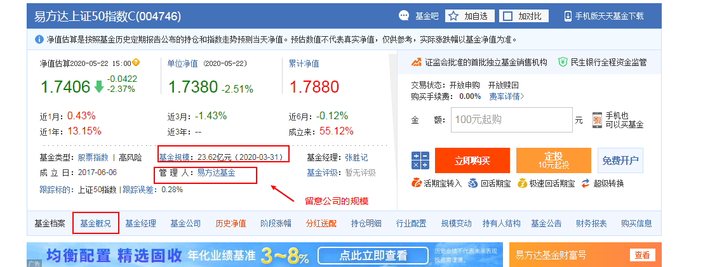
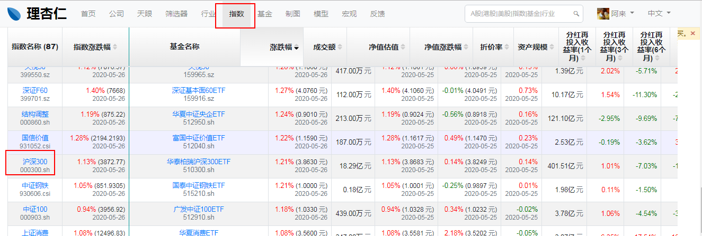
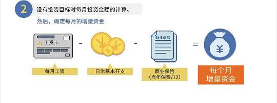

# 3 什么是指数基金

## 3.1 指数

### 3.1.1 概念

- 由交易所制定的，用来反映市场水平的的指标(还是很抽象)——长投小白营

- 指数就是选股规则(**哪些规则？**)，它的目的是按照某个规则选出一篮子股票，并反映这一篮子股票的平均价格走势——《指数基金投资指南》

- 类比举例：

  > 如果想知道一个班级中语文成绩的整体水平，平均水平能够反映。我们把这个班级学生的语文考试成绩加起来求平均数，这就是一个“语文成绩指数”。这个“语文成绩指数”的走势可以反映这个班级平均语文成绩的走势。

### 3.1.2 指数的规则

- 以**沪深300指数**进行举例

- 沪深300：由上海和深圳证券市场中，按照一定的规则(又是规则)，选取300只A股作为样本编制而成的成分股指数——《长投小白营》《指数基金投资指南》

- 具体规则——来源中证指数公司官网：

  **所谓规则就是从哪里选(样本空间)，用什么标准选(选样方法)**

  - 样本空间：沪深 A 股中，非创业板股票(上市时间超过一个季度  )，非 ST、 *ST 股票，非暂停上市股票 (这里还不懂) 
  - 选样方法
    - 计算样本空间内股票最近一年的 A 股日均成交金额与 A 股日均总市值；  
    - 上述计算的值由高到低排名，剔除排名后 50%的股票 。
    - 对剩余股票按照最近一年 A 股日均总市值由高到低排名，选取前 300 名股票作为指数样本。  

### 3.1.3 指数的点数

- 这里主要以沪深300为例说明点数的计算方法，具体有关沪深300，后面再总结。

- 在股票软件上经常看到沪深300后面会带有一个数字，如沪深300 3963.62，这个3963.62就是指数的点数。通过这个点数，就就可以反映A股300支股票，今天整体是涨了还是跌了。问题来了，这个点数是如何计算出来的呢?

- 沪深300，是2004年12月31日从1000点开始起步。也就是2004年12月30日的那300只股票的平均股价定义为1000。

- 以下为实时计算指数的公式

  (这里有点复杂，涉及到了流通股本、分级挂靠、除数调整的概念，没完全搞懂，暂时理解为，指数是由300只(除数也不一定是300支，视具体情况)股票，的平均状况得出来的)

### 3.1.4 指数的分类

- 国内三大指数系列
  - 上证指数(上海证券交易所开发)：如上证50指数(简称上证50)，
  - 深证系列指数(深圳证券交易所开发)
  - 中证指数(中证指数有限公司开发)：如沪深300指数(简称沪深300)，中证500指数(中证500)
  
- 美国
  - 纳斯达克斯指数——交易所开发,
  - 标普500指数——指数公司开发，由美国标准普尔公司选定，代表美国股票市场的500家上市公司。
  - 道琼指数——指数公司开发
  
- 中国香港：
  - 恒生指数——恒生公司开发
  - H股指数——恒生公司开发
  
- A股市场的主要指数：

  

  

- 指数与开发公司对应关系

  

## 3.2 指数基金

### 3.2.1 概念

- 指数是选股规则。如果基金公司开发一个基金产品，也完全按照指数的选股规则去买入完全一样的一篮子股票，这就是指数基金了——《长投小白营》《指数基金投资指南》
- 指数基金是一种特殊的股票基金。一般的股票基金依赖于基金经理的个人决策能力，而指数基金不一样：它是以某指数作为模仿对象，按照该指数构成的标准，购买该指数包含的证券市场中全部或部分的证券，目的在于获得与该指数相同的收益水平。
- 主动型基金：基金经理人拿了我们的钱替我们投资，投资哪家的股票投资多少都有基金经理说了算。盈利大部分取决于基金经理的能力
- 被动型基金：经理人不主动寻求超越市场的表现，选取特定的股票作为投资对象，试图复制整个市场的收益率。和主动型基金最大的不同是，它的风险和收益不依赖基金经理。而是由整个市场决定。指数基金就属于被动型基金

### 3.2.2 特点

- 特点1 长生不老:这里的长生不老，是针对单个股票和普通的股票基金来说的

  > 指数基金可以通过吸收新公司替换老公司的方法，实现长生不老。理论上，指数的寿命与国家的寿命等同。普通的股票基金无法做到这一点，因为普通股票基金的表现取决于基金经理，由基金经理来决定股票的买入和卖出

- 特点2 指数基金能长期上涨：指数基金为何能长期上涨呢，背后的解释有很多。一个比较通用的解释是，指数背后的公司，每年赚的钱，会不断再投入生产，这样来年可以带来更多的盈利。这样不断地利滚利，就会推动指数不断上涨。

  > 王大爷开了一家工厂，生产水果罐头。最初工厂是投了1000万元建立的，买了设备、原材料。第一年赚了100万元的净利润。罐头卖得不错，王大爷决定扩大生产。他把第一年赚的100万元再投入了进去，又买了一些设备。第二年罐头厂赚了110万元。王大爷尝到了甜头，每年的利润都会再投入进去。10年后，王大爷已经拥有了一家年利润260万元、持有资产2000多万元的罐头工厂。每年的净利润再投入，让王大爷有了更多的厂房、设备、原材料和员工。（资产的增加）
  >
  > 王大爷还收购了附近的果园，自己种水果，把中间利润环节去掉，节约原材料的成本；引入先进的罐头生产线，原本需要20个人三班倒生产，改良后只需要10个人，大大提高了效率。（效率的提升）不过王大爷发现，现在罐头卖不动了，每年能销售出去的罐头数量固定在20万罐，每个罐头20%的净利润。虽然罐头卖不动，但王大爷发现罐头可以提价格，每隔一段时间罐头的价格提一提，只要提价不太高，罐头的销量没有太大变化，仍然是20万罐。虽然水果原材料价格在上涨、工人的工资也在上涨，但罐头提价后，王大爷的净利润仍然能增长。（抗通货膨胀）

- 特点3 指数基金成本低(数据来源《指数基金投资指南》)

  - 管理费：主动型基金约为1.5%，指数基金为：0.69%
  - 托管费：基金的庞大资产并不是直接存放在基金公司的，一般会放在第三方如大型银行。就要支付托管费给银行。国内指数基金的托管费率平均在0.14%左右，低的可以做到0.1%

### 3.2.3 分类

- 第一种分类

- 区别：

  宽基指数基金的最大优势是覆盖的行业更广，分配的更加均匀，盈利也更加稳定

  行业指数基金受行业影响大。风险也会更高

- 第二种分类，分为完全复制型指数基金跟增强型指数基金

  

### 3.2.4 指数基金名称解读

1、指数基金的常见名字:ETF，ETF联接，LOF：
	1)、ETF，属于指数基金的一种，是在证券交易所上市交易的，即场内交易的，是基金份额可变的开放式的基金。
	特点：
		①跟踪指数效果更好；
		②相对场外指数基金，购买成本更低。
	2）ETF联接，买ETF基金的基金，一般以不低于90%的仓位投资于该标的的ETF基金；
	特点：收益与ETF基金有强相关性，但在跟踪指数的效果上略次于ETF。
	3）LOF，场内场外都能交易的基金，分类有被动跟踪指数的指数型基金，也有主动管理型的股票基金。

2、指数基金的a和c，与债券基金的abc很类似；

​	1）a类不收销售服务费，但是会收申购费，赎回费，根据持有时长变化；
​	2）c类不收申购费，但要比A类多收一定的销售服务费，按日计提，持有时间大于7天，赎回费率为0；
​	3）一般持有一年以内买c，持有一年以上就买as。

### 3.2.5 筛选指数基金的步骤

- 确定想要投资的指数：如沪深300指数
- 精选靠谱的基金公司(资金规模>1000亿为佳)
- 锁定指数基金，以下为筛选指标
  - 跟踪误差率：要低于同行的平均水平，是主要的判断标准，说明基金的运作水平
  - 基金规模(>2亿)
  - 成立年限(>3年)
  - 管理费用率：包括管理费、托管费、申购费、赎回费

### 3.2.6 筛选实操

对基金公司进行排行

输入要找的指数

**一般如果基金代码里显示“前端”或者“后端”字样，基金类型是“股票指数”的话，一般是场外购买**

**如果基金类型中显示的是“ETF-场内”的话，则是场内基金**

## 3.3 长投温度

### 3.3.1 市盈率(PE)

- 指的是一笔钱投资进一只股票，需要多多长时间能够回本。也就是与一只股票的盈利能力相比，目前它的价格是不是够便宜。
- 公式，市盈率 =公司市值/净利润
- 可以通过该指标初步判断一家公司是贵了还是便宜。该值越低，公司越便宜，该值越高，公司越贵。

### 3.3.2 市净率(PB)

- 市净率=市值/净资产
- 体现了公司的净值产是否被低估
- 像微软这种以知识产权为产品的轻资产公司，不需要投入太多的资产，就能获取更多的利润。这种情况下用该指标判断公司是否被高估不准确。

### 3.3.3 长投温度

- 判断股市估值高低的标准。温度越高，股市越火爆，风险越大，上涨的空间越小。温度越低，股市越冷清，风险则越小，上涨的空间更大。

- 长投温度=(PE温度+PB温度)/2

- 巧克力的故事

  

- 原理

  

### 3.3.4 长投温度计算

打开理杏仁：https://www.lixinger.com/profile/center/stocks

选择要查看的指数

先导出PE

接着导出PB

将两个表格的数据按照图中整合在一起

使用percentrank函数分别计算PE和PB的温度。**注意公式最后要x100**

最后求平均值

## 3.4 定投指数基金

### 3.4.1 定投小Tips

- 基金投资方式：

  投资基金有一次投资、不定期投资、定期定额和定期不定额4种方式。其中，定期不定额是基金投资的最佳方法，能让为我们在低估值的时候买入更多份额。从而获得更多收益。

- 定投小提示

  - 设置定投日期
  - 不要在定投过程中加入自己的主观判断
  - 投资收益投入再利用

### 3.4.2 简投法

1. 确定每个月的投资金额

2. 根据长投温度确定好要选择的指数，更对应的指数基金。参考4.3.3长投温度
3. 根据长投温度期间来确定要买入的时间和份额

4. 指数切换：出现另外一只指数的长投温度低于当前指数2度以上时候，我们就要迅速把这只指数对应的基揽入怀中。重复第三步中的买入策略。原来指数对应的基金继续持有。等温度合适时再卖出

### 3.4.3 场内外的区别

- 交易渠道不同：

  场内必须在证券公司的股票交易系统里下单买卖，证券公司也就是俗称的券商。如华泰、广发等。

  场外是通过银行柜台、网银、基金公司网站进行交易，如支付宝。

- 交易费率不同：

  场内买入或卖出单向交易，费率最高不超过0.05%。而场外的申购费率一般为0.6%~1.5%。

- 委托方式不同

  场内交易的委托方式是“买入卖出”，场外的委托方式是“申购赎回”。申购基金就是向基金公司申请购买新的基金份额；赎回基金就是向基金公司申请卖出我们手里的基金份额。
  
- 到账时间不同

  场外基金如果是当天下午三点前申购，那么会在下一个工作日确认份额，第二个工作日可以赎回，资金则要在赎回后的2-4个工作日才到账。如果是当天下午后申购，那么所有的时间点将顺延一天。

- 交易价格不同

  基金单位净值其实就是一份基金的价值。等于基金当日根据收盘价计算出来的总市值，减去当天的各类成本及费用。再除以基金发行的总份额数。

  场内交易是跟其他持有者交易，想买的人报价。想卖的人出价，价格一样就成交。而场外申购，一天只有一个价格，最后的交易价格以当天收市时的基金单位净值为准。

- 分红方式不同

  基金分红，就是基金公司将基金赚到的钱的一部分返回给投资者，分红方式主要有现金分红和红利再投资。现金分红就是分现金给你，现金直接转入到你的账户。红利再投资就是用分给你的钱直接买这个基金，等于把要给你的钱变成更多基金份额给，这样获得的份额，是不需要支付申购费用的。

  一般来说，场内基金只用现金分红的方式。而场外购买的基金两种方式都有，用户可以自行更改分红方式。

### 3.4.4 基金购买页面信息介绍

通过搜索，进入选定基金的详细界面：

