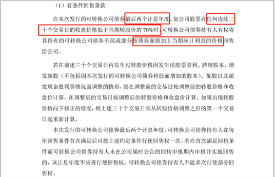
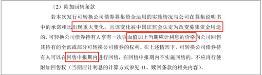
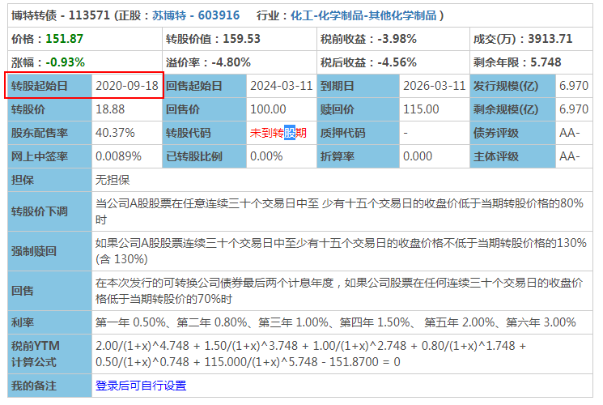
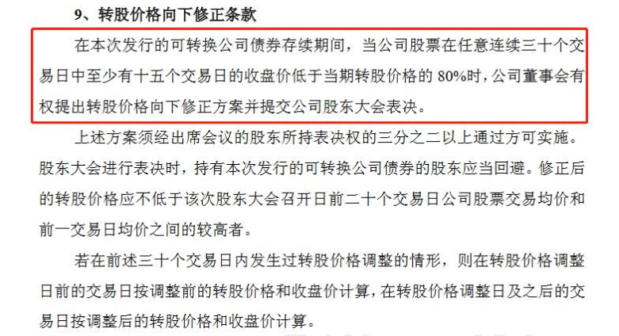
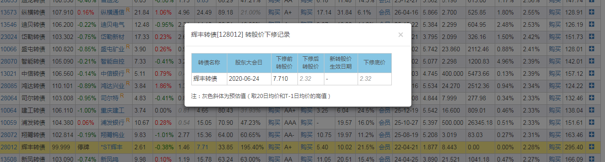

# 可转债

## 什么是可转债

### 概念

可转债，全名叫做“可转换公司债券”（Convertible bond, CB），简称“转债”或者“可转债”，目前的中国国内市场，就是指在一定条件下可以被转换成公司股票的债券。

可转债具有债权和期权的双重属性：其持有人可以选择持有债券到期，获取公司还本付息；也可以选择在约定的时间内转换成股票，享受股利分配或资本增值。

### 三个要点

- **可转债是上市公司发行的**

  所谓上市公司，通俗点讲就是在A股市场上正式发行了股票的公司。所以，每张可转债后面，都必定有一个且只有一个相对应的上市公司的背影，当然同时也必然有一个上市的股票存在，一般我们称之为“正股”。

- **可转债本质上是一张债券**

  债券，就是国家或者企业向社会筹集资金时，给投资者出具的债务凭据。说白了，债券就是一张借条，要求借钱的人到期还本付息。

  可转债的一张借条上会写着100元，通过发行几万、甚至几百万张借条跟普通投资人借钱。

- **在一定的条件下可转换为公司债券**

  > 在发行的时候，A公司就跟投资者约定好了，在可转债发行的5到6年的时间里（这段时间就是可转债从上市到退市的时间，有的可转债5年到期，有的6年到期），凡是拥有“A转债”的人，**在转股期内（一般从发行后6个月开始）**随时有权利可以拿着这张“可转换债券”，用约定的价格，假设是9元，购买A公司的股票。这乍一看，用9块钱换8块钱，好像一点也不划算，甚至还有点亏。
  >
  > 但是大家别忘了，5-6年的时间，要是公司不断往好的方向发展，股价肯定会上涨的，万一碰上牛市，这涨得可不是一点半点呢。那时候，如果把可转债转成股票，可不就赚大发了。要是投资者不想转换股票，把这张可转债高价卖给其他人，也是能赚不少的。最关键的一点是，可转债获取高收益的权利不用我们多花钱买，直接就包含在可转债价格里了。

### 两大特点

- **下有保底**

  首先要明确一下概念，只有在面值100元及以下，或者在回售价及以下买入的持有者，才能100%保底。回售价相当于一个可转债的保护价，一般比面值100元略高0.5～3元。

  为什么可转债100%能保底？因为这是合同规定的。

  从本质上说，可转债就是一个另类的债券。所有债券都有一个约定的还款兑现日期和约定利率，以及本金归还日期。所以，所有债券（当然包括可转债），都在合同中写明了：持有人买了我的债券，等于我向您借了多少年（比如5年、6年）的钱，在这几年当中，每年我都会给你利息（多少不等，1%到8%、9%的都有），然后，等到到期以后我肯定要把本金100%归还给您。其次，还有以下两个原因作为保障

  - 资质好，有还债能力

    证监会把控严格，这些发行可转债的上市公司，根正苗红底子硬，资质各方面都不错，最起码有很多东西可以用来还债，破产的可能性几乎为零。事实上，历史数据也的的确确显示是零。

  - 没必要

    发行可转债的公司实在没有必要为了这点芝麻，坏了本企业的百年圈钱大计

- 上不封顶
  在熊市，公司可能会下调转股价，在牛市，可转债充分体现了一张和正股绑定的期权所应该有的素质和效率，所谓“蚂蝗叮上鹭鸶脚，你上天来我上天”，一句话：正股有了好事，别想撇下兄弟我！

### 可转债获利三种方式

- **直接卖出可转债，赚取差价**

  那么可转债的价格为上会上涨内？

  可转债的价格，很大程度上受到正股价格影响。正股价格上涨，可转债价格必然也会上涨。从下面的公式可以看出。随着正股价的上升，转股价值也会不断上升。如果说可转债价格不变的话，那直接买入可转债再转换成股票，就能赚到钱。

  > 我们有一个叫A转债的可转债。
  >
  >
  > 现在的可转债价格是120元，转股价是5元，现在对应的正股价是6元，那么这支可转债转股后，转股价值也是120元（100/5\*6=120）。假设正股价涨到了7块钱，那么这支可转债转股后，更值钱了，值140元（100/5*7=140）。这时用可转债120元的价格买入，转股后卖出获得140元，白白的赚到了20元。

  **转股价值 = 面值 / 转股价 * 正股价** 

- **转股后长期持有**

  转股后获取股票上涨的收益。当然这种方式的风险也比较大
  
- **通过长期投资可转债，利用复利的力量，同样可以获得上不封顶的收益。**

  复利在投资里的本质，就是将投资获得的收益连同本金一起，不断继续投资。

  举个例子，我们的小名用一笔资金来连续投资可转债，他并不贪心地奢求上文提到过的，动辄百分之一两百的收益率，只求每年赚一小笔就好，那他能获得的收益情况如何呢？

  假设小名投资可转债每年能赚9%，他不断用收益连同本金继续投资可转债，那只需要8年，便能获得接近翻倍的收益。【计算：（1+9%）^8-1=0.99，收益接近翻倍】16年可以获得接近3倍的收益，32年能获得15倍的收益。【计算：（1+9%）^16-1=2.9;（1+9%）^32-1=14.7】而在前面摊大饼那么简单的投资方式里，每只可转债平均每年的复合年化收益率都有45%，用更好的投资策略，同样的时间里，收益翻倍会更多。

## 相关名词

### 可转债面值

可转债面值都是 100 元， 都是固定 100 元不会变的~  

### 收益率/复合年化收益率

又叫做投资收益率，简单来说就是你投资多少能赚多少的比例
计算公式：**收益率 = ( 卖出价格 / 买入价格 - 1 )  * 100%**
复合年化收益率，是在复利模式下每年能获得的收益率。
**复合年化收益率 = { （卖出价格 / 买入价格）^ （1/n))-1} * 100%**,**n为投资年限**
投资年限n大部分时间不是整数，可能是多少天，或者几年零多少天这就需要将天数换算成年数。

复合年化收益率推导：

### 到期赎回价

还是拿航信转债来举例说明， 到期赎回价说的是， 持有这个可转债 6 年到期了， 第六年的利息本来是 1.6%× 100=1.6  但是公司为了奖励我们借钱给他那么久， 就说多支付点儿， 大家都开心， 在发行的时候就约定好了， 到期了会按照 107 元/张赎回可转债~  到期赎回价也可以直接在集思录中看到的  

**到期赎回价， 也就是说， 在公司不违约的情况下， 持有可转债到期， 公司会按照这个赎回价来赎回投资者手中的可转**债  

### 到期价值

我们之前说过，每一张可转债，都可以理解为一张票面为100元的欠条，而到期之后，发行可转债的公司需要连本带息地还你钱。我们这里的“到期价值”指的是，**持有至可转债到期时，每一张可转债公司要还给你的钱，再加上利息再扣掉税**。

首先，到期赎回价=面值 100+最后一年利息+公司奖励  

根据我们的到期赎回价=面值 100+最后一年利息+公司奖励， 那我们就能得出这个海澜转债的到期赎回价 108 元是包含第 6 年的利息的也就是说持有到期， 公司一张可转债给我们 108 元， 里面包含 1.8 元利息的 。所以， 在计算到期价值时我们不用看第六年的利息， 直接看赎回价就可以了。   

那为什么最后一年不用乘 80%， 用其他年份的未付利息之和乘以 80%呢？因为可转债每年的利息， 个人投资者要缴 20%的利息税， 所以其他年份的收益要扣掉税收的部分， 那就剩下 80%了  

所以， 到期价值的计算就简化为：  
到期价值=到期赎回价+除最后一年外所有未付利息之和*80%  以维格转债为例， 一起计算一下。

它的付息日是每年的 1.24 日， 今年 1 月底满一年后， 已经付过第一年的利息了 ,所以未付利息指： 第二年， 第三年， 第四年， 第五年的利息， 以及最后的到期赎回价  
维格转债的到期价值=（0.7+1+1.5+2） *80%+115=119.16。  

### 年化到期收益率

以当下的价格买入可转债，等可转债到期赎回时，每年可以获得的收益率
到期收益率=（可转债到期价值-可转债买入价格 ） / 可转债买入价格  
这个公式里， 可转债到期价值 减 可转债买入价格 就是每张可转债的到期总收益 。结合上图可以看出，维格转债在价格92.17时候买入，那么， 维格转债的到期收益率=（119.16-92.17） / 92.17= 29.28%  
需要注意的是， 我们知道每个转债的剩余年限是不一样的， 如果只用到期收益率的总结果进行对比， 就会存在一定问题的。  因此， 我们需要将到期收益率年化， 也就是， 用到期收益率除以剩余年限。  
年化到期收益率（单利） =到期收益率 / 剩余年限  
维格转债的年化期收益率（单利） = 29.28%/4.627 = 6.33%  

### 可转债面值

可转债的面值始终是发行时的100元不变

### 可转债价格

可转债本身是一种可以交易的商品，有其自身的交易价格，经常讨论的价格涨跌，说的都是可转债的交易价格

### 正股价

发行可转债的公司一般都是上市公司。上市公司自然会发行股票，也就是说，每一只可转债都会对应着一只股票。
这里可转债对应的股票，在股票交易市场之中，在股票交易市场中有一个交易价格。我们称之为正股价

### 转股价

可转债在一定的条件下，可以按照一个约定的价格，被转化为对应的股票。这个约定的股价，就是转股价。
转股价是如何定出来的呢？
首先对于投资者，当然是希望转股价越低越好

> 可转债的面值是100元，假设转股价是10元/股，那么这张可转债可以换成100/10=10股，假设转股价是5元/股，那么这张可转债可以换成100/5=20股。我们可以看出，转股的数量差1倍。
> 假设股票每股涨了2元，那转股价是10时，转股后只能赚20元，但转股价是5时，转股后却能赚40元，收益多了一倍。

但是，转股价低，公司就吃亏：
根据公式：股票价格=市值/总股票数量，可转债转股的时候，上市公司的市值基本不发生变化。那如果因为转股价定的低，导致可转债能兑换成更多数量的股票，就会让总股票数量变多，股票价格就会下跌。也就是说，上市公司啥都没干，手里的股份就亏钱，而且亏得还不是1块2块这么点，几百万甚至十几亿都有可能。

为了平衡双方的利益，中国证监会出台了一系列的政策，现在都是按照这个规定来确定转股价，这条政策就是：
**转股价以本可转债募集说明书公告日前20个交易日公司股票交易均价和前一交易日公司股票交易均价二者之间的较高者。**
也就是，我们用募集说明书公告日前**20个股票交易日的平均交易价格，和前一日的交易平均价格，做比较，价高的那个就是转股价。**

> 某上市公司想发行可转债，它的可转债募集说明书公告日  前20个交易日公司股票交易均价为9.5元，假设公告日前一交易日公司股票交易均价为10元，10＞9.5，那么转股价就被定为10元；假设到公告日前一交易日公司股票交易均价为9元，9.5＞9，那么转股价就被定为9.5元。公司发行时会一并算好均价。

转股价并不是一成不变的，它会根据公司的发展调整。

### 可转债转股价值

转股价值 = 面值 / 转股价 * 正股价

### 转股期

指债券持有人可以将发行人的债券转换为发行人股票的起始日至结束日。
转股期是转股价的附属品，它规定了可转债发行上市以后，必须经过一定的时间之后才能转换成股票。

### 回售期

回售条款生效的时间

### 回售价

是触发回售条款时， 我们可以将持有的可转债以多少价格卖回给公司。  
**回售价格有两种，一种是可转债上市时，募集说明书中规定的固定回售价格，另一种回售价=面值+当期利息。下面计算回售价：**

根据图中的资料，第5年的利息是：100  * 1.5% = 1.5，回售价 = 面值 + 利息 = 100+ 1.5  = 101.5；第6年的利息是：
100  * 1.6% = 1.6 回售价 = 面值 + 利息 = 100+ 1.6  = 101.6

再举个例子:

航信转债， 发行日是 2015 年 6 月 12 日， 到期日是 2021 年 6 月12 日， 会在每年的 6 月 12 日付息， 遇到节假日顺延 
航信之前已经付息 4 次啦， 那么现在就按照第 5 年的利率来计算  知道了这个， 咱们来看看， 航信的回售公告  

**发布回售公告， 一般会给投资者一个回售申报期， 一般是一周~在这个时间段内， 可以把转债按照回售价， 回售给公司**， 这个是我们的权利， 公司不能拒绝  我们计算下航信的回售价， 从 2019 年 6 月 12 日起， 到 2020 年 1月 8 号， 总共是 210 天~按照第 5 年的利率 1.5%来计算， 一整年（365 天） 的利息是 100× 1.5%=1.5 元资金只占用 210 天， 按比例计算， 利息就是 1.5÷365× 210=0.86元 再加上转债的面值， 回售价=100+0.86=100.86 元/张  

### 存续年限

存续年限就是从开始上市到退市结束， 这只可转债一共存在了多长时间。

### 可交换债  

名字后带“EB” 的就是可交换债  可交换债是公司股东发行的， 不是公司发行的， 相对来说风险更大 。可转债， 缩写是是"CB”  

### 转股溢价率  

转股溢价率是怎么计算出来的 ?

转股溢价率计算的， **就是可转债现价和转股价值之间的差距。**  

那么， 如果想知道现在转股能不能赚， 当然就要用转股价值跟可转债价格作对比啦

我们打个比方， 小明找班班借 100 块钱， 打了个欠条， 那么这个欠条就值 100 块钱了。假如到了还钱的时候， 小明手头紧， 拿不出这 100 块钱， 就说， 班班呀， 我拿我刚买的一个长投周边（主题礼品） ， 跟你换这个欠条， 怎么样？ 那如果这个长投周边的价格超过了 100 块， 班班就可以考虑要不要换了。但是如果这个长投周边的价值比 100 块低， 那我也不傻， 肯定不会换嘛  。所以， 这个欠条也就是可转债的价格， 长投周边呢， 就是转股价值。  如果可转债价格比转股价值高， 转股肯定没有赚头。  如果可转债价格比转股价值低， 转股可能会有点赚头， 并且越低，赚头越大。所以表现在转股溢价率上面， 就是可转债价格比转股价值高， 转股溢价率就是正数， 那么这时候转股肯定是不太值得的。  可转债价格比转股价值低， 转股溢价率就是负数， 这时候转股还是有点赚头的， 而且负得越多， 赚头越大。    

下面距离举例计算转股溢价率

转股价值  = 面值 / 转股价 * 正股价 =  100 / 14.28 * 25.05 = 175.42(可对比上图)
转股溢价率 = （可转债价格 - 转股价值） / 转股价值 * 100% = -0.52% (可对比上图)
转股溢价率可直接在集思录中查看到。溢价率灰色代表未到转股期。 

我们刚刚已经知道了， 转股溢价率是负数， 这时候转股是有那么一点点赚头的  。但是我们买卖可转债， 买卖股票， 都是需要手续费的
需要注意两点：  

第一点， 手续费：
1、 可转债买卖有手续费。 不同的券商， 手续费会不同。
2、 可转债转股操作没有手续费。
3、 股票卖出有手续费。 一般来说每笔手续费的最低起点是 5 元  

所以， 看溢价率转股套利的操作， 一般需要： 买可转债---转股---卖出股票所以， 可转债价格与转股价值的差距， 至少要有 5 元以上， 我们才可能赚钱~  而且！ 转股以后 T+1 第二天才能卖出股票  

第二点， 转股溢价率是变动的。  可转债价格和正股价是随着时间变动的， 时间不同数据也就不同。 而
转股价， 也可能会因为各种情况发生调整。  

## 四大要素

### 转股价

可转债最大的特色就在于“可转换”为股票，所以以什么样的价格转换成股票，无疑是最重要的指标。那么转股价是如何确定的呢？
目前基本都是按照这个规定来确定转股价：

> “以本可转债募集说明书公告日前20个交易日公司股票交易均价和前一交易日公司股票交易均价二者之间的较高者。

为防止公司有如下操作：

- 首先在发行可转债前20日尽量打压股价，使得股价尽量很低；
- 然后在发行后，马上放出大量好消息刺激股价大涨，造成强制转股的条件，促使大量可转债持有人大量转股；
- 转股完毕后，马上打回原形，股价下跌，反正可转债的钱拿到手里了，股价与我何关乎？

证监会出台了转股期：
转股期是指债券持有人可以将发行人的债券转换为发行人股票的起始日至结束日。转股期是转股价的附属品，它规定了可转债发行上市以后，必须经过一定的时间之后才能转换成股票。这就等于限定了以上情况的发生，促使企业借到钱以后尽量用在生产上，而不是用来操纵股价牟取暴利。

> 套利小锦囊：值得需要特别指出的是：上市公司为了自己的利益，往往在可转债募集说明书公告日前的一些时间段，尽量放出利好刺激股价上升。这样可以将转股价的门槛定得高一些，未来转股的时候可以融到更多的钱。所以，擅长做短线的投资者可以利用这个机会适当参与博弈，进行套利。不过，这种套利是比较脆弱的，上市公司虽有拉抬股价的动力，但往往是动用利好而不是真金白银，具体成功与否还要看大市是否配合。

转股价不是一成不变的，在正式发行之后，当上市公司因送红股、转增股本、增发新股或配股、派息等情况（不包括因可转债转股增加的股本）使公司股份发生变化时，将按照一定的规则和公式，进行转股价格的调整。

### 强制赎回条款

- **具体内容：**
  **在可转债转股期内，如果本公司股票市场价格在一定的时间段内，高于设定的一个阀值（一般是当期转股价的130%），那么上市公司有权按照略高于可转债面值的一个约定赎回价格（一般是103元）赎回全部或部分未转股的可转债。**

- **具体分析：**
  

  **第一种情况是**，“在本次发行的可转债转股期内，如果公司股票连续三十个交易日中至少有十五个交易日的收盘价不低于当期转股价格的130%（含130%），公司有权按照债券面值加当期应计利息的价格赎回全部或部分未转股的可转债”。

  我们可以看到，图片中它的转股价是8.59元，它的正股价如果在连续30个交易日中有15个以上超过了11.17元，也就是转股价8.59的130%，那么“公司有权决定按照债券面值加当期应计利息的价格赎回全部或部分未转股的可转债”。也就是说，在转股期内，如果林洋转债的正股价在连续30个交易日里有15个超过了11.17元，就满足了强制赎回的条件。这时，林洋转债背后的上市公司需要先召开董事会。如果董事会同意强赎，那公司就会发布强赎公告，提醒投资人在某个规定的日期前，尽快卖出可转债或者转股；如果董事会不同意，那公司就会放弃强制赎回的权利。

  **第二种情况是**，“本次发行的可转债未转股余额不足人民币3000万元时，公司有权按照债券面值加当期应计利息的价格赎回全部或部分未转股的可转债”

  上图中的剩余规模处我们可以看到，林洋转债现在未转股的余额是30亿。根据《上海证券交易所股市上市规则》中的规定，一旦这个数字跌下了3000万元，公司也有权发布公告，强制赎回持有人手中的可转债。

- **为什么说强制赎回条款是胜利的曙光**
  **关键点一：满足签署条件**

  满足条件，意味着可转债的正股价肯定高于转股价的130%，根据公式 **转股价值 = 面值 / 转股价 * 正股价** 此时的转股价值等于面值的130%，也就是130。

  一般来说，当可转债进入转股期后，可转债价格是不会低于转股价值的。因为如果可转债价格低于转股价值的话，因为转股之后获得的股票价格更高，必然有激进的投资人买入可转债然后转股套利赚钱。直到没有可套利的空间，把可转债价格拉高到转股价值为止。因此我们可以知道，此时可转债价格是大于130的。如果我们是以面值100买入，就意味着至少赚30%。

  **关键点二：发布强制赎回公告**

  如果经过股东大会通过，公司同意发布强制赎回公告，那意味着我们知道了可转债买卖和转股的最终日期。在这个日期之前，大家一定要完成可转债的买卖或者转股，否则公司会以债券面值加当期应计利息赎回我们手中的可转债。就拿之前提到的林洋转债来说，如果林洋转债公告强赎了，那我们会知道一个日期，公司会在当天以债券面值加当期应计利息赎回。即使强赎发生在第六年利率最高的时候，我们100块买的可转债，也只能拿回102元。明明能赚30，最后却只赚到2块，真的太惨了。

### 向下修正转股价条款

了解了转股价，就更有必要了解和转股价息息相关的转股价下调条款。
假设碰到极端情况，在发行可转债以后，股市节节下跌，上市公司股票也是掉头向下，已经远远低于转股价，可转债基本已经毫无转股价值。对于投资者来说起码可以到期拿到100元本金，外加少少的利息。但对可转债发行公司，如果投资者未能转股，上市公司就得还钱。于是，正是基于“把债主变成股东”的伟大动力，上市公司在募集说明书中会提出“下调转股价条款”，又名“向下修正转股价条款”。
**“下调转股价条款”的基本思想是：**

> 假如上市公司的股票市场价，在一定的时间段内，低于设定的一个阀值，那么上市公司有权在一定的条件下下调转股价。下调修正后的转股价格一般应不低于一个特定日期前20个交易日内该公司股票交易均价和前一交易日均价之间的较高者，同时修正后的转股价格不低于最近一期经审计的每股净资产和股票面值。

以**深圳机场可转债募集说明书中的“转股价格向下修正条款**”为例说明：

> （1）修正权限与修正幅度
> 在本可转债存续期间，当本公司股票在任意连续20个交易日中有10个交易日的收盘价低于当期转股价格的85%时，公司董事会有权提出转股价格向下修正方案并提交本公司股东大会表决。
> 上述方案须经出席会议的股东所持表决权的三分之二以上通过方可实施。股东大会进行表决时，持有本可转债的股东应当回避。修正后的转股价格应不低于本次股东大会召开日前20个交易日本公司股票交易均价和前一交易日均价之间的较高者，同时修正后的转股价格不低于最近一期经审计的每股净资产和股票面值。若在前述20个交易日内发生过转股价格调整的情形，则在转股价格调整日前的交易日按调整前的转股价格和收盘价计算，在转股价格调整日及之后的交易日按调整后的转股价格和收盘价计算。
>
> （2）修正程序
> 如本公司决定向下修正转股价格时，本公司将在中国证监会指定的信息披露报刊及互联网网站上刊登股东大会决议公告，公告修正幅度和股权登记日及暂停转股期间。从股权登记日后的第一个交易日（即转股价格修正日），开始恢复转股申请并执行修正后的转股价格。若转股价格修正日为转股申请日或之后，转换股份登记日之前，该类转股申请应按修正后的转股价格执行

当本公司股票在任意连续20个交易日中有10个交易日的收盘价低于当期转股价格的85%时”，也就是说，比如现在深圳机场可转债的转股价是5.66元，如果深圳机场股票价格在任意连续20个交易日内有10个交易日低于5.66元的80%——也就是4.81元，那么公司“有权提出转股价格向下修正方案并提交本公司股东大会表决⋯⋯方案须经出席会议的股东所持表决权的三分之二以上通过方可实施⋯⋯转股价格应不低于本次股东大会召开日前20个交易日本公司股票交易均价和前一交易日均价之间的较高者，同时修正后的转股价格不低于最近一期经审计的每股净资产和股票面值。”可见，通过“向下修正股价条款”，上市公司可以合法地通过适时下调转股价，降低持有人转股的门槛，促进持有人转股，把持有人牢牢绑定在自己的马车上。

**需要注意的是，向下修正转股价条款是带有很多附加限制条件的，如“有权提出调整”说明仅是“权利”而不是“义务”；提交股东大会能否通过还需要一定的票数；就算是实施了，具体下调到哪里也有限制；此外，有的可转债进入转股期后才能向下修正，也需留心。**

### 回售条款

回售保护条款的核心思想是这样的：
在可转债存续的一定时间内，如果公司股票收盘价在N个交易日低于当期转股价格的一个阀值（这个阀值一般要低于向下修正转股价）时，可转债持有人有权将其持有的可转债全部或部分按面值的103%或面值100元+当期计息年度利息回售给本公司。任一计息年度可转债持有人在回售条件首次满足后可以进行回售，但若首次不实施回售的，则该计息年度不应再行使回售权。
以深圳机场可转债募集说明书的“回售保护条款”（原文是“有条件回售条款”）：

> 在本可转债最后两个计息年度，如果公司股票收盘价连续30个交易日低于当期转股价格的70%时，可转债持有人有权将其持有的可转债全部或部分按面值的103%（含当期计息年度利息）回售给本公司。任一计息年度可转债持有人在回售条件首次满足后可以进行回售，但若首次不实施回售的，则该计息年度不应再行使回售权。
> 若在上述交易日内发生过转股价格调整的情形，则在调整前的交易日按调整前的转股价格和收盘

这就意味着，假设深圳机场的股票价格达到了下调转股价的触发条件——在任意连续20个交易日中有10个交易日的收盘价低于当期转股价格的85%，也就是转股价5.66元×85% = 4.81元时——深圳机场公司没有提出下调转股价，或者提出了下调转股价提案但被股东大会否决了（纯属举例，请勿当真），持有人该怎么办？答案是：没法办。这是合法的！然而事情还没完！这时候，如果股市继续低迷不振，深圳机场公司也没有什么救市措施的话，股票和可转债会双双继续下跌。

当深圳机场的股票下跌达到了“回售保护条款”的触发条件：公司股票收盘价连续30个交易日低于当期转股价格的70%时，也就是5.66元×70% = 3.96元时，转机出现了！如果上市公司继续无所作为，可转债持有人有权将其持有的可转债全部或部分按面值的103%（含当期计息年度利息）回售给本公司！公司股价跌得再惨，持有人也能拿回103元；如果是在100元以下买的可转债，还能稳稳小赚5%、10%的！请注意：这里可是可转债持有人“有权”了，立即执行，无需股东大会批准！

这就意味着，如果走到这个地步，上市公司会将全部已经借到的钱，全部归还给持有人，自己的超低息五六年借款计划提前终止，“债主变股东”一分钱都不还的转股融资大计也算是彻底流产了！基本上，所有的上市公司都不愿意面对这样的结果，早知如此，何必当初花费那么多的人力物力去发行什么可转债呢？那可是一个漫长而又复杂的精密工程啊！所以，所有上市公司都会在回售价触发之前采取行动，要么拉抬股价，要么主动下调转股价，尽量远离回售保护区，起码保证当年不触发。回售价也就自然成了一个保底价。

**以上参考《可转债投资魔法书》，以下参考可转债训练营**

该技巧与回售条款息息相关。现在回售条款分两种。一种是条件回售条款，一种是附加回售条款。以和而转债为例说明

- 最后计息年度：指的就是回售期
  这个条件规定了可转债回售必须在回售期内，回售期一般是最后两个计息年度

- “连续30个交易日”“正股价低于转股价70%”，举例说明

  > 假设“和而转债”连续20日的正股价都低于转股价的70%，到第21日，正股价突然就上涨了，高出转股价的70%，那不好意思，回售条件不成立，下一次想要满足回售条款，又重新连续30日。
  >
  > 这个条件看起来非常严苛对不对，那是因为回售对公司意味着还钱。对于不想还钱只想把债主变成股东的公司来说，当然不能随随便便让回售成功。

- "面值加上当期的利息价格"
  指回售价格，意思是我们最后能够以这个价格卖回给公司

附加回售条款

关键词解释：
解释一下，如果上市公司发行可转债募集的钱实际用途发生了重大变化，而且证监会判定这个改变是存在的，那么持有者就有权利把手里的可转债以回售价格——面值加上当期利息，在回售申报期内回售给公司。

如果上市公司的资金用途真的发生了重大变化，确定触发了附加回售条款，那不论这只可转债在哪个时间段都会触发，一定会有相应的公告提示回售的，我们可以直接在自己的券商软件里查看。在“有条件回售条款”里，清晰地写出了回售的严苛条件，让投资人没那么容易回售；在附加回售条款里，又给了投资者保护，假如上市公司募集到了钱却不干正事，那么证监会也会插手。当然“有条件回售条款”并不是所有可转债都有。不同的可转债回售条款会根据实际情况略有不同

## 两个策略

### 低风险分散策略

- 核心
  **买入30只年化到期收益率>0或者其他数值**(可以根据情况进行调整)的可转债，并在满足强赎条件时卖出。投资可转债的数量越多，风险相对越小。

- 分析

  1. 买得越多风险越分散。30只是一个比较合适的数量

  2. 年化到期收益率>0

     > 到期收益率，以当下的价格买入可转债，等可转债到期赎回时，每年可以获得的收益率

     

     假设A可转债的到期价值是111元，可转债现在的价格是105元，可转债还两年到期。如果A可转债正常兑付，那么到期可以赚到6块钱的收益，用6块钱收益除以我们的买入价格105，就是两年的到期收益率。因为，为了获得这些收益我们用了两年的时间，所以年化到期收益就是两年的到期收益率除以2。也就是6/105/2=2.85%。

     到这里，可能有的小伙伴会疑惑，为什么年化到期收益直接就除以剩余年限了呢？之前的公式不是这样的啊？这是因为，这里我们用的是单利算法，单利就是说投资赚到钱之后，把收益拿去花掉或者做别的，而本金继续投资的情况。之前用的是复利算法，复利的意思是，投资赚到钱之后，把收益连同本金继续再投资。因为在资金量小时，每只可转债每年收获的利息最多几块钱，没有办法做到收益再投资。所以，这里的年化到期收益，直接除了剩余年限。而年化到期收益率为2.85%的意思就是，当可转债到期正常兑付时，我们每年可以获得2.85%的收益。

     如果到期收益率=0说明什么呢？说明到期我们没有获得任何的收益；也说明当到期收益率为0时，可转债的买入价格就等于到期价值。因此在到期收益率大于0时买入，就相当于在到期价值以下买入。

  3. 其他数值

     这个数值其实是保底收益，是可转债没有处罚强赎，并且没有违约时的最低收益保障。并不代表最终只能赚到这些钱。所以该数值以个人为主。当然不能设置得太高，不然筛选不出可转债，或者筛选出的可转债的评级较低。

  4. 卖出条件

     可转债满足强赎条件

### 精选策略

- 核心：
  选择10只以上可转债，**分两档建仓买入**，当可转债满足强赎条件时卖出

- 分析

  1. 选择10只评级高的可转债，可以减少持有可转债的数量，同时风险也会较低

  2. 通过分两档建仓买入的方式来提高我们的收益
     **这个分两档建仓买入是怎么回事呢？**
     
      其实就是，在可转债价格到达我们预期价格的时候买入一些，等这只可转债的价格变得更低的时候，再买入一些。目的是让我们在本金不变的情况下，买入更多数量的可转债，降低投资成本。成本低了，收益当然也会变高了。 分两档建仓买入，**就是先在可转债价格低于到期价值时，买入一些可转债**，等可转债价格下跌后，再在可转债价格低于面值时，买入相同数量的同一只可转债。到期价值是多少，并不需要我们自己计算。上节课我们已经学到了，当到期收益率大于0时，我们买入可转债的价格就低于它的到期价值。
     
      接下来，**我们再看看面值**，大家都知道，可转债的面值都是100元。不过，一般来说，评级为AAA的可转债，它的价格很难跌破面值价。所以，我们可以把AAA级的可转债标准放宽一点，102元或者103元就可以买入了。
     
      也就是说，两档建仓买入，**一档是在到期收益率大于或等于0时买入一些可转债，另一档是在可转债的价格低于面值时买入相同数量的同一只可转债（AAA级可转债在价格低于102或者103时买入）。**
     
      举个例子，老王现在有4200元，想要配置一只可转债。根据到期收益率大于等于0筛选之后，老王发现长投转债符合条件，它的价格为110元。在这时候买入20张可转债，也就是2200元。为什么不直接全买呢？刚刚我们也说过了，也许之后还会跌到更低的价格，我们留点钱，在面值价附近再买入一些。老王盯着长投转债还没多久，它就跌到了100元。那这时候，我们就可以用剩下的2000元，再买入20张长投转债。这时，老王一共用4200元，买入了40张可转债，一张可转债的成本价就是105元（4200/40=105）。
     
      而如果我们不用两档建仓，那买入每张长投转债的成本就是110元。所以，两档建仓，让我们投资长投转债的成本足足低了4.5。【（110-105）/110×100%】那有些小伙伴就要问了，如果我筛选的时候，可转债的价格直接就小于面值了，该怎么办，还要等它涨到到期价值再买吗？当然不用啦！就好像我们买面膜，看到促销价这么低的情况下，会特意等到它涨到活动价再买吗？可转债也是一样的道理，大家可不要忘了，两档建仓的根本目的是为了让我们在本金不变的情况下，多买一些可转债，提高我们的收益。
     
      当然，也会出现这样的情况。我们用到期收益率＞0进行了筛选，又用筛选出的价格买入可转债，可买完之后，可转债价格就一直上涨，不给我们用低于面值价买入的机会。这时，大家也不用纠结，继续持有可转债等待低价再买一次，或者卖出的机会就行。这也是我们让大家买入相等数量的原因。虽然在价格低的时候，买入更多可以把我们的成本变得更低，但没有人能预测市场，更低的价格可能不会出现，所以，每个价格档位买入相同数量的可转债就行。
     
  3. 卖出条件：达到强赎条件
  
- **关于两档建仓**
  1档：到期价值（税后到期收益率≥0）
  2档：AAA级可转债现价为102-103，AA+级可转债现价为面值以下

  我们筛选出来要买入的组合后就可以考虑建仓了，我们知道只要是筛选出来的肯定都是可转债现价低于到期价值的，所以此时会有两种情况：
  第一种情况：在可转债现价低于到期价值以下时建仓，建仓后，可转债价格没有下跌到第2档。这时候很多小伙伴会说，没办法两档建仓了怎么办，那就继续持有，静等满足强赎条件卖出就好啦。

  第二种情况：在筛选时，可转债价格已经满足第2档要求时（AAA级可转债现价为102-103，AA+级可转债现价为面值以下）这时就可以直接一次性建仓，不必等到上涨到第1档后再加仓哈

  有的小伙伴又有疑问啦，那资金到底该如何分配呢？班班来告诉你，把计划投资的钱平均分配到每一只可转债上。比如你打算投入一万块买十只，今天筛选了7只，那么你就可以先一只买一手，也就是花7000块左右买7只，剩下的钱放入货币基金，等过几天筛选下有合适的再买。

## 三个小技巧

### 博下修小技巧

“博”是赌博，“下修”指的是转股价下调。关于向下修正转股价条款，参考上面。

- 核心：
  博下修的套路，就是，购买满足下修条件却还没有发布下修公告的可转债，博公司会实行下修操作

- 分析

  - 博下修的好处
    一旦下调转股价，一张可转债能换到更过的股票，而此时可转债的价格大概率会上涨
    根据公式：转股价值 = 票面值 100元/转股价 * 正股价

    > 打个比方，现在有一只A可转债，现在的价格是80元，转股价是10元，正股价是7元，这时的转股价值是70元（100/10*7=70）。
    >
    > 如果公司下修了转股价，把转股价从10元下调到了8元，那转股价值会上涨到87.5元（100/8*7=87.5）。
    >
    > 伴随着转股价值的上涨，可转债价格也大致会涨到87.5元左右。我们假设在可转债价格刚好是80元时买入，又在转股价下调后，直接卖出，这几步简单的操作，就可以让我们获得大约9.4%的收益。【（87.5-80）/ 80≈9.4%】那如果下调转股价公告发布之后，你不打算卖出，想要继续持有，也是可以的。因为股价不断下跌，导致强制赎回条款不那么容易触发。但转股价一下调，正股价和强赎条款触发价格之间的距离，一下子就被缩短了，黎明的曙光也一下子明亮了起来。

  - 正股价一直低于转股价，但又没有实行下修转股价的话，最差的情况，就是你一直当债券持有，直到到期赎回，获得利息收益。

  - 对于投资者跟公司来说，下调转股价都是有利的，但会损害原持有这支股票的股东的利益。
    所以，可转债下修，必须要通过三分之二的股东同意才能有效，所以当大多数股东不同意下修时，可转债下修就不会成功。

### 升级版防守技巧

该技巧与回售条款息息相关，有关回售条款查看前文。该技巧分两种情况

- 第一种情况，持有可转债

  可能有小伙伴在“到期价值”以下买入了可转债，结果没等到正股上涨，触发强制赎回，反而迎来了正股下跌，下跌就算了，上市公司还不下调转股价。眼看着正股价一直跌，表面风平浪静，心里早就慌得不行。虽然这种情况比较少见，但这时候，如果你持有的可转债可以回售，并且已经在回售期满足了回售条件，那班长建议你赶紧回售。

  这种做法的好处是提高了资金的利用率。但是这样的做法也有不足，那就是：回售时有可能是亏的。如果买入价比回售价高，其实是不划算的。如果出现了这样的情况，这时候就要根据你的实际情况选择了。如果你不能忍受一丁点亏损，且不着急用钱，那么你完全可以持有到期，时间也不会很长，一般是2-3年的样子，拿到最后的利息加面值。

- 第二种情况，没有持有可转债

  因为回售是可转债最后的防守技巧，也就是说，即使可转债价格一直在跌，但是只要触发了回售，我们大概率不会亏钱，所以回售价也可以是买入价的一档。

  如果你的风险承受能力高，已经以“到期价值”建仓，以“回售价”加仓，以“面值”继续加仓，一共三档买入价格。

  我们以“国贸转债”为例，前面计算过(参考回售价解析)，它如果在第5年回售，那回售价是101.7；如果在第6年回售，那回售价是102。这时候就要根据实际情况判断了，

  如果你想要多一些投资机会，那么就可以在102建仓；如果你不想冒险，那么我们可以以101.7的价格建仓，反正最差也能以这个价回售给上市公司，不亏不赚。

  这里班长要说明一下，这里所有的计算都不包含手续费，如果要实际操作的话，还应该在回售价的基础上减去手续费的部分。具体手续费是多少，班长会在第十二课实操部分给大家介绍。

  说完了三档建仓，班长还想说另外一种投资逻辑，那就是两档建仓。

  如果你风险承受能力低一点，没有在“到期价值”建仓，还不想错过好的投资机会，那么你可以在“回售价”建仓，在“面值”加仓，这样一共是两档买入价。参考操作部分。

### 可转债打新

可转债打新，就是申购即将上市的可转债。

特点：门槛低，操作简单，可以增加资金的利用率。
操作步骤：

1. 申购
2. 等中签
3. 中签交钱
4. 等上市
5. 上市卖出

**技巧1：查看平均价格**

已上市可转债的平均价格=所有已上市的可转债当前交易价格的总和 / 可转债的总数量  表示的是可转债价格的平均数，相当于可转债的现在平均行情。通过以下方式查看

也可点击平均价格进去查看

如果平均价格小于100，就说明现在市场上，大部分可转债的交易价都小于100，如果平均价格大于110，就说明现在市场上，大部分可转债的交易价在110附近。如果平均价格大于110，意味着当前的可转债行情比较好，新上市的可转债，价格可能会追高到这个水平。所以当平均价格大于110时，就可以直接申购了。因为可转债的申购和发行会间隔2到3周时间，这段时间内可转债的行情很可能会发生变化。所以，建议大家看两次平均价格，提前了解可转债的情况。

第一次是在【申购当天】，判断自己该不该申购；第二次是在【上市前一天】，预估第二天上市的行情，就可以知道手上这只可转债大概率是亏损还是赚钱。“已上市可转债的平均价格”只是供大家参考，并不是说一定能避免破发。

**技巧2：查看可转债的评级**
理论上，评级越高的可转债破发的概率就越小。从历史数据中看，评级为AAA的可转债没有破发过。不过，考虑到AAA评级的可转债数量并不多，如果大家不介意有时会亏损个十几二十块的话，AA级以上的也可以申购，低于AA级的就不建议大家申购了。

**技巧3：何时卖出**
上市的可转债，就可以卖出啦，那可转债该怎么卖呢？上市当天就卖掉。为什么呢？

关于这个问题，其实可转债打新破发的概率不是很高，基本都是能涨的。如果股市行情好的话，新债上市的时候会涨个10%-20%左右，中1签能挣100-200元呢。如果行情不好的话，会发生亏损，一般最多亏个十几二十块。

那如果真的出现破发，亏损了怎么办呢？这里班长给两种解决办法：第一种办法是，卖出。这种办法的好处是，眼不见心不烦。因为亏也亏不了多少，最多十几块而已。第二种办法是，继续持有。可转债本身具有债券的性质，我们打新其实就相当于以面值价格买入可转债，所以是保本的。如果上市当天可转债出现了破发，亏损了十几块，而你一点也不想卖它，那就可以继续持有。等到它上涨到你心里合适的卖出价格就好啦，最差的结果就是可转债一直不涨，持有可转债6年拿到本金和利息。但是，这种情况可能会降低资金的利用效率。

## 可转债的一生

### 可转债发行  

可转债发行日， 我们可以申购新债， 也就是我们一直在做的打新债的那一天。  然后等 2-3 个星期， 新债就会上市， 具体上市日期在集思录或者是券商软件里都可以查看。大家记得及时关注下， 一般会在快上市的前几天会有显示具体的上市日期哒  

### 可转债上市到退市  

这阶段可转债又分为未到转股期和转股期  

1. **未到转股期（发行之后， 前 6 个月）**  
   可转债上市后， 就意味着我们可以在场内和其他路人甲乙丙们进行交易啦。  我们知道可转债是可以在一定条件下转换为股票的债券，这个一定条件就是转股期， 一般在可转债上市的前 6 个月， 还不是转股期， 我们只能买卖， 不能转股。未到转股期在集思录上的表现就是溢价率为灰色。  
   那么如果这段期间我们持有可转债， 可能会遇到什么情况 ?
   1. 首先肯定是无法满足强赎的， 也不能转股。  
      
   2. 下修虽然理论上是可以的， 但是一般也不会有公司会在还没到转股期时下修， 因为他们下修就是为了促进转股的 
   3. 回售是有可能发生的， 但是只限于附加回售条款， 也就是这期间公司如果改变了募集资金的用途被证监会发现了的话，就会触发附加回售条款， 附加回售条款在可转债一生中任何时间都是有可能发生的。  
      附加回售触发时间： 可转债存续期内的任意时间  
      附加回售触发条件： 公司改变可转债所募集资金的用途。  附加回售对我们的影响： 我们可以选择将可转债回售给公司， 也可以继续持有， 等待强赎或者持有到期。  
      有条件回售条款则是不可能的， 因为还没到回售期嘛  
2.  **转股期内（发行后 6 个月-退市）**
     在转股期内可转债可能会强赎、 可能会下修、 也可能会回售、 还有可能平平淡淡一直到期赎回。  
   1. **强赎条款**  
      强赎触发时间： 转股期内的任一时间段都有可能。 
      强赎触发条件： 如果公司股票在任意连续 M 个交易日中至少有 N个交易日的收盘价不低于当期转股价格的 X% 或者 本次发行的可转债里面， 没有转股的余额不足多少人民币时， 那么上市公司有权按照略高于可转债面值的一个约定赎回价格， 赎回全部或部分未转股的可转债。  满足强赎对我们的影响： 触发强赎， 就是我们收获的信号啦， 也就是集思录“强赎天计数” 标红的时候了。  这里划重点： 强制赎回是公司的权利， 不是义务， 也就是强赎触发后， 公司不一定会发布强赎公告。  
      如果公司发布了强赎公告， 我们应该怎么办呢？  那就更要及时卖出或者转股了， 这里大家不要等到最后一天， 因为发布公告以后就没有 130%的限制了。即使强赎期间， 可转债的价格也是可能下跌的， 不要想着最高点卖出， 价格差不多， 我们就可以卖出了。  一旦公司发布强赎公告， 就意味着可转债的使命完成了， 要提前
      退市了， 那么他的一生也就结束啦。
   2. 下修条款  
      下修触发时间： 存续期内的任一时间段都有可能。  
      转股价下修条件： 当公司股票在任意连续 M 个交易日中至少有 N个交易日的收盘价格低于当期转股价的 X%  下修条款对我们的影响： 我们可以使用博下修策略， 根据课程博下修的筛选条件， 选出合适的可转债， 博公司会下调转股价， 然后在可转债价格上涨的时候， 及时卖出， 赚取差价。  注意： 下修转股价不是一定要在回售期内才会发生， 只是在回售期公司下修的概率比较大， 毕竟不下修就要还钱。  但是也不一定在回售期一定会下修， 毕竟下修转股价会对股东的利益有影响， 超过三分之一的股东不同意， 都没有办法下修成功哦。  
   3.  回售条款   
      有条件回售触发时间： 规定的回售期内， 一般是可转债存续期的最后两年。 （也有的是最后三年）  
      有条件回售触发条件： 在回售期内， 如果公司股票收盘价在任何连续 M 个交易日低于当期转股价的 X%  也就是如果正股价还在往下跌， 我们还有回售条款可以保护投资者。  
      有条件回售对我们的影响：  假如我们持有的可转债， 没有希望触发强制赎回， 正股价一直
      往下跌， 公司也没有下修转股价的打算， 小伙伴们又不想把资金耗在这里。那我们就可以等持有的可转债触发回售条款， 及时回售给发行公司。  
      我们可以利用回售价， 使用防守小技巧提前做好进一步防守，加一层安全线。  也就是可以使用三档建仓， 在到期价值建仓、 回售价加仓、 面值价加仓。  

## 实操

### 查看募集说明书

募集说明说需要关注的信息：

1. 可转债的利息和付息方式  

   

   

2. 转股期和转股价  
   

   转股价是可转债的核心， 那么我们也能在募集说明书中找到可转债的转股价和转股期  

3. 转股价向下修正条款  
   

4. 强制赎回条款  
   

   以上就是可转债的强制赎回条款， 不过在募集说明书中称为“ 有条件赎回条款”   

5. 到期赎回  
   

6. 回售条款
   

   

回售条款有两种， 我们都可以在募集说明书中找到。募集说明书中还有很多信息。 基本你想要的关于这只可转债的细节都能找到。  

### 查看强制赎回条款

1. 打开集思录官网
2. 找到可转债
   

3. 查看强赎回
   

### 强赎天计数的五种情况

- **已公告强赎**
  

  这意味着这个上市公司发布了强赎公告，将鼠标移动到红色感叹号可以看到，可转债买卖和转股的最终日期。

  - 最后交易日：过了这个时间就不能自由买卖这只可转债了
  - 停止转股日：过了这个时间就不能把持有的可转债转换成公司股票了
  - 赎回登记日：过了这个时间，我们持有的可转债就会被上市公司强制赎回了
  - 赎回价格：上市公司强制赎回我们持有的可转债之后，给我们的钱

- **公告不强赎**
  
  这里表明，虽是符合强势的条件，但公司不行使强赎的权利；这里还有可能是赎回登记日还未确定

- **标红数字**

  

  只要是标红的数字，不管是15/30还是30/30都代表着公司已经满足了强制赎回的条件。但是公司还没有发布强赎公告。需要留意。

- **标蓝数字**
  
  图中华夏转债，9/30指的是上市公司的正股价在连续30个交易日内，有9个高于设定的阀值。标蓝意味着公司还没有满足强制赎回的条件

- 未到转股期
  
  图中表明该可转债尚未到转股期

### 查找公司公告

第一步：点击对应的可转债的**代码**，今日详情页面

第二步：点击正股代码

第三步：页面下拉，可以看到公告页面

### 低风险分散组合筛选

筛选前说明:
在集思录中，筛选条件中的到期收益率是指到期税前收益率。但实际上，如果可转债没有强赎，也没有违约我们最后拿到手的钱是会被扣税的。而每家公司用的扣税方式不一样扣税比例可参考：0.3%~0.7%，平均大概在0.59%左右。

假设以税前收益率为1.85%(1.25%(最低收益率) + 0.6%(税率))来筛选
**第1步：填入税率**

**第2步：用可转债评级缩小投资范围**

第3步：评级为AAA的跟AA+的可转债全部收下，在AA评级中按照到期收益率高低排名，选择高的，加在一起达成30只目标。先固定评级，然后对收益率进行排序

**第4步：买入单只可转债的金额不要超过投资可转债总金额的3%**。
比方说，我们有5万块，每只不超过3%，那每只最多买入1500元，相当于每只买1手。如果资金量比较大，比如说10万，按照每只不超过3%的投入，那每只可转债能买3手。

**第5步：卖出**
达到强赎条件时即可考虑卖出

### 精选策略筛选

说明：集思录筛选用的到期收益率是到期税前收益率，如果我们想筛选出到期税后收益率大于等于0的可转债，可以在到期收益率那里**填0.59%左右**。

对评级排序

固定AA+评级，对收益率进行排序

注意：AA+以下转债，在我们这个策略里是不要的。至此，我们的可转债就都选好了。以后，我们需要关注这些可转债的价格。**如果可转债的价格低于面值价，我们就要抓紧再次买入了。我们要的转债都买好之后，就可以等待满足强赎条件卖出了。**

### 查看下修条款

第1步：集思录中点击要查看的可转债的代码，进入详细页面

第2步：查看对应的可转债有没有下修
在可转债列表页面，在可转债界面上，转股价这一栏，有一部分转股价被标蓝，**并且转股价后边被打上了*号**。比如下边这个图：

点击标蓝的转股价，就可出现下修历史记录

还要的转股价标蓝但没有*号的情况

这里会有两种情况：
第一种情况是，这只可转债满足了下修条件后，发行公司提出了下修方案，股东大会的日期并未确定，或者确定了时间还没有开会。我们点击红框内的蓝色数字，就可以看到详情信息，如下图。

第二种情况是，这只可转债满足了下修条件后，发行公司提出了下修方案，但是下修方案并未被股东大会通过，同样是点击看到详情信息，如下图：

### 筛选博下修可转债

筛选的四个条件：

1. 在回售期内
   为什么呢？因为在回售期内，公司下修转股价的概率会大一些，所以我们“博下修”成功的概率也会大一些。如果没到回售期，我们还不能行使强卖的权利，公司就没有那么强烈的动力去下修转股价了，这时候进行“博下修”操作，很可能会失败。
2. 近一年没有因为满足下修条件下修过的可转债
   下调过，再下调的几率就不大了
3. 选择评级高于或等于AA级别
4. 到期税后收益率大于0

第一步：在可转债页面，对剩余年限从小到大进行排序

图上看出只有7只可转债的剩余年限<2，进入回售期

第2步：一年内没下修过。看转股价那一栏，如果转股价标蓝或者转股价后面有*,说明公司有相关下修的动作。

第3步：再跟进筛选条件的第3点跟第4点筛选出合适的可转债

### 查看有条件回售指标

列表页点击回售

这张截图就有我们想要的3个数据：回售期、回售触发价、回售价。

先说回售触发价，它就是转股价的70%。这是因为有条件回售条款就是以连续30个交易日，正股价低于转股价70%为条件的
“回售起始日”，这个数据是回售期开始的时间，意思是从这个时间开始，只要满足回售条件就能回售啦~

最后是回售价。无论是有条件回售还是附加回售，都涉及到回售价这个指标。集思录的“回售价”不准确。一般来说，回售价格有两种，一种是可转债上市时，募集说明书中规定的固定回售价格，另一种回售价=面值+当期利息。关于固定的回售价，我们可以直接看集思录，集思录上的数据是准确的。**但是，很多可转债的回售价在集思录上显示的都是100，没有加上当期利息，所以，关于回售价=面值+当期利息，我们是需要计算的**。计算方法参考上面的回售价名称解释

### 新债实操

**按照信息提示把钱转到证券账户就好啦， 上市公司会自动扣钱的。 交完钱后我们就等着安心上市就好， 一般是 2-3 周。**  

第七步， 上市卖出， 怎么查看是否上市呢？  

在隔两周左右的时候可以去券商 app 里， 经常专注一下是否公布上市时间  

### 查看可转债的历史价格

第一步：我们可以打开“涨乐财富通”（还是用华泰举例哦）

第二步：点击右上角的搜索。

第三步，输入转债代码或名称，或者首字母，搜索到雨虹转债。

第四步，点击“月K”

到底如何用最高价的肩部卖出呢？有两种方法：
第一种：我们可以找到历史最高价并记录下来，一旦可转债的价格跌破历
史最高价的90%，就马上卖出。
第二种：用历史最高价直接减去10元的价格卖出。

比如多多转债在过去5天的价格分别是100元，130元，150元，180元，
110元。
那么多多转债当前出现过的最高价就是180咯。
那多多转债跌破180的90%，也就是162元；

或者直接减去10元，就是多多转债的价格跌到170元时，我们就可以马上
卖出了。

### 买卖可转债

**第一部分：买入**
说明：
这里要注意的是，虽然可转债的最小交易单位是10张，但在我们实际买卖中，填写买入数量的时候，上交所和深交所上市的可转债填写数量的方式会有所不同。简单的来说，当我们要用1000元买10张可转债的时候，上交所上市的，应该填写1，而深交所上市的，应该填写10；因为上交所和深交所可转债的申购单位是不一样的，**上交所可转债申购是以“手”为单位，一手等于1000元，所以我们实际买入的时候要填1；深交所可转债申购是以“张”为单位，每10张等于1000元，所以我们要填10。**

**如果可转债的交易代码开头两位数是11，那就是上交所上市的。如果是12，那就是深交所上市的。**

**第二部分：卖出**
注意点：

一是，可转债交易是T+0，也就是买入当天就可以卖出，另外在交易时没有股票那样的涨停跌停限制。

二是，转债的价格和股票的价格一样是实时波动的，我们可以自己设置买入的价格和卖出的价格，不过也要避免设置的价格太高卖不出去。

三是，可转债卖出获得的收益，会直接进入到你的券商账户中，到时候记得查收呀。

四是，可转债的买卖是需要手续费的，通常上交所和深交所的手续费也是不同的，一般来说上交所的默认是万分之二，深交所的默认是千分之一。但是不同的券商会有不同的折扣，具体可以咨询开户对接的客户经理。

**第三部分：如何转股**

其实不推荐大家转股，因为虽然转债当天买入之后当天就能卖出，但转股之后，股票却需要再等至少一天才能卖出。什么意思呢？假设我们看股票涨势很好，想着转股之后卖出股票赚一波，但转股之后并不能立即卖出啊，要等第二个交易日才行。如果第二个交易日股票下跌了呢？那转股不仅赚不到，还很亏。因为没人能预测股市的短期波动，转股风险比较大，所以，不推荐大家转股 。
我们也知道，可以操作转股的可转债，必须处于转股期。转股期一般是在可转债发行后半年左右开始，到可转债到期为止，可能有的公司特殊一点，具体时间还是要看可转债的募集说明书。也可以直接看集思录，转股起始日，就是可转债可以开始转股的日期（下图

第三步：在债转股交易界面，输入可转债的转股代码以及想要转股的债券数量，委托账号会在我们输入转股代码后自动弹出，可以不用填写。

这里要提醒大家的是，沪市的转股代码和转债代码不一样，深市则一样。不过，不论是沪市还是深市，我们都可以在集思录的可转债详情页，看到它对应的转股代码。湖广转债的转股代码是127007，如果我们想要拿50张进行债券转股，那直接在数量处填写50即可。

那我们转股能获得多少股票呢？**公式：最终转股数量=面值100*转债数量÷当前转股价**

我们还是以湖广转债为例，在前面我们说到，想要用50张债券进行转股，湖广转债的转股价为7.92，那么我们获得的股票数量就是100\*50÷7.92=631.31。我们会发现，这样计算出来的数量往往不会是整数，但是大家放心，零头不会被直接抹去，不足一股的部分将以现金的形式，返还到券商账户里。上边案例里的这0.31股不足一股，将会以现金的形式返还到我们的账户中，返还金额为7.92*0.31=2.4552元。

### 设置智能盯盘

我们还是以涨乐财富通为例。

比如说我们关注的是晶瑞转债，现在的价格是119.503，你希望它降到100 元时再买入，而买入后希望它升到130后再卖出，那该如何设置盯盘呢？

第一步，你需要知道你要盯盘的转债代码，例如晶瑞转债的代码就是123031，然后你需要在涨乐财富通上搜索到这支可转债，会出现如下界面：

第二步，大家会发现右上角有一个加自选的模块，点击加自选，会出现如下AI盯盘的选项。

第三步：

第4步：

## 常见问题总结

