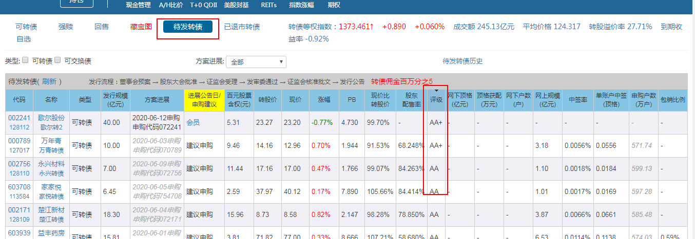

# 三个小技巧

## 博下修小技巧

“博”是赌博，“下修”指的是转股价下调。关于向下修正转股价条款，参考上面。

- 核心：
  博下修的套路，就是，购买满足下修条件却还没有发布下修公告的可转债，博公司会实行下修操作

- 分析

  - 博下修的好处
    一旦下调转股价，一张可转债能换到更过的股票，而此时可转债的价格大概率会上涨
    根据公式：转股价值 = 票面值 100元/转股价 * 正股价

    > 打个比方，现在有一只A可转债，现在的价格是80元，转股价是10元，正股价是7元，这时的转股价值是70元（100/10*7=70）。
    >
    > 如果公司下修了转股价，把转股价从10元下调到了8元，那转股价值会上涨到87.5元（100/8*7=87.5）。
    >
    > 伴随着转股价值的上涨，可转债价格也大致会涨到87.5元左右。我们假设在可转债价格刚好是80元时买入，又在转股价下调后，直接卖出，这几步简单的操作，就可以让我们获得大约9.4%的收益。【（87.5-80）/ 80≈9.4%】那如果下调转股价公告发布之后，你不打算卖出，想要继续持有，也是可以的。因为股价不断下跌，导致强制赎回条款不那么容易触发。但转股价一下调，正股价和强赎条款触发价格之间的距离，一下子就被缩短了，黎明的曙光也一下子明亮了起来。

  - 正股价一直低于转股价，但又没有实行下修转股价的话，最差的情况，就是你一直当债券持有，直到到期赎回，获得利息收益。

  - 对于投资者跟公司来说，下调转股价都是有利的，但会损害原持有这支股票的股东的利益。
    所以，可转债下修，必须要通过三分之二的股东同意才能有效，所以当大多数股东不同意下修时，可转债下修就不会成功。

## 升级版防守技巧

该技巧与回售条款息息相关，有关回售条款查看前文。该技巧分两种情况

- 第一种情况，持有可转债

  可能有小伙伴在“到期价值”以下买入了可转债，结果没等到正股上涨，触发强制赎回，反而迎来了正股下跌，下跌就算了，上市公司还不下调转股价。眼看着正股价一直跌，表面风平浪静，心里早就慌得不行。虽然这种情况比较少见，但这时候，如果你持有的可转债可以回售，并且已经在回售期满足了回售条件，那班长建议你赶紧回售。

  这种做法的好处是提高了资金的利用率。但是这样的做法也有不足，那就是：回售时有可能是亏的。如果买入价比回售价高，其实是不划算的。如果出现了这样的情况，这时候就要根据你的实际情况选择了。如果你不能忍受一丁点亏损，且不着急用钱，那么你完全可以持有到期，时间也不会很长，一般是2-3年的样子，拿到最后的利息加面值。

- 第二种情况，没有持有可转债

  因为回售是可转债最后的防守技巧，也就是说，即使可转债价格一直在跌，但是只要触发了回售，我们大概率不会亏钱，所以回售价也可以是买入价的一档。

  如果你的风险承受能力高，已经以“到期价值”建仓，以“回售价”加仓，以“面值”继续加仓，一共三档买入价格。

  我们以“国贸转债”为例，前面计算过(参考回售价解析)，它如果在第5年回售，那回售价是101.7；如果在第6年回售，那回售价是102。这时候就要根据实际情况判断了，

  如果你想要多一些投资机会，那么就可以在102建仓；如果你不想冒险，那么我们可以以101.7的价格建仓，反正最差也能以这个价回售给上市公司，不亏不赚。

  这里班长要说明一下，这里所有的计算都不包含手续费，如果要实际操作的话，还应该在回售价的基础上减去手续费的部分。具体手续费是多少，班长会在第十二课实操部分给大家介绍。

  说完了三档建仓，班长还想说另外一种投资逻辑，那就是两档建仓。

  如果你风险承受能力低一点，没有在“到期价值”建仓，还不想错过好的投资机会，那么你可以在“回售价”建仓，在“面值”加仓，这样一共是两档买入价。参考操作部分。

## 可转债打新

可转债打新，就是申购即将上市的可转债。

特点：门槛低，操作简单，可以增加资金的利用率。
操作步骤：

1. 申购
2. 等中签
3. 中签交钱
4. 等上市
5. 上市卖出

**技巧1：查看平均价格**

已上市可转债的平均价格=所有已上市的可转债当前交易价格的总和 / 可转债的总数量  表示的是可转债价格的平均数，相当于可转债的现在平均行情。通过以下方式查看

也可点击平均价格进去查看

如果平均价格小于100，就说明现在市场上，大部分可转债的交易价都小于100，如果平均价格大于110，就说明现在市场上，大部分可转债的交易价在110附近。如果平均价格大于110，意味着当前的可转债行情比较好，新上市的可转债，价格可能会追高到这个水平。所以当平均价格大于110时，就可以直接申购了。因为可转债的申购和发行会间隔2到3周时间，这段时间内可转债的行情很可能会发生变化。所以，建议大家看两次平均价格，提前了解可转债的情况。

第一次是在【申购当天】，判断自己该不该申购；第二次是在【上市前一天】，预估第二天上市的行情，就可以知道手上这只可转债大概率是亏损还是赚钱。“已上市可转债的平均价格”只是供大家参考，并不是说一定能避免破发。

**技巧2：查看可转债的评级**
理论上，评级越高的可转债破发的概率就越小。从历史数据中看，评级为AAA的可转债没有破发过。不过，考虑到AAA评级的可转债数量并不多，如果大家不介意有时会亏损个十几二十块的话，AA级以上的也可以申购，低于AA级的就不建议大家申购了。

**技巧3：何时卖出**
上市的可转债，就可以卖出啦，那可转债该怎么卖呢？上市当天就卖掉。为什么呢？

关于这个问题，其实可转债打新破发的概率不是很高，基本都是能涨的。如果股市行情好的话，新债上市的时候会涨个10%-20%左右，中1签能挣100-200元呢。如果行情不好的话，会发生亏损，一般最多亏个十几二十块。

那如果真的出现破发，亏损了怎么办呢？这里班长给两种解决办法：第一种办法是，卖出。这种办法的好处是，眼不见心不烦。因为亏也亏不了多少，最多十几块而已。第二种办法是，继续持有。可转债本身具有债券的性质，我们打新其实就相当于以面值价格买入可转债，所以是保本的。如果上市当天可转债出现了破发，亏损了十几块，而你一点也不想卖它，那就可以继续持有。等到它上涨到你心里合适的卖出价格就好啦，最差的结果就是可转债一直不涨，持有可转债6年拿到本金和利息。但是，这种情况可能会降低资金的利用效率。