# 实操

## 查看募集说明书

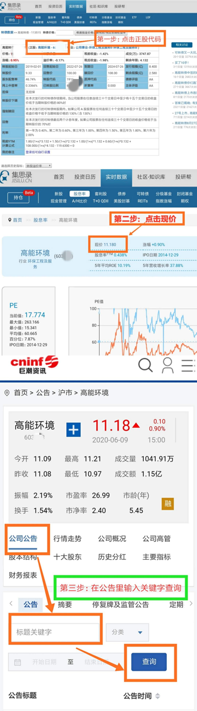

募集说明说需要关注的信息：

1. 可转债的利息和付息方式  

   

   

2. 转股期和转股价  
   

   转股价是可转债的核心， 那么我们也能在募集说明书中找到可转债的转股价和转股期  

3. 转股价向下修正条款  
   

4. 强制赎回条款  
   

   以上就是可转债的强制赎回条款， 不过在募集说明书中称为“ 有条件赎回条款”   

5. 到期赎回  
   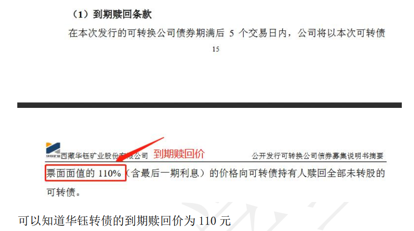

6. 回售条款
   

   

回售条款有两种， 我们都可以在募集说明书中找到。募集说明书中还有很多信息。 基本你想要的关于这只可转债的细节都能找到。  

## 查看强制赎回条款

1. 打开集思录官网
2. 找到可转债
   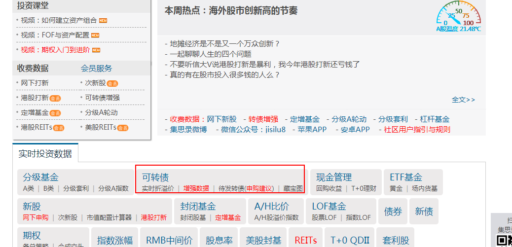

3. 查看强赎回
   

## 强赎天计数的五种情况

- **已公告强赎**
  

  这意味着这个上市公司发布了强赎公告，将鼠标移动到红色感叹号可以看到，可转债买卖和转股的最终日期。

  - 最后交易日：过了这个时间就不能自由买卖这只可转债了
  - 停止转股日：过了这个时间就不能把持有的可转债转换成公司股票了
  - 赎回登记日：过了这个时间，我们持有的可转债就会被上市公司强制赎回了
  - 赎回价格：上市公司强制赎回我们持有的可转债之后，给我们的钱

- **公告不强赎**
  
  这里表明，虽是符合强势的条件，但公司不行使强赎的权利；这里还有可能是赎回登记日还未确定

- **标红数字**

  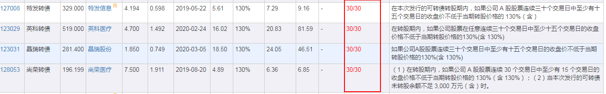

  只要是标红的数字，不管是15/30还是30/30都代表着公司已经满足了强制赎回的条件。但是公司还没有发布强赎公告。需要留意。

- **标蓝数字**
  
  图中华夏转债，9/30指的是上市公司的正股价在连续30个交易日内，有9个高于设定的阀值。标蓝意味着公司还没有满足强制赎回的条件

- 未到转股期
  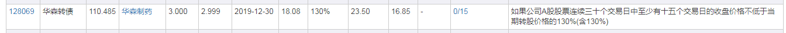
  图中表明该可转债尚未到转股期

## 查找公司公告

第一步：点击对应的可转债的**代码**，今日详情页面
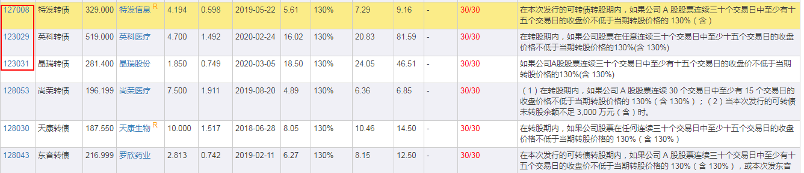

第二步：点击正股代码
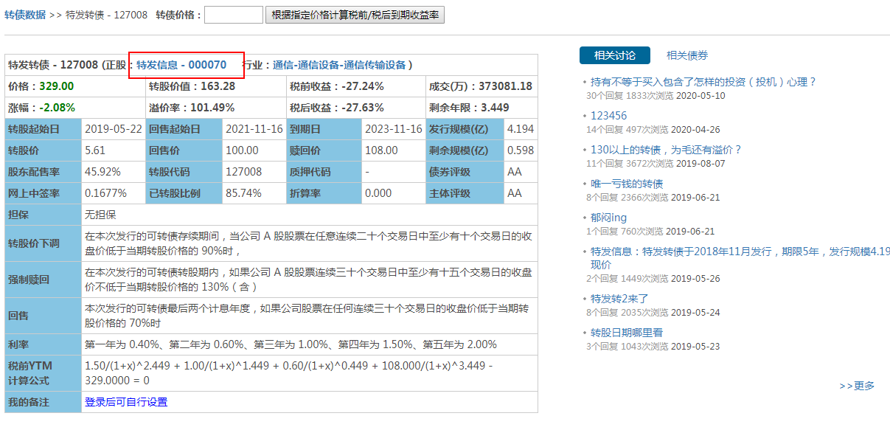

第三步：页面下拉，可以看到公告页面
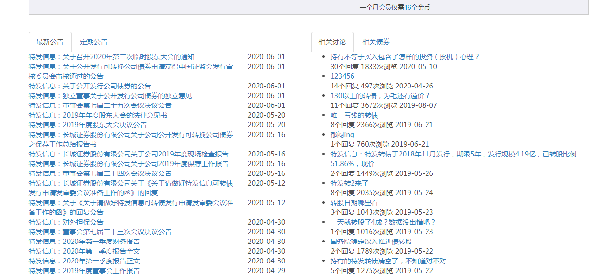

## 低风险分散组合筛选

筛选前说明:
在集思录中，筛选条件中的到期收益率是指到期税前收益率。但实际上，如果可转债没有强赎，也没有违约我们最后拿到手的钱是会被扣税的。而每家公司用的扣税方式不一样扣税比例可参考：0.3%~0.7%，平均大概在0.59%左右。

假设以税前收益率为1.85%(1.25%(最低收益率) + 0.6%(税率))来筛选
**第1步：填入税率**
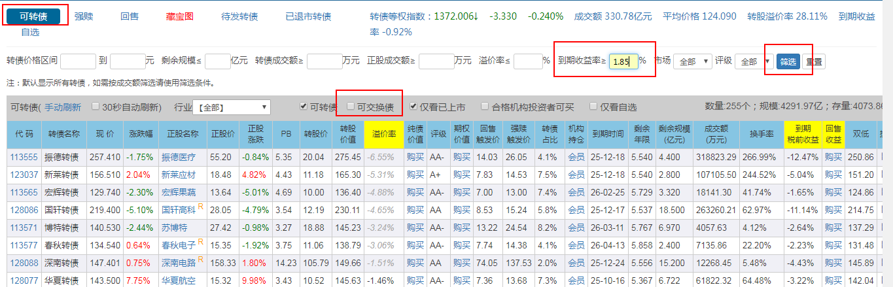

**第2步：用可转债评级缩小投资范围**
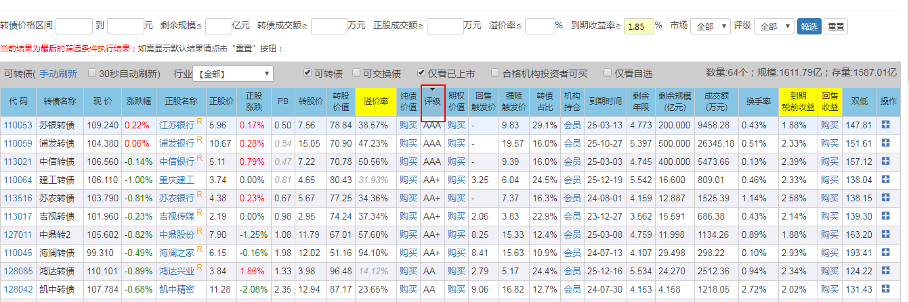

第3步：评级为AAA的跟AA+的可转债全部收下，在AA评级中按照到期收益率高低排名，选择高的，加在一起达成30只目标。先固定评级，然后对收益率进行排序

**第4步：买入单只可转债的金额不要超过投资可转债总金额的3%**。
比方说，我们有5万块，每只不超过3%，那每只最多买入1500元，相当于每只买1手。如果资金量比较大，比如说10万，按照每只不超过3%的投入，那每只可转债能买3手。

**第5步：卖出**
达到强赎条件时即可考虑卖出
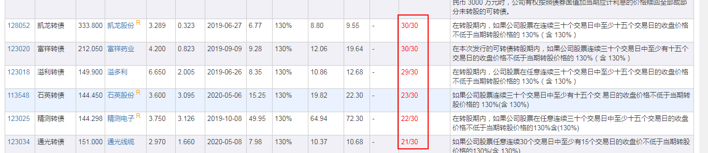

## 精选策略筛选

说明：集思录筛选用的到期收益率是到期税前收益率，如果我们想筛选出到期税后收益率大于等于0的可转债，可以在到期收益率那里**填0.59%左右**。
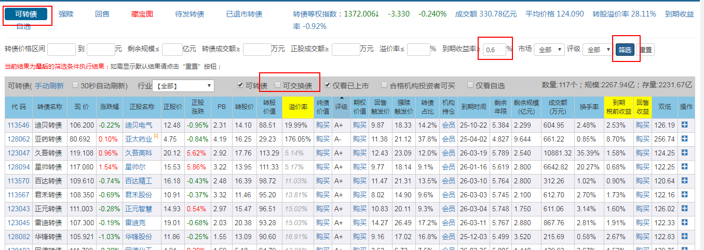

对评级排序

固定AA+评级，对收益率进行排序
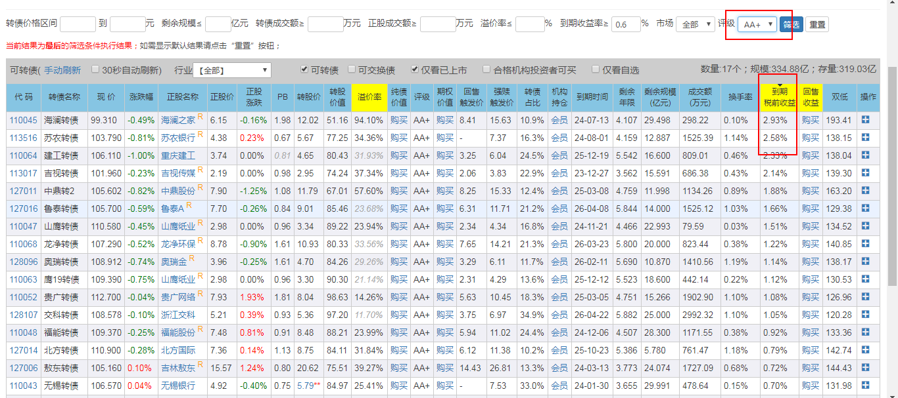

注意：AA+以下转债，在我们这个策略里是不要的。至此，我们的可转债就都选好了。以后，我们需要关注这些可转债的价格。**如果可转债的价格低于面值价，我们就要抓紧再次买入了。我们要的转债都买好之后，就可以等待满足强赎条件卖出了。**

## 查看下修条款

第1步：集思录中点击要查看的可转债的代码，进入详细页面

第2步：查看对应的可转债有没有下修
在可转债列表页面，在可转债界面上，转股价这一栏，有一部分转股价被标蓝，**并且转股价后边被打上了*号**。比如下边这个图：

点击标蓝的转股价，就可出现下修历史记录
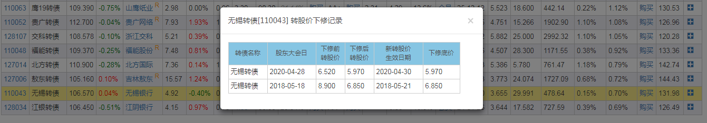

还要的转股价标蓝但没有*号的情况
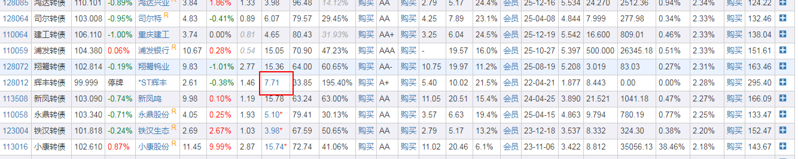

这里会有两种情况：
第一种情况是，这只可转债满足了下修条件后，发行公司提出了下修方案，股东大会的日期并未确定，或者确定了时间还没有开会。我们点击红框内的蓝色数字，就可以看到详情信息，如下图。

第二种情况是，这只可转债满足了下修条件后，发行公司提出了下修方案，但是下修方案并未被股东大会通过，同样是点击看到详情信息，如下图：
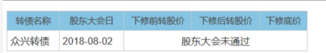

## 筛选博下修可转债

筛选的四个条件：

1. 在回售期内
   为什么呢？因为在回售期内，公司下修转股价的概率会大一些，所以我们“博下修”成功的概率也会大一些。如果没到回售期，我们还不能行使强卖的权利，公司就没有那么强烈的动力去下修转股价了，这时候进行“博下修”操作，很可能会失败。
2. 近一年没有因为满足下修条件下修过的可转债
   下调过，再下调的几率就不大了
3. 选择评级高于或等于AA级别
4. 到期税后收益率大于0

第一步：在可转债页面，对剩余年限从小到大进行排序
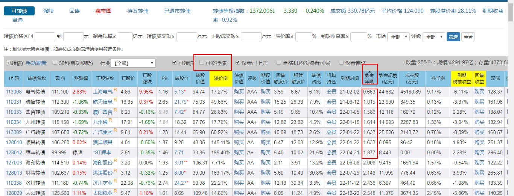

图上看出只有7只可转债的剩余年限<2，进入回售期

第2步：一年内没下修过。看转股价那一栏，如果转股价标蓝或者转股价后面有*,说明公司有相关下修的动作。
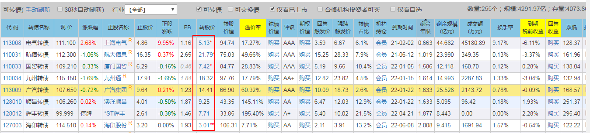

第3步：再跟进筛选条件的第3点跟第4点筛选出合适的可转债

## 查看有条件回售指标

列表页点击回售

这张截图就有我们想要的3个数据：回售期、回售触发价、回售价。

先说回售触发价，它就是转股价的70%。这是因为有条件回售条款就是以连续30个交易日，正股价低于转股价70%为条件的
“回售起始日”，这个数据是回售期开始的时间，意思是从这个时间开始，只要满足回售条件就能回售啦~

最后是回售价。无论是有条件回售还是附加回售，都涉及到回售价这个指标。集思录的“回售价”不准确。一般来说，回售价格有两种，一种是可转债上市时，募集说明书中规定的固定回售价格，另一种回售价=面值+当期利息。关于固定的回售价，我们可以直接看集思录，集思录上的数据是准确的。**但是，很多可转债的回售价在集思录上显示的都是100，没有加上当期利息，所以，关于回售价=面值+当期利息，我们是需要计算的**。计算方法参考上面的回售价名称解释

## 新债实操

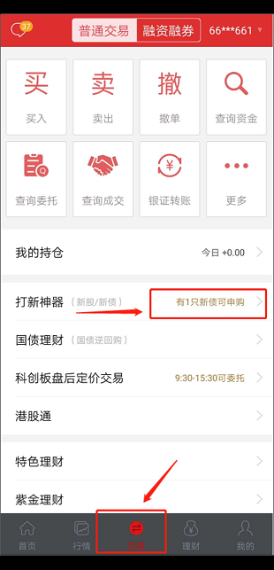

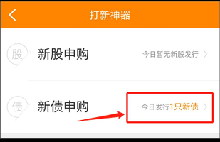

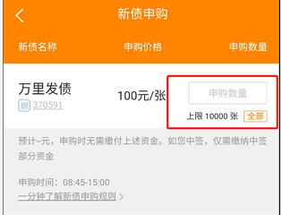

**按照信息提示把钱转到证券账户就好啦， 上市公司会自动扣钱的。 交完钱后我们就等着安心上市就好， 一般是 2-3 周。**  

第七步， 上市卖出， 怎么查看是否上市呢？  

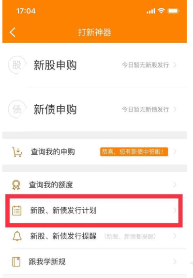

在隔两周左右的时候可以去券商 app 里， 经常专注一下是否公布上市时间  

## 查看可转债的历史价格

第一步：我们可以打开“涨乐财富通”（还是用华泰举例哦）

第二步：点击右上角的搜索。

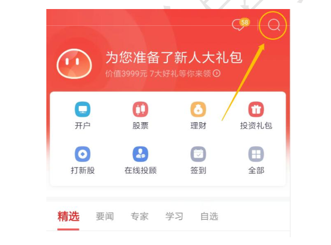

第三步，输入转债代码或名称，或者首字母，搜索到雨虹转债。

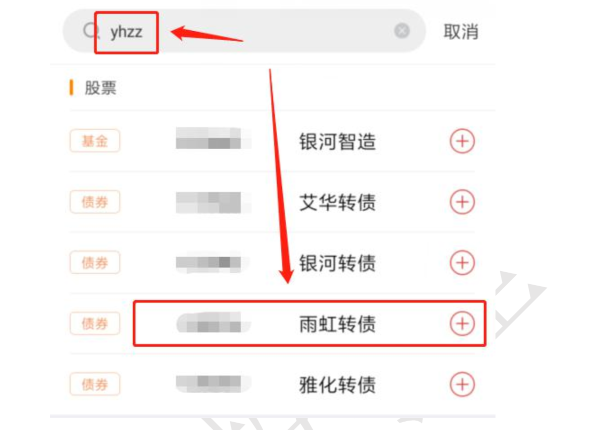

第四步，点击“月K”

到底如何用最高价的肩部卖出呢？有两种方法：
第一种：我们可以找到历史最高价并记录下来，一旦可转债的价格跌破历
史最高价的90%，就马上卖出。
第二种：用历史最高价直接减去10元的价格卖出。

比如多多转债在过去5天的价格分别是100元，130元，150元，180元，
110元。
那么多多转债当前出现过的最高价就是180咯。
那多多转债跌破180的90%，也就是162元；

或者直接减去10元，就是多多转债的价格跌到170元时，我们就可以马上
卖出了。

## 买卖可转债

**第一部分：买入**
说明：
这里要注意的是，虽然可转债的最小交易单位是10张，但在我们实际买卖中，填写买入数量的时候，上交所和深交所上市的可转债填写数量的方式会有所不同。简单的来说，当我们要用1000元买10张可转债的时候，上交所上市的，应该填写1，而深交所上市的，应该填写10；因为上交所和深交所可转债的申购单位是不一样的，**上交所可转债申购是以“手”为单位，一手等于1000元，所以我们实际买入的时候要填1；深交所可转债申购是以“张”为单位，每10张等于1000元，所以我们要填10。**

**如果可转债的交易代码开头两位数是11，那就是上交所上市的。如果是12，那就是深交所上市的。**

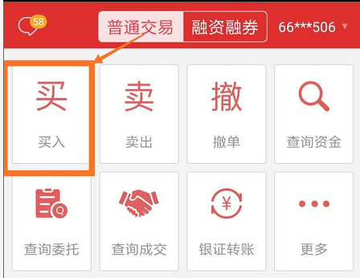

**第二部分：卖出**
注意点：

一是，可转债交易是T+0，也就是买入当天就可以卖出，另外在交易时没有股票那样的涨停跌停限制。

二是，转债的价格和股票的价格一样是实时波动的，我们可以自己设置买入的价格和卖出的价格，不过也要避免设置的价格太高卖不出去。

三是，可转债卖出获得的收益，会直接进入到你的券商账户中，到时候记得查收呀。

四是，可转债的买卖是需要手续费的，通常上交所和深交所的手续费也是不同的，一般来说上交所的默认是万分之二，深交所的默认是千分之一。但是不同的券商会有不同的折扣，具体可以咨询开户对接的客户经理。

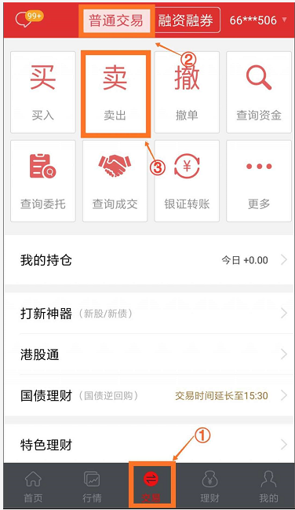

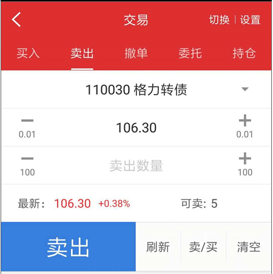

**第三部分：如何转股**

其实不推荐大家转股，因为虽然转债当天买入之后当天就能卖出，但转股之后，股票却需要再等至少一天才能卖出。什么意思呢？假设我们看股票涨势很好，想着转股之后卖出股票赚一波，但转股之后并不能立即卖出啊，要等第二个交易日才行。如果第二个交易日股票下跌了呢？那转股不仅赚不到，还很亏。因为没人能预测股市的短期波动，转股风险比较大，所以，不推荐大家转股 。
我们也知道，可以操作转股的可转债，必须处于转股期。转股期一般是在可转债发行后半年左右开始，到可转债到期为止，可能有的公司特殊一点，具体时间还是要看可转债的募集说明书。也可以直接看集思录，转股起始日，就是可转债可以开始转股的日期（下图
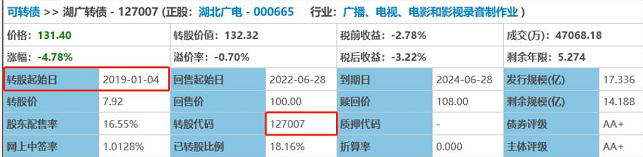

第三步：在债转股交易界面，输入可转债的转股代码以及想要转股的债券数量，委托账号会在我们输入转股代码后自动弹出，可以不用填写。

这里要提醒大家的是，沪市的转股代码和转债代码不一样，深市则一样。不过，不论是沪市还是深市，我们都可以在集思录的可转债详情页，看到它对应的转股代码。湖广转债的转股代码是127007，如果我们想要拿50张进行债券转股，那直接在数量处填写50即可。

那我们转股能获得多少股票呢？**公式：最终转股数量=面值100*转债数量÷当前转股价**

我们还是以湖广转债为例，在前面我们说到，想要用50张债券进行转股，湖广转债的转股价为7.92，那么我们获得的股票数量就是100\*50÷7.92=631.31。我们会发现，这样计算出来的数量往往不会是整数，但是大家放心，零头不会被直接抹去，不足一股的部分将以现金的形式，返还到券商账户里。上边案例里的这0.31股不足一股，将会以现金的形式返还到我们的账户中，返还金额为7.92*0.31=2.4552元。

## 设置智能盯盘

我们还是以涨乐财富通为例。

比如说我们关注的是晶瑞转债，现在的价格是119.503，你希望它降到100 元时再买入，而买入后希望它升到130后再卖出，那该如何设置盯盘呢？

第一步，你需要知道你要盯盘的转债代码，例如晶瑞转债的代码就是123031，然后你需要在涨乐财富通上搜索到这支可转债，会出现如下界面：

第二步，大家会发现右上角有一个加自选的模块，点击加自选，会出现如下AI盯盘的选项。

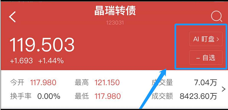

第三步：

