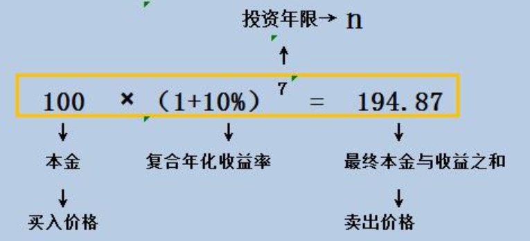
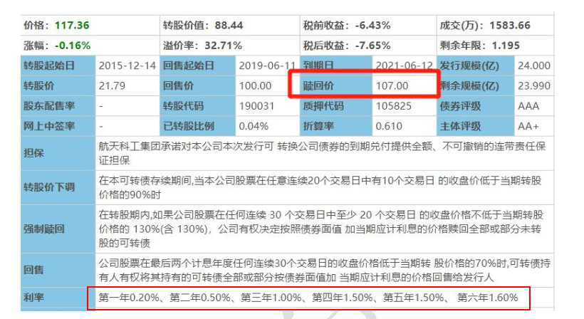
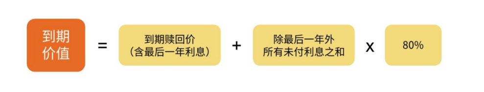
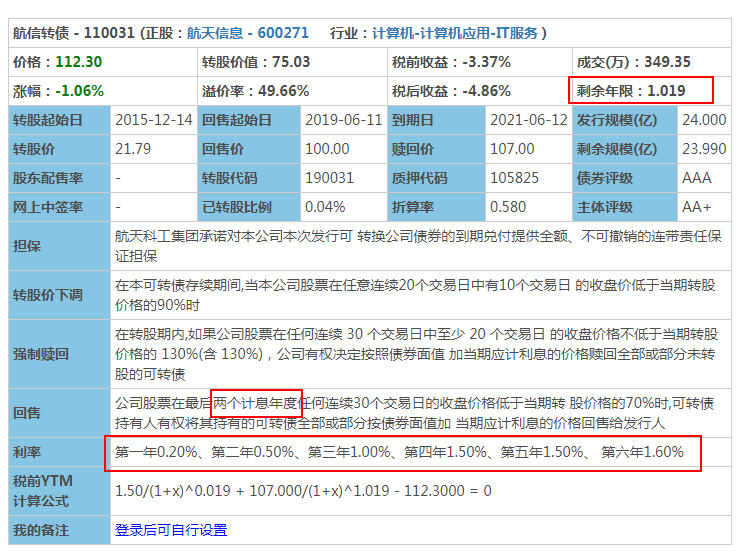
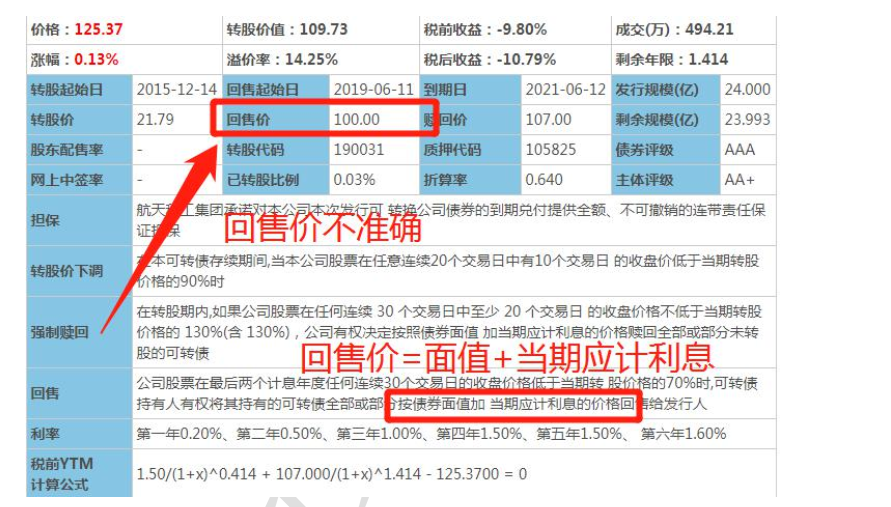
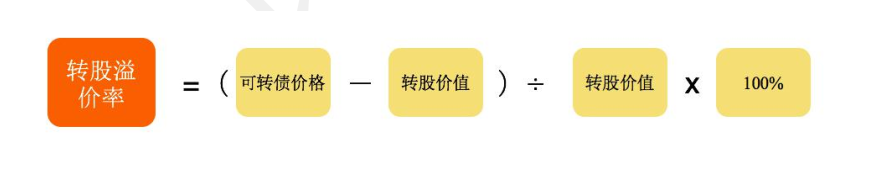
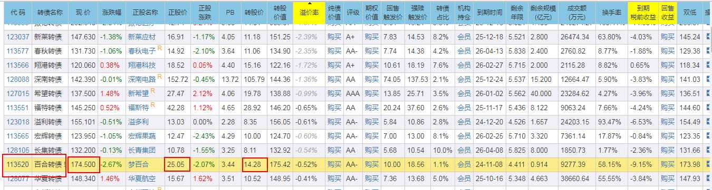

# 相关名词

## 可转债面值

可转债面值都是 100 元， 都是固定 100 元不会变的~  

## 收益率/复合年化收益率

又叫做投资收益率，简单来说就是你投资多少能赚多少的比例
计算公式：**收益率 = ( 卖出价格 / 买入价格 - 1 )  * 100%**
复合年化收益率，是在复利模式下每年能获得的收益率。
**复合年化收益率 = { （卖出价格 / 买入价格）^ （1/n))-1} * 100%**,**n为投资年限**
投资年限n大部分时间不是整数，可能是多少天，或者几年零多少天这就需要将天数换算成年数。

复合年化收益率推导：

## 到期赎回价

还是拿航信转债来举例说明， 到期赎回价说的是， 持有这个可转债 6 年到期了， 第六年的利息本来是 1.6%× 100=1.6  但是公司为了奖励我们借钱给他那么久， 就说多支付点儿， 大家都开心， 在发行的时候就约定好了， 到期了会按照 107 元/张赎回可转债~  到期赎回价也可以直接在集思录中看到的  

**到期赎回价， 也就是说， 在公司不违约的情况下， 持有可转债到期， 公司会按照这个赎回价来赎回投资者手中的可转**债  

## 到期价值

我们之前说过，每一张可转债，都可以理解为一张票面为100元的欠条，而到期之后，发行可转债的公司需要连本带息地还你钱。我们这里的“到期价值”指的是，**持有至可转债到期时，每一张可转债公司要还给你的钱，再加上利息再扣掉税**。

首先，到期赎回价=面值 100+最后一年利息+公司奖励  

根据我们的到期赎回价=面值 100+最后一年利息+公司奖励， 那我们就能得出这个海澜转债的到期赎回价 108 元是包含第 6 年的利息的也就是说持有到期， 公司一张可转债给我们 108 元， 里面包含 1.8 元利息的 。所以， 在计算到期价值时我们不用看第六年的利息， 直接看赎回价就可以了。   

那为什么最后一年不用乘 80%， 用其他年份的未付利息之和乘以 80%呢？因为可转债每年的利息， 个人投资者要缴 20%的利息税， 所以其他年份的收益要扣掉税收的部分， 那就剩下 80%了  

所以， 到期价值的计算就简化为：  
到期价值=到期赎回价+除最后一年外所有未付利息之和*80%  以维格转债为例， 一起计算一下。

它的付息日是每年的 1.24 日， 今年 1 月底满一年后， 已经付过第一年的利息了 ,所以未付利息指： 第二年， 第三年， 第四年， 第五年的利息， 以及最后的到期赎回价  
维格转债的到期价值=（0.7+1+1.5+2） *80%+115=119.16。  

## 年化到期收益率

以当下的价格买入可转债，等可转债到期赎回时，每年可以获得的收益率
到期收益率=（可转债到期价值-可转债买入价格 ） / 可转债买入价格  
这个公式里， 可转债到期价值 减 可转债买入价格 就是每张可转债的到期总收益 。结合上图可以看出，维格转债在价格92.17时候买入，那么， 维格转债的到期收益率=（119.16-92.17） / 92.17= 29.28%  
需要注意的是， 我们知道每个转债的剩余年限是不一样的， 如果只用到期收益率的总结果进行对比， 就会存在一定问题的。  因此， 我们需要将到期收益率年化， 也就是， 用到期收益率除以剩余年限。  
年化到期收益率（单利） =到期收益率 / 剩余年限  
维格转债的年化期收益率（单利） = 29.28%/4.627 = 6.33%  

## 可转债面值

可转债的面值始终是发行时的100元不变

## 可转债价格

可转债本身是一种可以交易的商品，有其自身的交易价格，经常讨论的价格涨跌，说的都是可转债的交易价格

## 正股价

发行可转债的公司一般都是上市公司。上市公司自然会发行股票，也就是说，每一只可转债都会对应着一只股票。
这里可转债对应的股票，在股票交易市场之中，在股票交易市场中有一个交易价格。我们称之为正股价

## 转股价

可转债在一定的条件下，可以按照一个约定的价格，被转化为对应的股票。这个约定的股价，就是转股价。
转股价是如何定出来的呢？
首先对于投资者，当然是希望转股价越低越好

> 可转债的面值是100元，假设转股价是10元/股，那么这张可转债可以换成100/10=10股，假设转股价是5元/股，那么这张可转债可以换成100/5=20股。我们可以看出，转股的数量差1倍。
> 假设股票每股涨了2元，那转股价是10时，转股后只能赚20元，但转股价是5时，转股后却能赚40元，收益多了一倍。

但是，转股价低，公司就吃亏：
根据公式：股票价格=市值/总股票数量，可转债转股的时候，上市公司的市值基本不发生变化。那如果因为转股价定的低，导致可转债能兑换成更多数量的股票，就会让总股票数量变多，股票价格就会下跌。也就是说，上市公司啥都没干，手里的股份就亏钱，而且亏得还不是1块2块这么点，几百万甚至十几亿都有可能。

为了平衡双方的利益，中国证监会出台了一系列的政策，现在都是按照这个规定来确定转股价，这条政策就是：
**转股价以本可转债募集说明书公告日前20个交易日公司股票交易均价和前一交易日公司股票交易均价二者之间的较高者。**
也就是，我们用募集说明书公告日前**20个股票交易日的平均交易价格，和前一日的交易平均价格，做比较，价高的那个就是转股价。**

> 某上市公司想发行可转债，它的可转债募集说明书公告日  前20个交易日公司股票交易均价为9.5元，假设公告日前一交易日公司股票交易均价为10元，10＞9.5，那么转股价就被定为10元；假设到公告日前一交易日公司股票交易均价为9元，9.5＞9，那么转股价就被定为9.5元。公司发行时会一并算好均价。

转股价并不是一成不变的，它会根据公司的发展调整。

## 可转债转股价值

转股价值 = 面值 / 转股价 * 正股价

## 转股期

指债券持有人可以将发行人的债券转换为发行人股票的起始日至结束日。
转股期是转股价的附属品，它规定了可转债发行上市以后，必须经过一定的时间之后才能转换成股票。

## 回售期

回售条款生效的时间

## 回售价

是触发回售条款时， 我们可以将持有的可转债以多少价格卖回给公司。  
**回售价格有两种，一种是可转债上市时，募集说明书中规定的固定回售价格，另一种回售价=面值+当期利息。下面计算回售价：**

根据图中的资料，第5年的利息是：100  * 1.5% = 1.5，回售价 = 面值 + 利息 = 100+ 1.5  = 101.5；第6年的利息是：
100  * 1.6% = 1.6 回售价 = 面值 + 利息 = 100+ 1.6  = 101.6

再举个例子:

航信转债， 发行日是 2015 年 6 月 12 日， 到期日是 2021 年 6 月12 日， 会在每年的 6 月 12 日付息， 遇到节假日顺延 
航信之前已经付息 4 次啦， 那么现在就按照第 5 年的利率来计算  知道了这个， 咱们来看看， 航信的回售公告  

**发布回售公告， 一般会给投资者一个回售申报期， 一般是一周~在这个时间段内， 可以把转债按照回售价， 回售给公司**， 这个是我们的权利， 公司不能拒绝  我们计算下航信的回售价， 从 2019 年 6 月 12 日起， 到 2020 年 1月 8 号， 总共是 210 天~按照第 5 年的利率 1.5%来计算， 一整年（365 天） 的利息是 100× 1.5%=1.5 元资金只占用 210 天， 按比例计算， 利息就是 1.5÷365× 210=0.86元 再加上转债的面值， 回售价=100+0.86=100.86 元/张  

## 存续年限

存续年限就是从开始上市到退市结束， 这只可转债一共存在了多长时间。

## 可交换债  

名字后带“EB” 的就是可交换债  可交换债是公司股东发行的， 不是公司发行的， 相对来说风险更大 。可转债， 缩写是是"CB”  

## 转股溢价率  

转股溢价率是怎么计算出来的 ?

转股溢价率计算的， **就是可转债现价和转股价值之间的差距。**  

那么， 如果想知道现在转股能不能赚， 当然就要用转股价值跟可转债价格作对比啦

我们打个比方， 小明找班班借 100 块钱， 打了个欠条， 那么这个欠条就值 100 块钱了。假如到了还钱的时候， 小明手头紧， 拿不出这 100 块钱， 就说， 班班呀， 我拿我刚买的一个长投周边（主题礼品） ， 跟你换这个欠条， 怎么样？ 那如果这个长投周边的价格超过了 100 块， 班班就可以考虑要不要换了。但是如果这个长投周边的价值比 100 块低， 那我也不傻， 肯定不会换嘛  。所以， 这个欠条也就是可转债的价格， 长投周边呢， 就是转股价值。  如果可转债价格比转股价值高， 转股肯定没有赚头。  如果可转债价格比转股价值低， 转股可能会有点赚头， 并且越低，赚头越大。所以表现在转股溢价率上面， 就是可转债价格比转股价值高， 转股溢价率就是正数， 那么这时候转股肯定是不太值得的。  可转债价格比转股价值低， 转股溢价率就是负数， 这时候转股还是有点赚头的， 而且负得越多， 赚头越大。    

下面距离举例计算转股溢价率

转股价值  = 面值 / 转股价 * 正股价 =  100 / 14.28 * 25.05 = 175.42(可对比上图)
转股溢价率 = （可转债价格 - 转股价值） / 转股价值 * 100% = -0.52% (可对比上图)
转股溢价率可直接在集思录中查看到。溢价率灰色代表未到转股期。 

我们刚刚已经知道了， 转股溢价率是负数， 这时候转股是有那么一点点赚头的  。但是我们买卖可转债， 买卖股票， 都是需要手续费的
需要注意两点：  

第一点， 手续费：
1、 可转债买卖有手续费。 不同的券商， 手续费会不同。
2、 可转债转股操作没有手续费。
3、 股票卖出有手续费。 一般来说每笔手续费的最低起点是 5 元  

所以， 看溢价率转股套利的操作， 一般需要： 买可转债---转股---卖出股票所以， 可转债价格与转股价值的差距， 至少要有 5 元以上， 我们才可能赚钱~  而且！ 转股以后 T+1 第二天才能卖出股票  

第二点， 转股溢价率是变动的。  可转债价格和正股价是随着时间变动的， 时间不同数据也就不同。 而
转股价， 也可能会因为各种情况发生调整。  