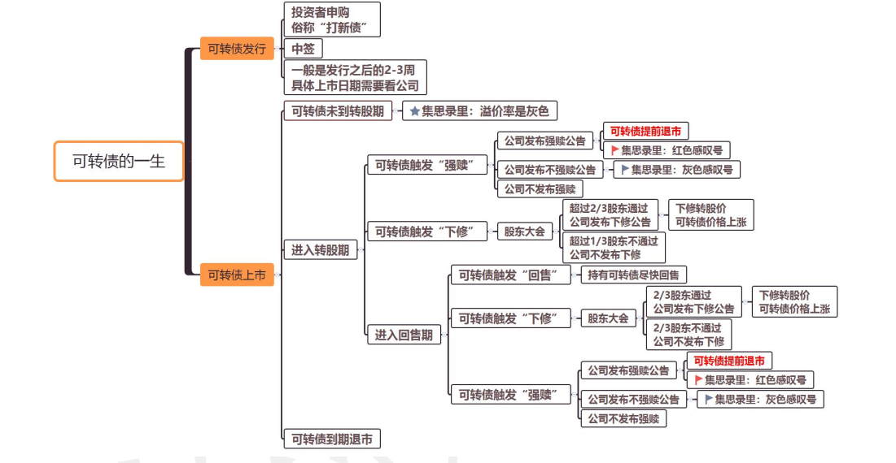
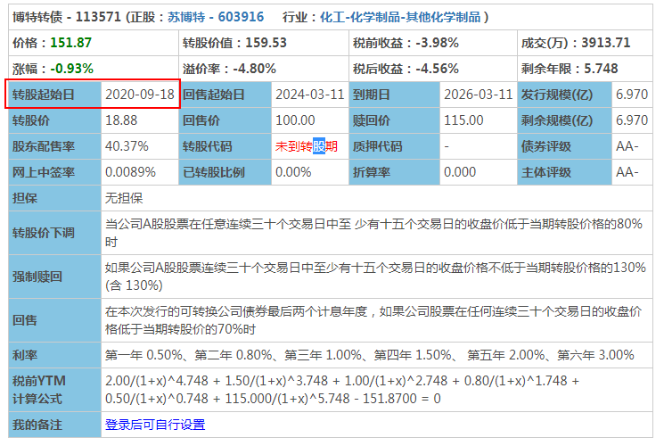

# 可转债的一生

## 可转债发行  

可转债发行日， 我们可以申购新债， 也就是我们一直在做的打新债的那一天。  然后等 2-3 个星期， 新债就会上市， 具体上市日期在集思录或者是券商软件里都可以查看。大家记得及时关注下， 一般会在快上市的前几天会有显示具体的上市日期哒  

## 可转债上市到退市  

这阶段可转债又分为未到转股期和转股期  

1. **未到转股期（发行之后， 前 6 个月）**  
   可转债上市后， 就意味着我们可以在场内和其他路人甲乙丙们进行交易啦。  我们知道可转债是可以在一定条件下转换为股票的债券，这个一定条件就是转股期， 一般在可转债上市的前 6 个月， 还不是转股期， 我们只能买卖， 不能转股。未到转股期在集思录上的表现就是溢价率为灰色。  
   那么如果这段期间我们持有可转债， 可能会遇到什么情况 ?
   1. 首先肯定是无法满足强赎的， 也不能转股。  
      
   2. 下修虽然理论上是可以的， 但是一般也不会有公司会在还没到转股期时下修， 因为他们下修就是为了促进转股的 
   3. 回售是有可能发生的， 但是只限于附加回售条款， 也就是这期间公司如果改变了募集资金的用途被证监会发现了的话，就会触发附加回售条款， 附加回售条款在可转债一生中任何时间都是有可能发生的。  
      附加回售触发时间： 可转债存续期内的任意时间  
      附加回售触发条件： 公司改变可转债所募集资金的用途。  附加回售对我们的影响： 我们可以选择将可转债回售给公司， 也可以继续持有， 等待强赎或者持有到期。  
      有条件回售条款则是不可能的， 因为还没到回售期嘛  
2. **转股期内（发行后 6 个月-退市）**
    在转股期内可转债可能会强赎、 可能会下修、 也可能会回售、 还有可能平平淡淡一直到期赎回。  
   1. **强赎条款**  
      强赎触发时间： 转股期内的任一时间段都有可能。 
      强赎触发条件： 如果公司股票在任意连续 M 个交易日中至少有 N个交易日的收盘价不低于当期转股价格的 X% 或者 本次发行的可转债里面， 没有转股的余额不足多少人民币时， 那么上市公司有权按照略高于可转债面值的一个约定赎回价格， 赎回全部或部分未转股的可转债。  满足强赎对我们的影响： 触发强赎， 就是我们收获的信号啦， 也就是集思录“强赎天计数” 标红的时候了。  这里划重点： 强制赎回是公司的权利， 不是义务， 也就是强赎触发后， 公司不一定会发布强赎公告。  
      如果公司发布了强赎公告， 我们应该怎么办呢？  那就更要及时卖出或者转股了， 这里大家不要等到最后一天， 因为发布公告以后就没有 130%的限制了。即使强赎期间， 可转债的价格也是可能下跌的， 不要想着最高点卖出， 价格差不多， 我们就可以卖出了。  一旦公司发布强赎公告， 就意味着可转债的使命完成了， 要提前
      退市了， 那么他的一生也就结束啦。
   2. 下修条款  
      下修触发时间： 存续期内的任一时间段都有可能。  
      转股价下修条件： 当公司股票在任意连续 M 个交易日中至少有 N个交易日的收盘价格低于当期转股价的 X%  下修条款对我们的影响： 我们可以使用博下修策略， 根据课程博下修的筛选条件， 选出合适的可转债， 博公司会下调转股价， 然后在可转债价格上涨的时候， 及时卖出， 赚取差价。  注意： 下修转股价不是一定要在回售期内才会发生， 只是在回售期公司下修的概率比较大， 毕竟不下修就要还钱。  但是也不一定在回售期一定会下修， 毕竟下修转股价会对股东的利益有影响， 超过三分之一的股东不同意， 都没有办法下修成功哦。  
   3.  回售条款   
      有条件回售触发时间： 规定的回售期内， 一般是可转债存续期的最后两年。 （也有的是最后三年）  
      有条件回售触发条件： 在回售期内， 如果公司股票收盘价在任何连续 M 个交易日低于当期转股价的 X%  也就是如果正股价还在往下跌， 我们还有回售条款可以保护投资者。  
      有条件回售对我们的影响：  假如我们持有的可转债， 没有希望触发强制赎回， 正股价一直
      往下跌， 公司也没有下修转股价的打算， 小伙伴们又不想把资金耗在这里。那我们就可以等持有的可转债触发回售条款， 及时回售给发行公司。  
      我们可以利用回售价， 使用防守小技巧提前做好进一步防守，加一层安全线。  也就是可以使用三档建仓， 在到期价值建仓、 回售价加仓、 面值价加仓。  