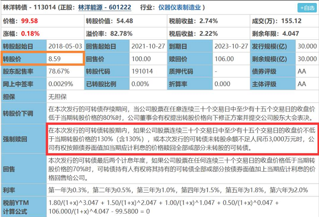
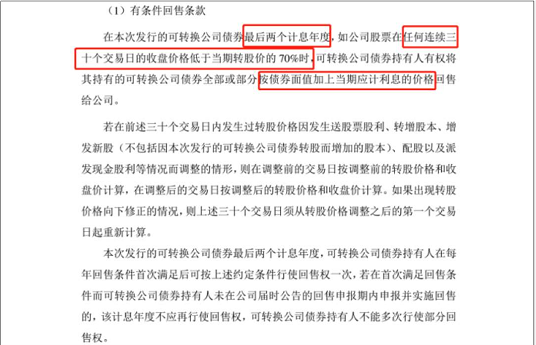
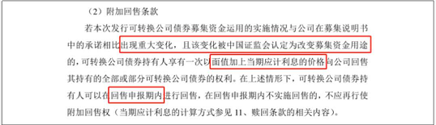

# 四大要素

## 转股价

可转债最大的特色就在于“可转换”为股票，所以以什么样的价格转换成股票，无疑是最重要的指标。那么转股价是如何确定的呢？
目前基本都是按照这个规定来确定转股价：

> “以本可转债募集说明书公告日前20个交易日公司股票交易均价和前一交易日公司股票交易均价二者之间的较高者。

为防止公司有如下操作：

- 首先在发行可转债前20日尽量打压股价，使得股价尽量很低；
- 然后在发行后，马上放出大量好消息刺激股价大涨，造成强制转股的条件，促使大量可转债持有人大量转股；
- 转股完毕后，马上打回原形，股价下跌，反正可转债的钱拿到手里了，股价与我何关乎？

证监会出台了转股期：
转股期是指债券持有人可以将发行人的债券转换为发行人股票的起始日至结束日。转股期是转股价的附属品，它规定了可转债发行上市以后，必须经过一定的时间之后才能转换成股票。这就等于限定了以上情况的发生，促使企业借到钱以后尽量用在生产上，而不是用来操纵股价牟取暴利。

> 套利小锦囊：值得需要特别指出的是：上市公司为了自己的利益，往往在可转债募集说明书公告日前的一些时间段，尽量放出利好刺激股价上升。这样可以将转股价的门槛定得高一些，未来转股的时候可以融到更多的钱。所以，擅长做短线的投资者可以利用这个机会适当参与博弈，进行套利。不过，这种套利是比较脆弱的，上市公司虽有拉抬股价的动力，但往往是动用利好而不是真金白银，具体成功与否还要看大市是否配合。

转股价不是一成不变的，在正式发行之后，当上市公司因送红股、转增股本、增发新股或配股、派息等情况（不包括因可转债转股增加的股本）使公司股份发生变化时，将按照一定的规则和公式，进行转股价格的调整。

## 强制赎回条款

- **具体内容：**
  **在可转债转股期内，如果本公司股票市场价格在一定的时间段内，高于设定的一个阀值（一般是当期转股价的130%），那么上市公司有权按照略高于可转债面值的一个约定赎回价格（一般是103元）赎回全部或部分未转股的可转债。**

- **具体分析：**
  

  **第一种情况是**，“在本次发行的可转债转股期内，如果公司股票连续三十个交易日中至少有十五个交易日的收盘价不低于当期转股价格的130%（含130%），公司有权按照债券面值加当期应计利息的价格赎回全部或部分未转股的可转债”。

  我们可以看到，图片中它的转股价是8.59元，它的正股价如果在连续30个交易日中有15个以上超过了11.17元，也就是转股价8.59的130%，那么“公司有权决定按照债券面值加当期应计利息的价格赎回全部或部分未转股的可转债”。也就是说，在转股期内，如果林洋转债的正股价在连续30个交易日里有15个超过了11.17元，就满足了强制赎回的条件。这时，林洋转债背后的上市公司需要先召开董事会。如果董事会同意强赎，那公司就会发布强赎公告，提醒投资人在某个规定的日期前，尽快卖出可转债或者转股；如果董事会不同意，那公司就会放弃强制赎回的权利。

  **第二种情况是**，“本次发行的可转债未转股余额不足人民币3000万元时，公司有权按照债券面值加当期应计利息的价格赎回全部或部分未转股的可转债”

  上图中的剩余规模处我们可以看到，林洋转债现在未转股的余额是30亿。根据《上海证券交易所股市上市规则》中的规定，一旦这个数字跌下了3000万元，公司也有权发布公告，强制赎回持有人手中的可转债。

- **为什么说强制赎回条款是胜利的曙光**
  **关键点一：满足签署条件**

  满足条件，意味着可转债的正股价肯定高于转股价的130%，根据公式 **转股价值 = 面值 / 转股价 * 正股价** 此时的转股价值等于面值的130%，也就是130。

  一般来说，当可转债进入转股期后，可转债价格是不会低于转股价值的。因为如果可转债价格低于转股价值的话，因为转股之后获得的股票价格更高，必然有激进的投资人买入可转债然后转股套利赚钱。直到没有可套利的空间，把可转债价格拉高到转股价值为止。因此我们可以知道，此时可转债价格是大于130的。如果我们是以面值100买入，就意味着至少赚30%。

  **关键点二：发布强制赎回公告**

  如果经过股东大会通过，公司同意发布强制赎回公告，那意味着我们知道了可转债买卖和转股的最终日期。在这个日期之前，大家一定要完成可转债的买卖或者转股，否则公司会以债券面值加当期应计利息赎回我们手中的可转债。就拿之前提到的林洋转债来说，如果林洋转债公告强赎了，那我们会知道一个日期，公司会在当天以债券面值加当期应计利息赎回。即使强赎发生在第六年利率最高的时候，我们100块买的可转债，也只能拿回102元。明明能赚30，最后却只赚到2块，真的太惨了。

## 向下修正转股价条款

了解了转股价，就更有必要了解和转股价息息相关的转股价下调条款。
假设碰到极端情况，在发行可转债以后，股市节节下跌，上市公司股票也是掉头向下，已经远远低于转股价，可转债基本已经毫无转股价值。对于投资者来说起码可以到期拿到100元本金，外加少少的利息。但对可转债发行公司，如果投资者未能转股，上市公司就得还钱。于是，正是基于“把债主变成股东”的伟大动力，上市公司在募集说明书中会提出“下调转股价条款”，又名“向下修正转股价条款”。
**“下调转股价条款”的基本思想是：**

> 假如上市公司的股票市场价，在一定的时间段内，低于设定的一个阀值，那么上市公司有权在一定的条件下下调转股价。下调修正后的转股价格一般应不低于一个特定日期前20个交易日内该公司股票交易均价和前一交易日均价之间的较高者，同时修正后的转股价格不低于最近一期经审计的每股净资产和股票面值。

以**深圳机场可转债募集说明书中的“转股价格向下修正条款**”为例说明：

> （1）修正权限与修正幅度
> 在本可转债存续期间，当本公司股票在任意连续20个交易日中有10个交易日的收盘价低于当期转股价格的85%时，公司董事会有权提出转股价格向下修正方案并提交本公司股东大会表决。
> 上述方案须经出席会议的股东所持表决权的三分之二以上通过方可实施。股东大会进行表决时，持有本可转债的股东应当回避。修正后的转股价格应不低于本次股东大会召开日前20个交易日本公司股票交易均价和前一交易日均价之间的较高者，同时修正后的转股价格不低于最近一期经审计的每股净资产和股票面值。若在前述20个交易日内发生过转股价格调整的情形，则在转股价格调整日前的交易日按调整前的转股价格和收盘价计算，在转股价格调整日及之后的交易日按调整后的转股价格和收盘价计算。
>
> （2）修正程序
> 如本公司决定向下修正转股价格时，本公司将在中国证监会指定的信息披露报刊及互联网网站上刊登股东大会决议公告，公告修正幅度和股权登记日及暂停转股期间。从股权登记日后的第一个交易日（即转股价格修正日），开始恢复转股申请并执行修正后的转股价格。若转股价格修正日为转股申请日或之后，转换股份登记日之前，该类转股申请应按修正后的转股价格执行

当本公司股票在任意连续20个交易日中有10个交易日的收盘价低于当期转股价格的85%时”，也就是说，比如现在深圳机场可转债的转股价是5.66元，如果深圳机场股票价格在任意连续20个交易日内有10个交易日低于5.66元的80%——也就是4.81元，那么公司“有权提出转股价格向下修正方案并提交本公司股东大会表决⋯⋯方案须经出席会议的股东所持表决权的三分之二以上通过方可实施⋯⋯转股价格应不低于本次股东大会召开日前20个交易日本公司股票交易均价和前一交易日均价之间的较高者，同时修正后的转股价格不低于最近一期经审计的每股净资产和股票面值。”可见，通过“向下修正股价条款”，上市公司可以合法地通过适时下调转股价，降低持有人转股的门槛，促进持有人转股，把持有人牢牢绑定在自己的马车上。

**需要注意的是，向下修正转股价条款是带有很多附加限制条件的，如“有权提出调整”说明仅是“权利”而不是“义务”；提交股东大会能否通过还需要一定的票数；就算是实施了，具体下调到哪里也有限制；此外，有的可转债进入转股期后才能向下修正，也需留心。**

## 回售条款

回售保护条款的核心思想是这样的：
在可转债存续的一定时间内，如果公司股票收盘价在N个交易日低于当期转股价格的一个阀值（这个阀值一般要低于向下修正转股价）时，可转债持有人有权将其持有的可转债全部或部分按面值的103%或面值100元+当期计息年度利息回售给本公司。任一计息年度可转债持有人在回售条件首次满足后可以进行回售，但若首次不实施回售的，则该计息年度不应再行使回售权。
以深圳机场可转债募集说明书的“回售保护条款”（原文是“有条件回售条款”）：

> 在本可转债最后两个计息年度，如果公司股票收盘价连续30个交易日低于当期转股价格的70%时，可转债持有人有权将其持有的可转债全部或部分按面值的103%（含当期计息年度利息）回售给本公司。任一计息年度可转债持有人在回售条件首次满足后可以进行回售，但若首次不实施回售的，则该计息年度不应再行使回售权。
> 若在上述交易日内发生过转股价格调整的情形，则在调整前的交易日按调整前的转股价格和收盘

这就意味着，假设深圳机场的股票价格达到了下调转股价的触发条件——在任意连续20个交易日中有10个交易日的收盘价低于当期转股价格的85%，也就是转股价5.66元×85% = 4.81元时——深圳机场公司没有提出下调转股价，或者提出了下调转股价提案但被股东大会否决了（纯属举例，请勿当真），持有人该怎么办？答案是：没法办。这是合法的！然而事情还没完！这时候，如果股市继续低迷不振，深圳机场公司也没有什么救市措施的话，股票和可转债会双双继续下跌。

当深圳机场的股票下跌达到了“回售保护条款”的触发条件：公司股票收盘价连续30个交易日低于当期转股价格的70%时，也就是5.66元×70% = 3.96元时，转机出现了！如果上市公司继续无所作为，可转债持有人有权将其持有的可转债全部或部分按面值的103%（含当期计息年度利息）回售给本公司！公司股价跌得再惨，持有人也能拿回103元；如果是在100元以下买的可转债，还能稳稳小赚5%、10%的！请注意：这里可是可转债持有人“有权”了，立即执行，无需股东大会批准！

这就意味着，如果走到这个地步，上市公司会将全部已经借到的钱，全部归还给持有人，自己的超低息五六年借款计划提前终止，“债主变股东”一分钱都不还的转股融资大计也算是彻底流产了！基本上，所有的上市公司都不愿意面对这样的结果，早知如此，何必当初花费那么多的人力物力去发行什么可转债呢？那可是一个漫长而又复杂的精密工程啊！所以，所有上市公司都会在回售价触发之前采取行动，要么拉抬股价，要么主动下调转股价，尽量远离回售保护区，起码保证当年不触发。回售价也就自然成了一个保底价。

**以上参考《可转债投资魔法书》，以下参考可转债训练营**

该技巧与回售条款息息相关。现在回售条款分两种。一种是条件回售条款，一种是附加回售条款。以和而转债为例说明

- 最后计息年度：指的就是回售期
  这个条件规定了可转债回售必须在回售期内，回售期一般是最后两个计息年度

- “连续30个交易日”“正股价低于转股价70%”，举例说明

  > 假设“和而转债”连续20日的正股价都低于转股价的70%，到第21日，正股价突然就上涨了，高出转股价的70%，那不好意思，回售条件不成立，下一次想要满足回售条款，又重新连续30日。
  >
  > 这个条件看起来非常严苛对不对，那是因为回售对公司意味着还钱。对于不想还钱只想把债主变成股东的公司来说，当然不能随随便便让回售成功。

- "面值加上当期的利息价格"
  指回售价格，意思是我们最后能够以这个价格卖回给公司

附加回售条款

关键词解释：
解释一下，如果上市公司发行可转债募集的钱实际用途发生了重大变化，而且证监会判定这个改变是存在的，那么持有者就有权利把手里的可转债以回售价格——面值加上当期利息，在回售申报期内回售给公司。

如果上市公司的资金用途真的发生了重大变化，确定触发了附加回售条款，那不论这只可转债在哪个时间段都会触发，一定会有相应的公告提示回售的，我们可以直接在自己的券商软件里查看。在“有条件回售条款”里，清晰地写出了回售的严苛条件，让投资人没那么容易回售；在附加回售条款里，又给了投资者保护，假如上市公司募集到了钱却不干正事，那么证监会也会插手。当然“有条件回售条款”并不是所有可转债都有。不同的可转债回售条款会根据实际情况略有不同