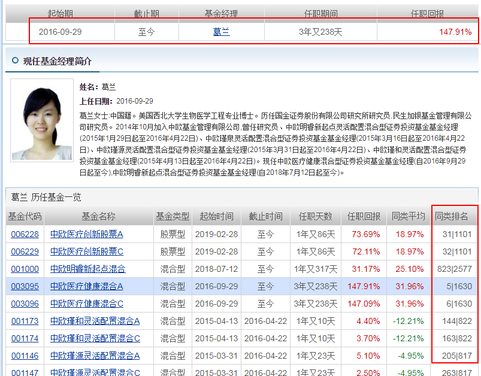

# 2 什么是基金

## 2.1  股票

### 2.1.1 概念

- 股份公司为筹集资金而发行给各个股东作为持股凭证并借以取得股息和红利的一种有价证券——百度百科

- 小故事(来自《小狗钱钱》)

  > “你们设想一下，”老太太继续说，“假设马塞尔花2500马克为他的面包派送业务买一台电脑，就会大大减轻他的工作量，还可以节省很多时间。可是他不想为此花自己的钱。这样的话，他可以借钱。一个选择是向银行借，也就是贷一笔款，可是那样的话，他就必须定期还贷款，另外还要支付利息。另
  > 外还有一种完全不同的选择，他可以向你们两个求助，请你们借钱给他的公司，这样不用定期还钱，也不用支付利息。假设你们每人借给他800马克。”
  > “为什么我们要这样做呢？”莫尼卡茫然地问道。
  > “这就是关键的一点，”陶穆太太连忙解释，“只有当你们能从这件事中得到好处的时候，才会去做。如果马塞尔让你们参与他公司的分红，那么你们这样做就有意义了。”
  > “怎么进行呢？”我想知道。
  > “比如说，你们可以约定，每人拥有他公司10%的股份。我们就算他的公司价值1万马克吧。”
  > “我们怎么知道它值多少呢？”我问。
  > “决定一件东西价值多少的唯一因素就是，你愿意为它支付多少钱。”老太太解释说。马塞尔立刻又有了一个想法：“也许会有另一个面包商愿意把它买下来，这样他还会有新顾客，这肯定是划算的。”
  > 陶穆太太赞许地点点头。“你很有商人头脑。”她夸奖说。马塞尔立即就喜形于色了。
  > 陶穆太太接着说：“如果他现在想把公司卖掉，而且有人愿意出1万马克购买，那他的公司的市值就是1万马克。他拥有80%的股份，也就是8000马克。你们两个每人拿到10%，也就是1000马克。”
  > “那我拿到的钱就比给他的钱多200马克！”莫尼卡欢呼。
  > “机灵鬼！”马塞尔咯咯地笑着说。莫尼卡白了他一眼。
  > “就是说，”我边想边说，“我们只有卖掉公司，然后才能赚到钱？”
  > “不完全是，”老太太回答道，“也可能会有另一个人想要从你手里买下这10%，那就由你决定卖什么价钱。假设你开价1100马克，那你就能很快赚一笔。”
  > “那我不如开价2000马克。”莫尼卡叫道。
  > “这不是不可以，”陶穆太太同意说，“但这样的话，可能就没有人要买下你手里的10%了。因为只有当别人相信这些股份将来可以卖出一个更好的价钱的时候，他才会买进。这就是每天在交易所里发生的事情。交易所是人们聚在一起买卖公司股份的地方，每个人都希望将来会有人以更高的价钱买下他手里的股份。”
  > “但是这谁能说得准呢？”我一边思考一边说。
  > “你说得很对，”老太太同意我的说法，“不过还是有人可以预测马塞尔的公司是不是有升值的潜力。”
  > “如果我的公司升了值，那你们的股份也会更值钱。”马塞尔领悟了，说道，“如果有些人看到了继续升值的希望，可能会用更高的价钱买下我的公司的股份。”
  > 我佩服地看着他说：“这些东西你这么快就懂了！”
  > “对，他是领悟得很快，”陶穆太太再次夸奖了他，“不是每个人都会这么快进入状态的。”“我就觉得一点儿也不容易！”莫尼卡抱怨说。
  > “这正是股票的好处，”老太太轻快地说，“你不需要自己开公司，只要在公司参股就行，你所用的方法就是购买公司的股份，也就是股票。”

## 2.2 基金

### 2.2.1 概念

- 基金公司收集投资者的钱按照**证监会的规则**进行各种各样的投资的投资品——《小白营》

- 基金就像一口大锅，不亲自去买股票的投资人都会把钱投进这口锅里，这些钱由基金经理人去投资买股票。国家对此进行严格的监督，基金经理人必须**遵守一定的规定**。比如，他们至少必须购买20种不同的股票。——《小狗钱钱》

- 由一家基金公司收集很多投资者的钱，汇聚在一起，按照一定的规则，进行格式各样的投资以获取收益的一种投资

- 一个篮子，里面可以按照预先**设定好的规则**，装入各种各样的资产，这样做的好处是，把一篮子资产分隔成若干小份，用较少的资金就可以投资。——《指数基金投资指南》

- 小故事(来自《小狗钱钱》)

  > 老太太解释说，“假设你有1000马克，你用这笔钱以每股50马克的价格买了20股某种股票，如果现在这只股票跌了40%，那你就不能再以50马克的价格，而只能以30马克卖出去了。你把它们卖掉的话，你就只剩下600马克了。”
  > “这样做真蠢。”马塞尔评论说。
  > “正因为如此，基金经理人必须购买至少20家不同公司的股票。我们还拿这1000马克做例子吧。假设现在用这些钱买了20种不同的股票，如果其中一种股票的价值下跌了40%，而其他的还保持原来的水平，那么我们总共还有980马克。”
  > 马塞尔飞快地计算着，说道：“这样，按总共1000马克计算，我们只损失了2%。”
  > “没错，你已经领会到了！”陶穆太太表扬他说，“在实际情况中，会有几种股票行情下跌，有几种上涨，还有几种几乎保持不变。总体来说行情还是上涨的，因为基金经理人相当精通此道。”
  > “要是所有的股票行情都下跌，该怎么办呢？”我担心地问。
  > “那你就不要卖出。”陶穆太太向我解释，“你还记得上回我们谈起股票的时候说的话吗？在这种时候，只有当你把股票实际卖出的时候，才会有损失。”
  > 马塞尔自言自语着：“那我们只能把不是马上要用的钱投进基金里，对不对？”“完全正确！”老太太高兴地说，“如果我们打算投资买基金，就要准备把自己的钱在里面放上5～10年。对于那些能等这么长时间的人来说，基金几乎是一种零风险的投资。”
  > “对，因为大多数股票在这么长一段时间里总能获得丰厚的利润。”马塞尔推断说。
  > 莫尼卡刚刚安静了一阵子，这会儿又开始嚷嚷起来：“要是基金经理人带着我们的钱跑掉了该怎么办呢？”
  > “他根本不可能这样做，因为他自己绝对拿不到这些钱。”陶穆太太微笑着说，“这些钱会先划进一家银行保管，是百分之百安全的。”

### 2.2.2 基金分类

- **按照投资品划分**：

  - 货币基金：投资短期债券(一般一年以内)、银行定期存款

  - 债券基金：投资债券，如国债、企业债、地方债、股票。债券持有时间一般一年以上

    

    

  - 股票基金：投资股票(80%以上)+其他(20%)

  - 混合基金：投资股票和债券

    

    

- **按照交易场所划分**——数据来源《长投小白营》：

  通常把证券市场(股票市场)进行的交易统称为场内交易(如：证券交易所)，把此渠道之外进行的交易统称为场外交易(如支付宝，理财通)

  - 场内基金:场内渠道;特点：
    -  场内基金的交易方式有申购、赎回、买入、卖出，交易方一般为其他投资者。
    -  交易费费率一般为0.03%
    -  佣金低、可以**实时看到价格的变动**
  - 场外基金:如通过银行、基金公司、第三方代销平台(如天天基金、蚂蚁聚宝、京东金融等渠道)
    - 特点：场外交易的方式有申购、赎回，交易方位基金公司
    - 费率：基金公司(0.15%),中国银行(0.72%),建设银行(1.2%),天天基金(0.12%),蚂蚁财富(0.06%)
    - 操作方便、不需要开户
    - 以天为单位、**不能实时看到价格波动**

  

- 按照运作方式划分

  - 开发式基金：基金总量大小不固定，随买随卖，份额可增可减
  - 封闭式基金：份额不变，只能场内进行交易，买入卖出必须平衡

- 按照投资方式划分：

  - 主动型基金：由基金经理人按照自己的判断跟决策来购买的一篮子股票
  - 被动型基金(指数基金)：以某种指数（**什么是指数？**）作为模仿对象，按照该指数构成的标准(这个标准是啥？)，购买该指数包含的证券市场中全部或部分的证券。目的在于获得与该指数相同的收益水平。——《指数基金投资指南》
  - 被动型基金(指数基金)：通过一系列标准(**这些标准是啥？**)选出的股票称为成分股，追踪这些成分股进行购买的基金，试图复制整个市场的平均收益率——小白营

- 余额宝是货币基金，也是场内基金，同时是开放式基金(在分类中不冲突)

### 2.2.3 基金整体特点

- 风险低：相比于单一股票，基金购买了很多支股票，分散了风险。参照上述小故事。

- 三大优势

  

- 基金的风险

  

### 2.2.3 从名字认识基金

- 名字组成：公司名称+投资方向/基金特点+基金类型；举例说明

  - 天弘安康颐养混合 代码420009(投资方向主要是"养老")
  - 国泰沪深300代码020011
  - 嘉实沪港深精选股票代码001878

- 修饰词没有参考价值

- 名字后面的ABC，如 格林货币A代码004865；格林货币B代码004866 中加货币C代码000332 华夏债券A代码001001 华夏债券B代码001002

  - 货币基金abc的区别在于【申购门槛不同】(也就是购买门槛)

    

  - 债券基金的abc主要在于【收费方式的不同】

    

    申购费率，随你持有基金的时间长短来决定，一般持有的时间越长呢，费率越低

    那关于后缀为C的呢，一般会**免去申购费**,一般是收取销售服务费

### 2.2.4 收取费用分类

- 认购费：是在基金正式发行之前（募集期）去购买，相当于“预订”，这个时候收取的买入的费用，就叫认购费
- 申购费和赎回费，也就是买入和卖出产生的手续费用管理费和托管费分别是基金公司帮我们管理基金和托管银行等机构帮我们保管资金分别收取的“辛苦费”
- 销售服务费是销售平台收取的“辛苦费”
- 管理费、托管费和销售服务费的收取方式相同，都是每日从基金资产中计提，所以大家看到的基金净值是已经扣除了这部分费用的，也就是自动从收益中扣除
- 货币基金有一个特殊的地方，是**不收取申购、赎回费，但是会收取管理费和托管费**，货币基金还有销售
  服务费～就比如余额宝，大家买卖没收手续费吧，然后管理费和托管费之类的，是直接从收益里扣除了的，没有说要大家额外交费用吧，不过，虽然看不到扣费过程，我们心里也要有数，这笔钱是要被收取的

### 2.2.5 基金招募书

- 查看招募项-了解基金类型
- 查看基金管理人——了解基金经理
- 查看基金投资——了解基金的投资范围

### 2.2.6 基金的“一生”

- 产品设计：基金公司确定基金的类型，如债券基金

- 证监会审批：基金公司申请并被审核

- 确认发行：确认发行的时间、地点

- 募集资金：筹钱阶段，此时购买则需要认购费

- 封闭建仓：资金募集成功后进入短暂的封闭期(从产品成立那天起不超过3个月)+建仓期(产品成立那天起不超过6个月)。这段时间既不能买入也不能卖出

- 开放运作期：如果这只鸡是开放式基金就可以正常接受申购、和赎回了，那在申购，也就是买入的时候，收取的手续费，就是【申购费】啦，卖出的时候，收取的手续费，就是【赎回费】啦，那有的基金，不收取【申购费】，比如债券基金的C类就有【销售服务费】

  如果是封闭式基金（圈养的鸡），成立之后进入募集期（筹钱的阶段），募集期过后，直接进入封闭期（封闭期的时间在基金成立前就已经确定好了，可能是5年，也可能是10年、15年），在这期间，无法向基金公司赎回，但是投资者可以在场内和其他投资者交易也就是说，有两种封闭期，一种是针对开放式基金的，不超过3个月，是用来进行进行资金的清算（算一下有多少钱，才能更好的利用）和按照产品计划进行初步建仓。另一种呢，是针对封闭式基金的，这个封闭期，一般需要5年甚至更长

- 清盘——“不玩了，把钱分了，大家散伙吧”清盘，就是一个基金的“死亡”。满足以下任一条件则清盘

  - ①连续60天，资金规模＜5000万
  - ②连续60天，持有人数＜200人。

### 2.2.7 基金的各项指标说明

- 基金净值：基金的单价
- 份额规模：及基金的份数。分为份额规模和拟购买的份额
- 资产规模：基金的总额。=基金净值*份额规模
- 净值估算：估计一份基金的价格
- 单位净值：实际的一份基金的价格
- 累计净值：单位净值+基金成立后累计单位派息金额

## 2.3 货币基金

### 2.3.1 筛选指标

- 成立时间：3-5年以上比较好，可以参考老数据。新基金风险更大

- 基金规模：适中最好。>20亿，<2000亿。规模大不易被清盘。太大则可选择的投资品受限，收益反而会下滑。

- **流动性**：指卖出该基金后，资金多久可以回到我们的帐上。一般来说有T+0跟T+1两种交割方式。T表示交易日。前者是及时清算。T+1就是隔日交割。(重要指标)

- 收益率：一般万分收益率在1左右。7日年化在3%左右。

  - 万分收益率：上一日或上一交易日的收益率，一万元本金能够赚多少钱

    投资1000元,一天0.2 则万分收益率=0.2/1000*10000=2

  - 七日年化收益率：根据过去七天的收益总和。计算出的年化收益率。

    投资1000元，7天赚1元，则七日年化率=1/7*365\*1000/10000

### 2.3.2 实操

## 2.4. 债券基金

### 2.4.1 独有优势

### 2.4.2 筛选指标

- 年限：3-5年
- 收益率：看累计三年以上的收益率。选择高的
- 规模：5~100亿
- 费率：越低越好。统计各种费率
- 经理的更换频率：越稳定越好。更换频率要>半年

### 2.4.3 纯债基金

- 百分之百用于投资债券的基金

- 选择债券基金的目的：追求稳定的表现

- 分类：

  - 短债基金：这种基金投资的债券大多是1年之内到期的。目前国内短债基金很少，收益和货币基金差不多，但是因为投资对象是债券，下跌风险却比货币基金要大。
  - 中长债基金：顾名思义，这种基金买的债券大多是1-5年到期的。目前国内大部分纯债基金都是中长债基金。

- 投资纯债券基金的三种情况：

  - 1-3年用不到的钱；
  - 股市进入牛市，找不到低估指数基金的时候；
  - 作为资产配置的一部分。

- 筛选步骤

  1 http://cn.morningstar.com/main/default.aspx

  2 

  

- 买入时机总结

  研究发现，**纯债基金的买卖时机和“市场利率”密切相关**(看懂这句话就可以)。所谓“市场利率”，是市场资金借贷成本的真实反映，能够及时反映短期市场利率的指标有银行间同业拆借利率、国债回购利率等。

  市场利率一般就参考**国债利率**，一般参考10年期国债利率。10年期国债到期收益率是2.707，那么现在的
  市场利率就是2.707。

  市场利率和债券价格的关系：
  市场利率上升，债券价格下跌；
  市场利率下降，债券价格上升。

  > |比如今年2月市场利率是3%，二狗公司发行了债券，利息4%；到了6月份，市场利率升高到3.5%，没有风险就可以获得3.5%的收益，那4%的收益就没啥吸引力了呢，很多人就会觉得稳妥的获得3.5%更划算.那么，那些买了二狗公司债券的人就会卖出债券，直到它的收益率重新变得有吸引力为止，所以受供求关系影响，债券的价格就会下跌,也就是市场利率上升，债券价格下跌啦。同样的道理，市场利率下跌时，债券的价格会上涨。我们想要债券价格上升，那也就是希望接下来市场利率下降

  市场利率并不会无限制的上升和下降，通常都是在一个区间内波动的，当市场利率超过平均值后下跌的概率就会更大，当市场利率低于平均值后上涨的概率就会更大

  根据历史统计，中国10年期国债收益率的平均值在3.3%-3.5%，这就是市场利率的平均值，由于市场利率波动
  小，比较稳定，这个平均值也是长期稳定的。所以我们只要拿现在的市场利率（也就是10年期国债收益
  率）和3.5%比较就可以判断是否应该买入纯债基金：

  

- 查看市场利率

  https://cn.investing.com/

  

  

### 2.4.4 实操

## 2.5 混合型基金

### 2.5.1 筛选指标

- 收益率：看累计3年以上的收益率，选择收益率高的
- 成立时间：三年以上
- 基金规模：不宜过小也不宜过大，太小的基金配置得资源较少，风险比较大，而太大的基金趋于保守，收益可能不高。建议2亿~100亿。
- 手续费：越低越好
- 基金经理的更换频率：越低越好
- 基金公司的盈利能力：一是看在同类基金公司中的排名。选择排名靠前的。而是看盈利能力能否跑赢沪深300指数。沪深300可以大致代表大盘的走势
- 基金经理选股时的能力：主要参考四个指标：从业情况（>3年,因为我们筛选基金时，选择的是三年的收益率排行，只有经理稳定了才有参考意义）、评分（>50分）、星级（>3星）和管理的基金排名（>大于同类的平均水平）

### 2.5.2 实操

## 2.6 股票基金

筛选指标跟混合基金基本一样

