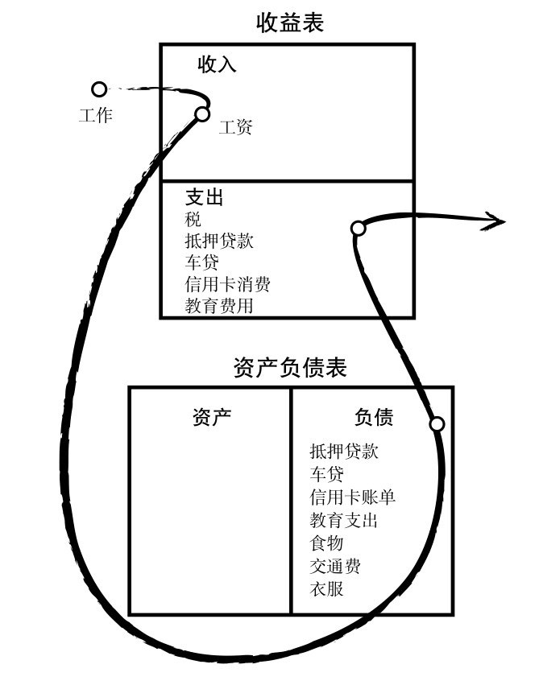

# 投资品
## 种类
主要分为以下几大类
- 中间商倒买倒卖型：P2P,银行(存款和贷款)
- 无中间商赚差价型：债券(如国债、地方债、企业债)
- 投资者拥有部分资产型：股票
- 称为资产所有人型：黄金、期货、房地产、艺术品珍藏
- 混合型：银行理财、基金
## 理财金字塔

​														  				（图片来源小白营）
# 资产
## 资产
### 概念
- 资产：是能够把钱放进口袋的东西——《穷爸爸富爸爸》
- 负债：把钱从口袋中取走的东西
- 财富：支撑一个人生存多次时间的能力(如果今天停止了工作，还能活多久)
  
  > 只要把支出控制在资产项能够产生的现金之下，就会越来越富有，也会有越来越多的非劳动收入

## 资产分配
——图片来源《长投小白训练营》

## 现金流图

——图片来源《富爸爸穷爸爸》

- 富人的现金流图

  

- 中产阶级现金流图

  

## 财商

由四个方面组成：

- 会计：财务知识或解读数字的能力，读懂财务报表
- 投资：钱生钱的科学，涉及策略和方案
- 了解市场：是供给与需求的科学
- 法律：了解减税政策和公司法

# 什么是基金

## 股票

### 概念

- 股份公司为筹集资金而发行给各个股东作为持股凭证并借以取得股息和红利的一种有价证券——百度百科

- 小故事(来自《小狗钱钱》)

  > “你们设想一下，”老太太继续说，“假设马塞尔花2500马克为他的面包派送业务买一台电脑，就会大大减轻他的工作量，还可以节省很多时间。可是他不想为此花自己的钱。这样的话，他可以借钱。一个选择是向银行借，也就是贷一笔款，可是那样的话，他就必须定期还贷款，另外还要支付利息。另
  > 外还有一种完全不同的选择，他可以向你们两个求助，请你们借钱给他的公司，这样不用定期还钱，也不用支付利息。假设你们每人借给他800马克。”
  > “为什么我们要这样做呢？”莫尼卡茫然地问道。
  > “这就是关键的一点，”陶穆太太连忙解释，“只有当你们能从这件事中得到好处的时候，才会去做。如果马塞尔让你们参与他公司的分红，那么你们这样做就有意义了。”
  > “怎么进行呢？”我想知道。
  > “比如说，你们可以约定，每人拥有他公司10%的股份。我们就算他的公司价值1万马克吧。”
  > “我们怎么知道它值多少呢？”我问。
  > “决定一件东西价值多少的唯一因素就是，你愿意为它支付多少钱。”老太太解释说。马塞尔立刻又有了一个想法：“也许会有另一个面包商愿意把它买下来，这样他还会有新顾客，这肯定是划算的。”
  > 陶穆太太赞许地点点头。“你很有商人头脑。”她夸奖说。马塞尔立即就喜形于色了。
  > 陶穆太太接着说：“如果他现在想把公司卖掉，而且有人愿意出1万马克购买，那他的公司的市值就是1万马克。他拥有80%的股份，也就是8000马克。你们两个每人拿到10%，也就是1000马克。”
  > “那我拿到的钱就比给他的钱多200马克！”莫尼卡欢呼。
  > “机灵鬼！”马塞尔咯咯地笑着说。莫尼卡白了他一眼。
  > “就是说，”我边想边说，“我们只有卖掉公司，然后才能赚到钱？”
  > “不完全是，”老太太回答道，“也可能会有另一个人想要从你手里买下这10%，那就由你决定卖什么价钱。假设你开价1100马克，那你就能很快赚一笔。”
  > “那我不如开价2000马克。”莫尼卡叫道。
  > “这不是不可以，”陶穆太太同意说，“但这样的话，可能就没有人要买下你手里的10%了。因为只有当别人相信这些股份将来可以卖出一个更好的价钱的时候，他才会买进。这就是每天在交易所里发生的事情。交易所是人们聚在一起买卖公司股份的地方，每个人都希望将来会有人以更高的价钱买下他手里的股份。”
  > “但是这谁能说得准呢？”我一边思考一边说。
  > “你说得很对，”老太太同意我的说法，“不过还是有人可以预测马塞尔的公司是不是有升值的潜力。”
  > “如果我的公司升了值，那你们的股份也会更值钱。”马塞尔领悟了，说道，“如果有些人看到了继续升值的希望，可能会用更高的价钱买下我的公司的股份。”
  > 我佩服地看着他说：“这些东西你这么快就懂了！”
  > “对，他是领悟得很快，”陶穆太太再次夸奖了他，“不是每个人都会这么快进入状态的。”“我就觉得一点儿也不容易！”莫尼卡抱怨说。
  > “这正是股票的好处，”老太太轻快地说，“你不需要自己开公司，只要在公司参股就行，你所用的方法就是购买公司的股份，也就是股票。”

## 基金

### 概念

- 基金公司收集投资者的钱按照**证监会的规则**进行各种各样的投资的投资品——《小白营》

- 基金就像一口大锅，不亲自去买股票的投资人都会把钱投进这口锅里，这些钱由基金经理人去投资买股票。国家对此进行严格的监督，基金经理人必须**遵守一定的规定**。比如，他们至少必须购买20种不同的股票。——《小狗钱钱》

- 一个篮子，里面可以按照预先**设定好的规则**，装入各种各样的资产，这样做的好处是，把一篮子资产分隔成若干小份，用较少的资金就可以投资。——《指数基金投资指南》

- 小故事(来自《小狗钱钱》)

  > 老太太解释说，“假设你有1000马克，你用这笔钱以每股50马克的价格买了20股某种股票，如果现在这只股票跌了40%，那你就不能再以50马克的价格，而只能以30马克卖出去了。你把它们卖掉的话，你就只剩下600马克了。”
  > “这样做真蠢。”马塞尔评论说。
  > “正因为如此，基金经理人必须购买至少20家不同公司的股票。我们还拿这1000马克做例子吧。假设现在用这些钱买了20种不同的股票，如果其中一种股票的价值下跌了40%，而其他的还保持原来的水平，那么我们总共还有980马克。”
  > 马塞尔飞快地计算着，说道：“这样，按总共1000马克计算，我们只损失了2%。”
  > “没错，你已经领会到了！”陶穆太太表扬他说，“在实际情况中，会有几种股票行情下跌，有几种上涨，还有几种几乎保持不变。总体来说行情还是上涨的，因为基金经理人相当精通此道。”
  > “要是所有的股票行情都下跌，该怎么办呢？”我担心地问。
  > “那你就不要卖出。”陶穆太太向我解释，“你还记得上回我们谈起股票的时候说的话吗？在这种时候，只有当你把股票实际卖出的时候，才会有损失。”
  > 马塞尔自言自语着：“那我们只能把不是马上要用的钱投进基金里，对不对？”“完全正确！”老太太高兴地说，“如果我们打算投资买基金，就要准备把自己的钱在里面放上5～10年。对于那些能等这么长时间的人来说，基金几乎是一种零风险的投资。”
  > “对，因为大多数股票在这么长一段时间里总能获得丰厚的利润。”马塞尔推断说。
  > 莫尼卡刚刚安静了一阵子，这会儿又开始嚷嚷起来：“要是基金经理人带着我们的钱跑掉了该怎么办呢？”
  > “他根本不可能这样做，因为他自己绝对拿不到这些钱。”陶穆太太微笑着说，“这些钱会先划进一家银行保管，是百分之百安全的。”

### 基金分类

- 按照基金包含的资产类型划分：

  - 货币基金：投资短期债券、银行存款
  - 债券基金：投资债券，如国债、企业债、地方债
  - 股票基金：投资股票的基金(本质是购买股票)
  - 混合基金：投资股票和债券

- 按照交易场所划分——数据来源《长投小白营》：

  通常把证券市场(股票市场)进行的交易统称为场内交易，把此渠道之外进行的交易统称为场外交易

  - 场内基金:场内渠道;特点：
    -  场内基金的交易方式有申购、赎回、买入、卖出，交易方一般为其他投资者。
    - 交易费费率一般为0.03%
    - 佣金低、可以**实时看到价格的变动**
  - 场外基金:如通过银行、基金公司、第三方代销平台(如天天基金、蚂蚁聚宝、京东金融等渠道)
    - 特点：场外交易的方式有申购、赎回，交易方位基金公司
    - 费率：基金公司(0.15%),中国银行(0.72%),建设银行(1.2%),天天基金(0.12%),蚂蚁财富(0.06%)
    - 操作方便、不需要开户
    - 以天为单位、**不能实时看到价格波动**

- 按照影响购买因素划分：

  - 主动型基金：由基金经理人按照自己的判断跟决策来购买的一篮子股票
  - 被动型基金(指数基金)：以某种指数（**什么是指数？**）作为模仿对象，按照该指数构成的标准(这个标准是啥？)，购买该指数包含的证券市场中全部或部分的证券。目的在于获得与该指数相同的收益水平。——《指数基金投资指南》
  - 被动型基金(指数基金)：通过一系列标准(**这些标准是啥？**)选出的股票称为成分股，追踪这些成分股进行购买的基金称为指数基金——小白营

### 基金整体特点

- 风险低：相比于单一股票，基金购买了很多支股票，分散了风险。参照上述小故事。

#  什么是指数基金

## 指数

### 概念

- 由交易所制定的，用来反映市场水平的的指标(还是很抽象)——长投小白营

- 指数就是选股规则(**哪些规则？**)，它的目的是按照某个规则选出一篮子股票，并反映这一篮子股票的平均价格走势——《指数基金投资指南》

- 类比举例：

  > 如果想知道一个班级中语文成绩的整体水平，平均水平能够反映。我们把这个班级学生的语文考试成绩加起来求平均数，这就是一个“语文成绩指数”。这个“语文成绩指数”的走势可以反映这个班级平均语文成绩的走势。

### 指数的规则

- 以**沪深300指数**进行举例

- 沪深300：由上海和深圳证券市场中，按照一定的规则(又是规则)，选取300只A股作为样本编制而成的成分股指数——《长投小白营》《指数基金投资指南》

- 具体规则——来源中证指数公司官网：

  **所谓规则就是从哪里选(样本空间)，用什么标准选(选样方法)**

  - 样本空间：沪深 A 股中，非创业板股票(上市时间超过一个季度  )，非 ST、 *ST 股票，非暂停上市股票 (这里还不懂) 
  - 选样方法
    - 计算样本空间内股票最近一年的 A 股日均成交金额与 A 股日均总市值；  
    - 上述计算的值由高到低排名，剔除排名后 50%的股票 。
    - 对剩余股票按照最近一年 A 股日均总市值由高到低排名，选取前 300 名股票作为指数样本。  

### 指数的点数

- 这里主要以沪深300为例说明点数的计算方法，具体有关沪深300，后面再总结。

- 在股票软件上经常看到沪深300后面会带有一个数字，如沪深300 3963.62，这个3963.62就是指数的点数。通过这个点数，就就可以反映A股300支股票，今天整体是涨了还是跌了。问题来了，这个点数是如何计算出来的呢?

- 沪深300，是2004年12月31日从1000点开始起步。也就是2004年12月30日的那300只股票的平均股价定义为1000。

- 以下为实时计算指数的公式

  

  (这里有点复杂，涉及到了流通股本、分级挂靠、除数调整的概念，没完全搞懂，暂时理解为，指数是由300只(除数也不一定是300支，视具体情况)股票，的平均状况得出来的)

### 指数的分类

- 国内三大指数系列
  - 上证指数(上海证券交易所开发)：如上证50指数(简称上证50)，
  - 深证系列指数(深圳证券交易所开发)
  - 中证指数(中证指数有限公司开发)：如沪深300指数(简称沪深300)，中证500指数(中证500)
- 美国
  - 纳斯达克斯指数——交易所开发
  - 标普500指数——指数公司开发
  - 道琼指数——指数公司开发
- 中国香港：
  - 恒生指数——恒生公司开发
  - H股指数——恒生公司开发

## 指数基金

### 概念

- 指数是选股规则。如果基金公司开发一个基金产品，也完全按照指数的选股规则去买入完全一样的一篮子股票，这就是指数基金了——《长投小白营》《指数基金投资指南》
- 指数基金是一种特殊的股票基金。一般的股票基金依赖于基金经理的个人决策能力，而指数基金不一样：它是以某指数作为模仿对象，按照该指数构成的标准，购买该指数包含的证券市场中全部或部分的证券，目的在于获得与该指数相同的收益水平。

### 特点

- 长生不老:这里的长生不老，是针对单个股票和普通的股票基金来说的

  > 指数基金可以通过吸收新公司替换老公司的方法，实现长生不老。理论上，指数的寿命与国家的寿命等同。普通的股票基金无法做到这一点，因为普通股票基金的表现取决于基金经理，由基金经理来决定股票的买入和卖出

- 指数基金能长期上涨：指数基金为何能长期上涨呢，背后的解释有很多。一个比较通用的解释是，指数背后的公司，每年赚的钱，会不断再投入生产，这样来年可以带来更多的盈利。这样不断地利滚利，就会推动指数不断上涨。

  

  > 王大爷开了一家工厂，生产水果罐头。最初工厂是投了1000万元建立的，买了设备、原材料。第一年赚了100万元的净利润。罐头卖得不错，王大爷决定扩大生产。他把第一年赚的100万元再投入了进去，又买了一些设备。第二年罐头厂赚了110万元。王大爷尝到了甜头，每年的利润都会再投入进去。10年后，王大爷已经拥有了一家年利润260万元、持有资产2000多万元的罐头工厂。每年的净利润再投入，让王大爷有了更多的厂房、设备、原材料和员工。（资产的增加）
  >
  > 王大爷还收购了附近的果园，自己种水果，把中间利润环节去掉，节约原材料的成本；引入先进的罐头生产线，原本需要20个人三班倒生产，改良后只需要10个人，大大提高了效率。（效率的提升）不过王大爷发现，现在罐头卖不动了，每年能销售出去的罐头数量固定在20万罐，每个罐头20%的净利润。虽然罐头卖不动，但王大爷发现罐头可以提价格，每隔一段时间罐头的价格提一提，只要提价不太高，罐头的销量没有太大变化，仍然是20万罐。虽然水果原材料价格在上涨、工人的工资也在上涨，但罐头提价后，王大爷的净利润仍然能增长。（抗通货膨胀）

- 指数基金成本低(数据来源《指数基金投资指南》)
  - 管理费：主动型基金约为1.5%，指数基金为：0.69%
  - 托管费：基金的庞大资产并不是直接存放在基金公司的，一般会放在第三方如大型银行。就要支付托管费给银行。国内指数基金的托管费率平均在0.14%左右，低的可以做到0.1%

## 指数及对应基金

(未完待续。。。。。。)

