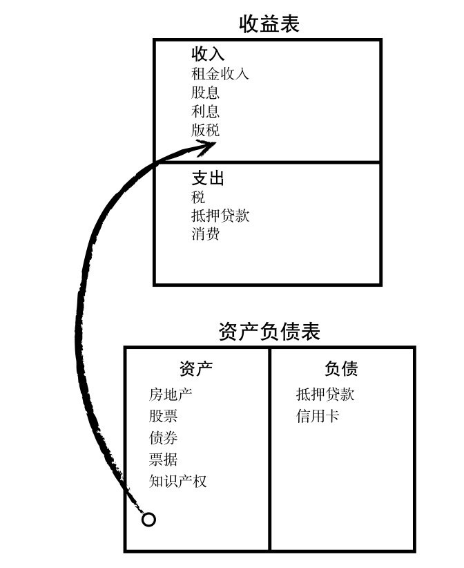

# 1资产
## 1.1 投资品
### 1.1.1 种类

主要分为以下几大类

- 中间商倒买倒卖型：P2P,银行(存款和贷款)
- 无中间商赚差价型：债券(如国债、地方债、企业债)
- 投资者拥有部分资产型：股票
- 称为资产所有人型：黄金、期货、房地产、艺术品珍藏
- 混合型：银行理财、基金

### 1.1.2 理财金字塔

——图片来源《长投小白训练营》

## 1.2  资产

### 1.2.1 概念

- 资产：是能够把钱放进口袋的东西——《穷爸爸富爸爸》

- 负债：把钱从口袋中取走的东西

- 财富：支撑一个人生存多次时间的能力(如果今天停止了工作，还能活多久)

  > 只要把支出控制在资产项能够产生的现金之下，就会越来越富有，也会有越来越多的非劳动收入

### 1.2.2 资产分配

——图片来源《长投小白训练营》

### 1.2.3 现金流图

—— 图片来源《富爸爸穷爸爸》

- 富人的现金流图

- 中产阶级现金流图

### 1.2.4 财商

由四个方面组成：

- 会计：财务知识或解读数字的能力，读懂财务报表
- 投资：钱生钱的科学，涉及策略和方案
- 了解市场：是供给与需求的科学
- 法律：了解减税政策和公司法

### 1.2.5 资产配置

