## 债券基金

### 分类

债券的本质，是机构公开向大家借钱并承诺还本付息的一种凭证。**根据借钱人的不同，可以分为三类。**

1. 政府债券：就是政府向我们借钱的凭证

   主要分为两类：中央政府来接，叫国债；地方政府来借，叫地方债，也称“市政债券”。

2. 金融机构债券：就是金融机构向我们借钱的凭证。比如银行，证券公司，保险公司等
   主要分为三类：中央银行借钱，叫央行票据；政策性银行借钱，叫政策性金融债券，比如中国开发银行发行的国开债；其他金融债券：同业存单，商业银行债，证券公司债，保险公司债。

3. 企业债券：指企业向我们借钱的凭证。
   企业债券可以分为普通公司债，企业短期融资债，中期票据，资产支持债券，可转债债券。

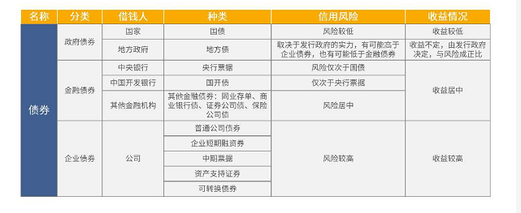

根据投资股票占比的不同，债券基金分为纯债基金和偏债基金。

1. 纯债基金：全部资产都用来投资债券的基金。
2. 偏债基金：有至少80%的资金投资债券，剩下的投资股票。

### 纯债基金

#### 筛选指标

#### 筛选步骤

第一步：进入晨星网，点击基金筛选

第二步：点击更多筛选条件，后进入以下界面，输入筛选条件

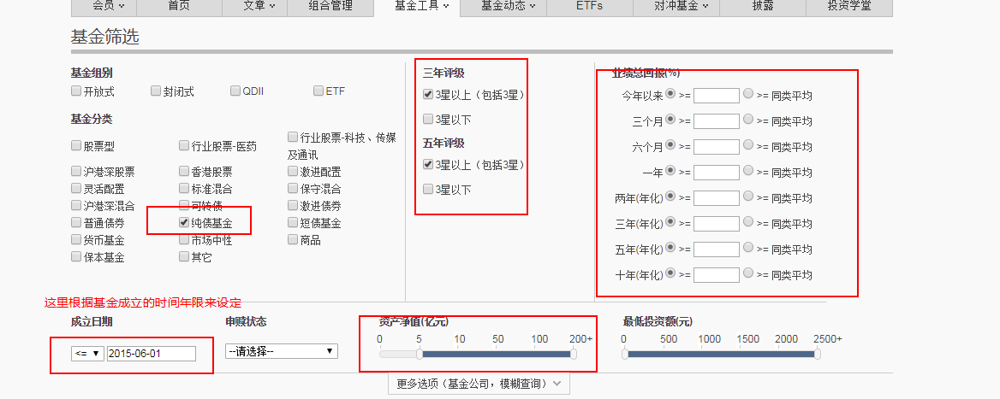

筛选之后，有以下44只基金：
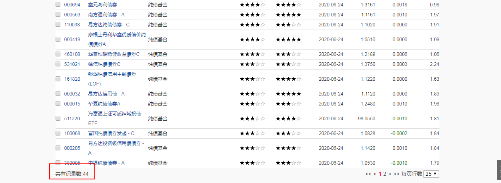

把星级条件再缩小，选择大于等于“双4星”的纯债基金

第三步：查看具体的基金投资了什么，以**000186 华泰柏瑞季季红债券**为例

	

选择纯债基金的时候，建议优先考虑持有国债和金融机构债券的占比总和在20%以上的。如果占比没有超过20%那就剔除。最后统计成以下表格。

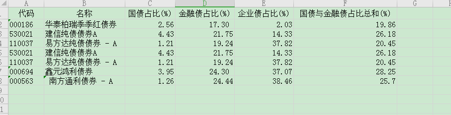

因为纯债本身的风险较小，从中选1-2只即可

### 偏债基金

#### 特点

1. 相对于纯债基金，偏债基金可以在牛市中博取更大的收益。
2. 相对于股票型基金，偏债基金在熊市中往往可以有更小的下跌幅度，属于进可攻退可守的基金。

#### 筛选

在晨星网中“基金筛选”页面，勾选“激进债券”

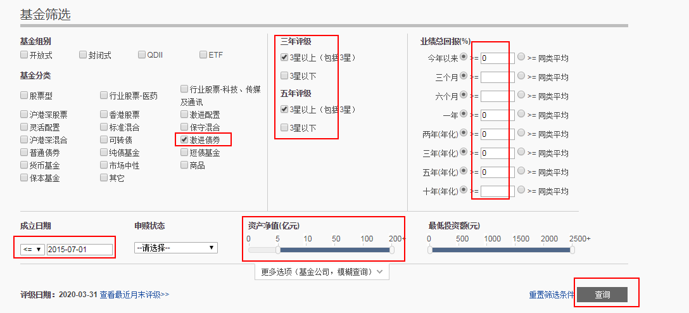

在筛选出的基金中，优先选择评级大于等于“双5星”的基金

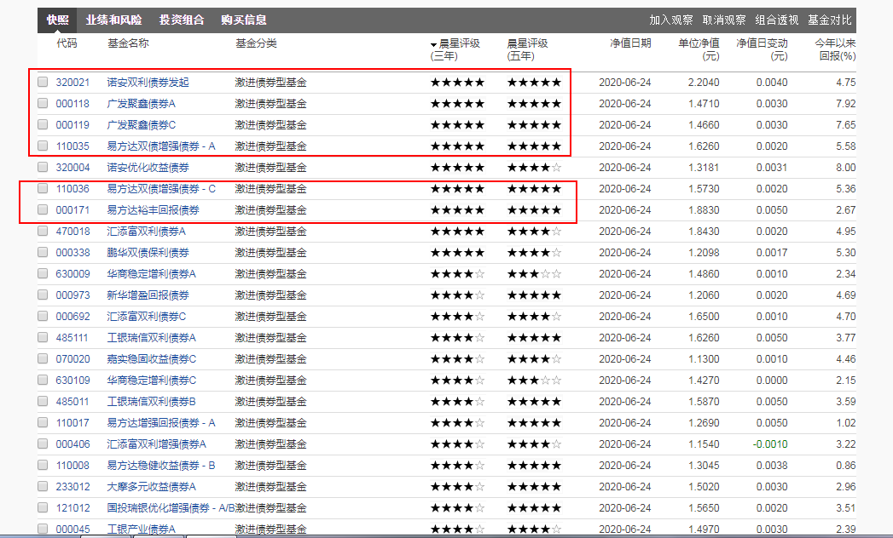

最关键的一步，看基金经理，**基金基金任职时间<5年的**，剔除。进入基金的详情页，然后点击“基金经理”。有的基金有多个经理，可以参考任职时间最长的那个

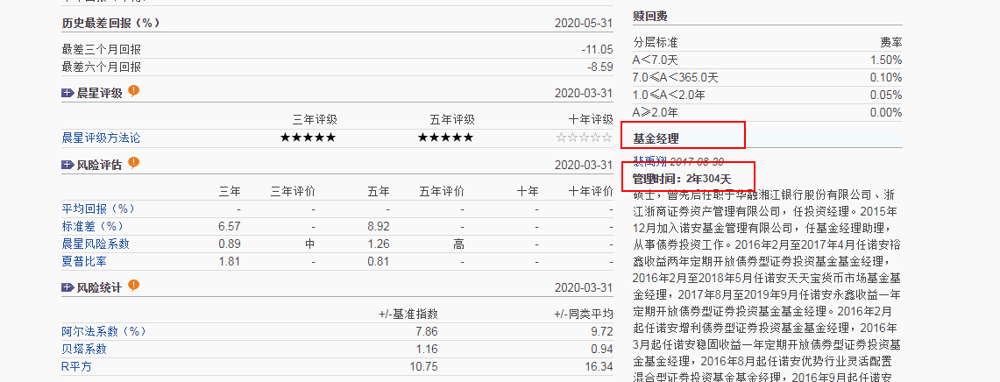

最后可以统计出下面的表格

### 入场时机

债券可以在市场上进行交易，在这个买卖的过程中，债券的价格会因为供求关系产生波动，像股票一样。

一旦市场上资金借贷的利息，也就是市场利息上调，投资者们会更愿意把钱借出去，而不是购买债券。这样，债券的价格就会下跌，债券基金就有可能出现亏算。这就是债券基金的利率风险。

在市场利率高的时候买入债券基金，再在市场利率低的时候卖出它，这样就能够实现低卖高卖了。

#### 市场利率

市场利率怎么样才算高，怎么样才算低呢？

市场利率可以参考10年期的国债利率。比如10年期国债到期收益率是3.179%，那么现在的市场利率就是3.17%

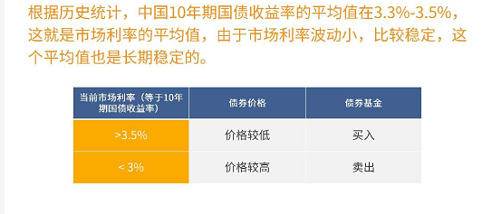

查看当前10年期国债收益率：直接到英才网站查找

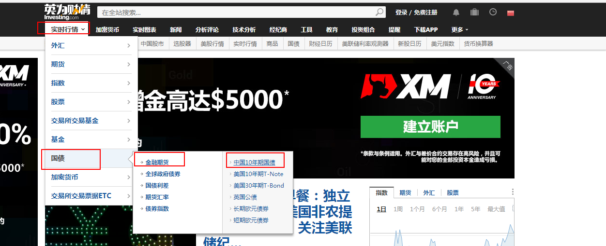

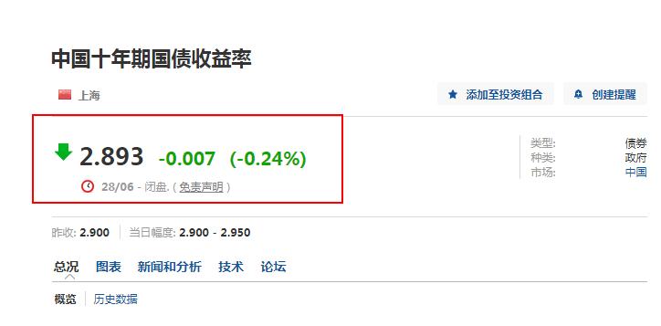

### 可转债基金

可转债投资占比较高，一般在40%以上，有些甚至达到80%，90%以上。

#### 筛选

1. 看历史综合评价，看晨星网的晨星评级
2. 历史回报率，可转债基金，我们更看重它保底的属性，所以最好选择历史收益大于0
3. 成立时间，成立时间不能太短，这样收益才可参考，我们要选择成立时间>5年的
4. 规模不要太小，不要小于5亿。

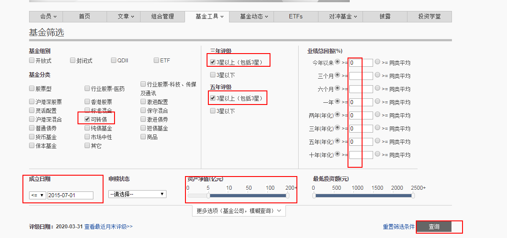

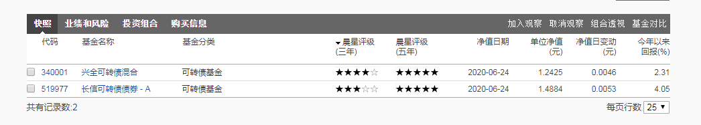

在筛选出的可转债基金中按照以下思路进行比较

1. 比较基金的规模
   基金的业绩越好会吸引更多的投资者，规模会增大。所以规模的大小一定程度上可以反应基金受市场肯定的程度
2. 比较历史回报
   经历一轮牛熊的长期回报更有说服力，所以我们主要看5年回报率。
3. 比较基金投资风格
   可转债投资比例越高，基金的投资风格越激进。在牛市有望获得更高的收益，但在熊市可能下跌得也更多。

#### 买卖时机

市面上所有可转债的平均价格低于100元，可以买入可转债。市面上所有可转债的平均价格高于130元时，可以卖出可转债。

查看可转债的平均价格：打开集思录

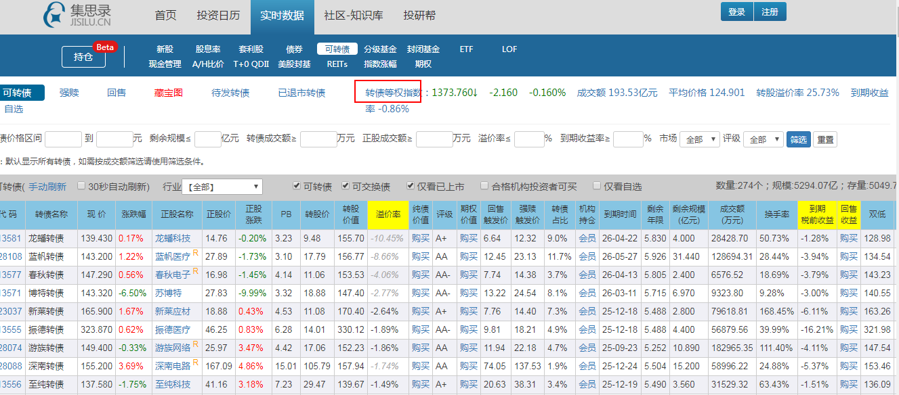

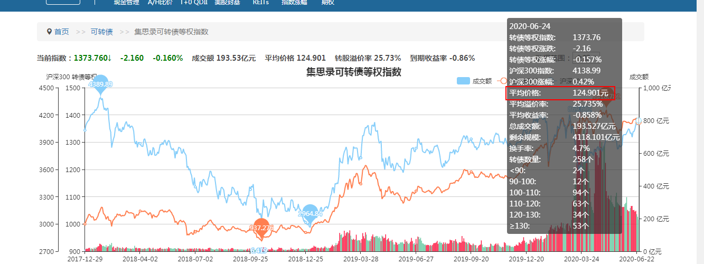

### 总结

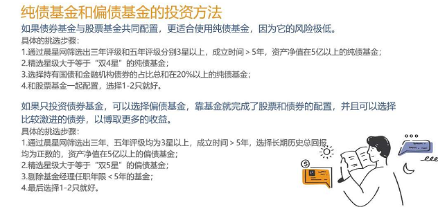

