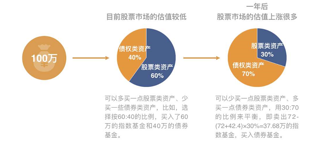
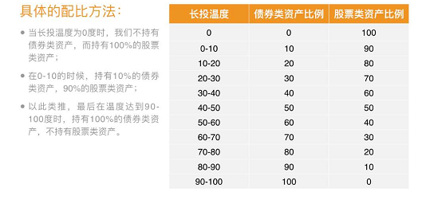
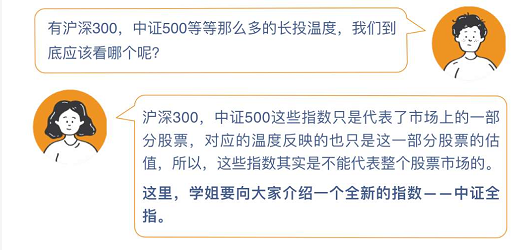
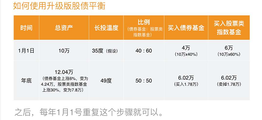

# 股债平衡

## 策略一

50：50股债平衡，是资产配置得众多策略之一。

50：50股债平衡是将资金平均分配到股票类资产和债券类资产，各占50%。一年后调整一次，将两类资产的比例再恢复到50：50的比例

**缺点：**
50：50这个固定的配置比例，会导致我们在估值较高的时候，买入相对过多的股票类资产，在下跌得时候造成损失。而在估值低的时候，少买了股票类资产，上涨时收益又不够高。

总体来说，虽说50：50股债平衡的配置策略十分简单易操作，但这个固定的比例的设定，却会让我们错过不少的收益。

## 升级策略

### 概念

升级版股债平衡其实是在50：50股债平衡的基础上，吸收简投法的优点进行了改进。即每年调整的时候不再以一个固定的比例，而是根据市场的估值来灵活调整股债资产的配比。

升级版股债平衡的关键，就在于根据市场估值确认资产的配比，也就是股票市场便宜的时候多买点股票类资产，贵的时候，多买点债券类资产。

长投温度使我们用来判断故事估值高低的依据。

### 配置方法

中证全指，是由整个A股市场的股票组成的指数，可以用来代表整个A股市场的情况。
因此可以根据中证全指的长投温度，来得出目前股市的估值情况。每年计算一次中证全指的温度，根据温度来进行股债资产的调整即可。

### 总结

