## 博格公式

### 概念

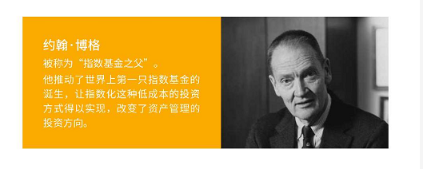

只要是用来对行业基金进行估值，判断未来的收益。

### 公式

股市长期回报率 = 投资回报率 + 投机回报率	
						  = （初始时刻的股息率 + 投资期内的盈率增长率） + 投资期内的市盈率变化率

投资回报率 = 初始时刻的股息率 + 投资期内的盈率增长率
投机回报率 = 投资期内的市盈率变化率

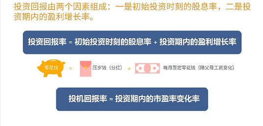

博格一只都任务，投资一组股票的收益有两个重要的来源，一个是经济，一个是情绪。

经济：是指一家公司实实在在的盈利，可以把它称为投资回报。
情绪：是指投资者的买卖交易，可以把这部分称之为投资回报。

### 博格公式与估值

投资一只指数基金的收益率大约等于博格公式的计算结果。

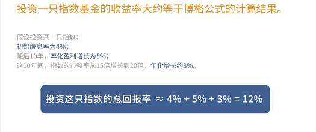

复合年化增长率=【（未来的价格/现在的价格）^(1/n)-1】*100%其中n是时间。
具体到上课时举的例子，n就是10年。我们将例子中的具体数字代入到公式就等于目前20倍的市盈率除以原来15倍的市盈率，然后开10次方根，再减一，最后乘以100%。
列式子就是：=（(20/15)^(1/10)-1）\*100%四舍五入，算出来就是3%啦！

历史数据证明：

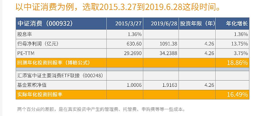

**博格公式只能给医药和消费行业估值么？**

严谨点说，是只适合给盈	利能力稳定、且盈利增长率可预估的指数估值。因为博格公式=股息率+盈利增长率+市盈率增长率。其中盈利增长率是需要预估的，对于一年盈利大幅波动的指数肯定不适合，另外盈利要长期比较好，我们才敢做保守的预估。就像医药和消费行业，他们的盈利长期以来稳定且高于其他行业，我们可以保守地用GDP来作为盈利增长率。

### 实操

股市长期回报率 = （初始时刻的股息率 + 投资期内的盈率增长率） + 投资期内的市盈率变化率，以中证医药为例，
先查看第一个指标：**初始时刻的股息率**，使用理杏仁，搜索中证医药，当前的姑股息率为0.79%

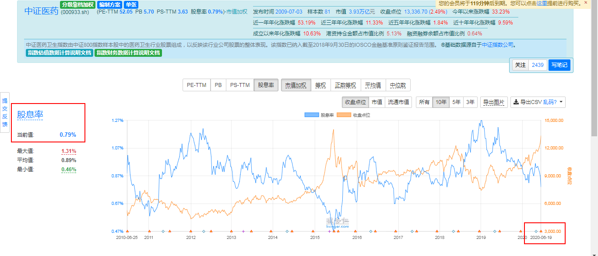

**查看第二个指标：投资期内的盈利增长率**。是指投资期内能够赚多少钱的比率。该数据参考国家GDP的平均增长率
https://data.eastmoney.com/cjsj/gdp.html 打开该网址查看

第一种方法：在【东方财富网】-【数据中心】-【经济数据】 - 【国内生产总值】就能看到GDP，挑选出每年的1-4季度的数据整理到表格中。
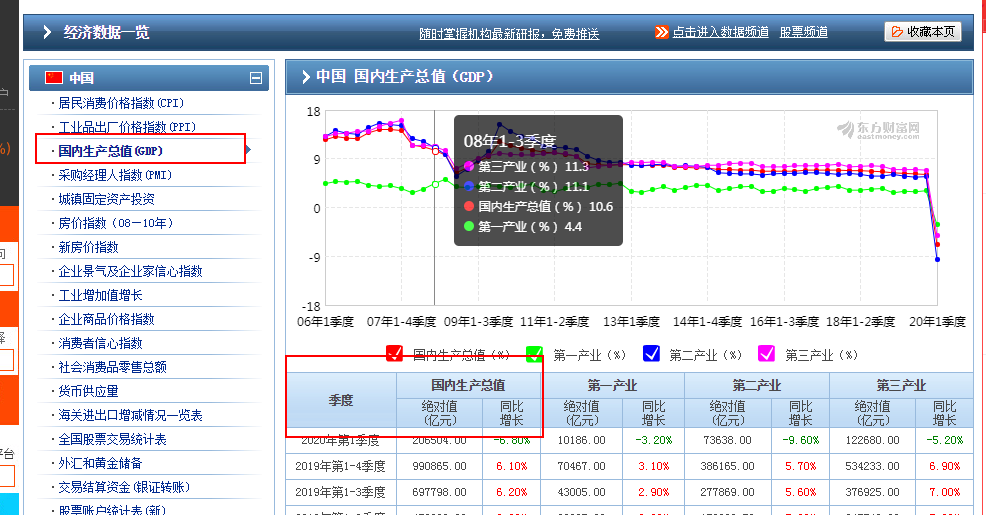

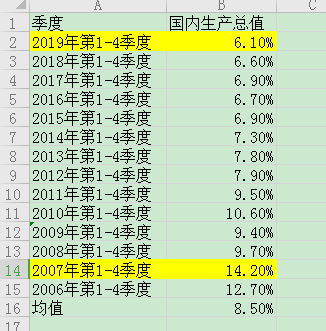

**第三个指标：投资期内的市盈率变化率**
回到理杏仁网站，点击“PE-TTM”，“市值加权”，“10年”，导出CSV【按天】

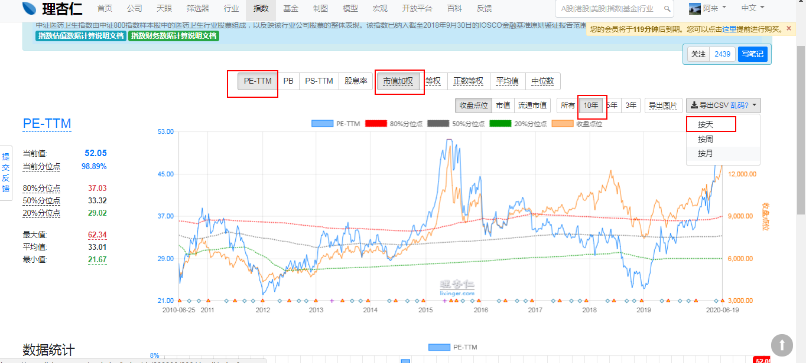

然后再表格中找到指定日期的数据，如2020/6/19
获取当天的PE-TTM值为52.0496；
PE-TTM80%分位点值为37.0256；
PE-TTM50%分位点值为33.3236；
PE-TTM20%分位点值为29.025。

假设投资3年，可以分为3种情况进行估算
第一种：乐观预计，市盈率会继续上升到危险值附近
第二种：中性预计，市盈率回落到中位值附近
第三种：悲观预计，是盈率降到机会值附近

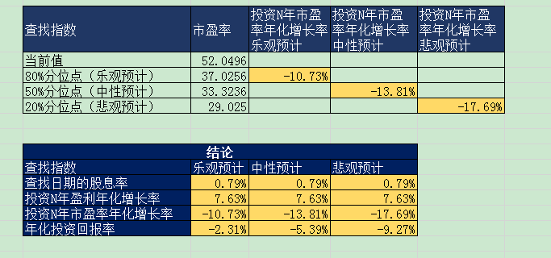

表中为负值，表示当下不适合投资

表格里有三个预计值，那我们应该如何使用这三个预计值呢？班班的使用方法是将投资者的投资风格可以按三种情况分为保守型、稳健型、激进型。

倘若我是激进型，那我对应的是乐观预计的收益率，那我都心理预期可能是12%，这个时候，我进场投资。
乐观、中性、悲观是对同一个时间点估值时的3种不同预计,激进的投资者倾向乐观预计，而稳健的投资者倾向于中性预计，谨慎的投资者倾向于悲观预计。博格公式，就是从更稳妥的角度，给出三种情况的预估收益率，
每个人根据自己的情况做一个投资决策当下是否买入。
同样的投资品，同一个当下，有人买有人卖，就是因为大家对它的期待不同。而卖出呢，有两种情况，一种是当达到了我们的预期收益时，直接卖出获益。或者是当我们投资的指数基金跟踪的指数的PE值已经达到了80%分位点的时候卖出。

在这里班班举个例子，假设博格公式计算出来，悲观预计15%，中性预计18%，乐观预计22%。如果我是按照悲观预计投资，发现15%的悲观预计符合我的预期收益了，就投入。等到指数基金收益达到15%的时候就直接卖出。另外，可能在我投资期间一直等，但是收益没达到15%。但是对应的指数PE值已经等于危险值，即80%PE分为点，或者已经超过了，不管收益到没到预期都要考虑卖出了。

### 证券行业估值

先来看证券公司的盈利波动
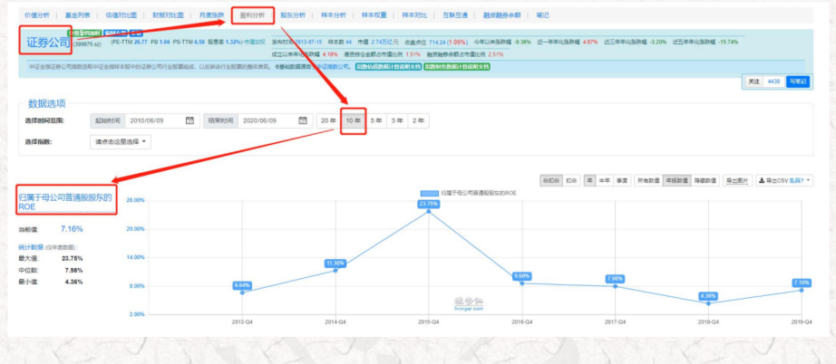

在2018年11月16日，证券公司指数的PE温度达到了58.36度，乍一看，高估啊！但是，同一天的pb温度只有7.82，非但没有高估，相反还处于非常低估的区域。

让我们接着往下看证券行业的归母净利润和归母净资产。
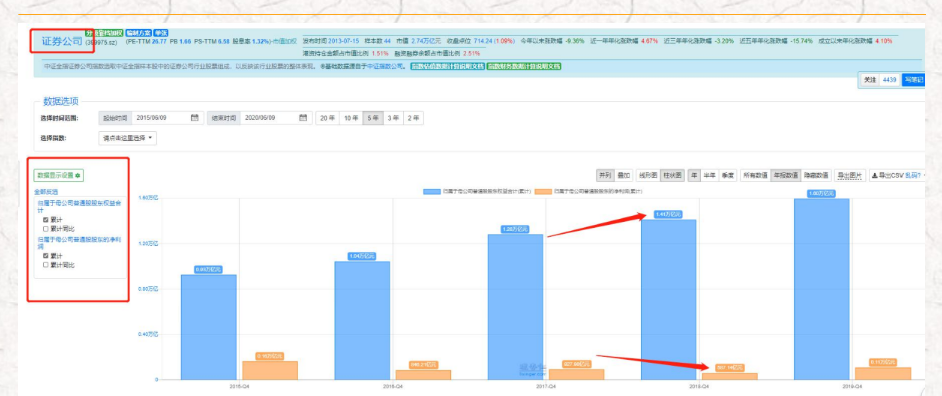

这时就会发现2018年由于市场极度低迷，整个证券行业的净利润比2017年下降了快一半，但是净资产却没有下降，依然处于稳步增长中。净利润下降得过快便是导致证券公司指数PE升高的主要原因，而由于净资产没有跟着下降，因此，PB依然处于低估区域。这种净利润的下降并不是永久的，一旦进入市场牛市，盈利能力就会上升。

所以，pe的高估不值得参考，根据PB判断证券行业的估值更加靠谱。

现在来看，我们也会发现，18年年底其实是投资证券行业的好时机，到2019年开年，便有了不错的涨势。
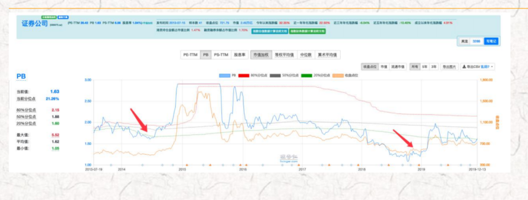

还可以看出，每次pb温度低的时候，都是好的投资时机。这里的pb温度算法和初级课完全一样哦~是用percentrank公式
只计算pb就好

记得要用10年的数据，成立时间不满10年的指数用【所有】。除了证券行业，我们前面讲到的海外互联网指数，大家还记得么？它也适合用PB温度估值哦~
为啥海外互联网也看PB呢？难道互联网行业也是周期性行业吗？当然不是，主要是因为海外互联网指数中的有些公司，尽管未来可能是美好的，但现实还是在亏损的。

我们从中证指数公司官网，查看中证海外中国互联网指数截至2020年6月的十大权重股：
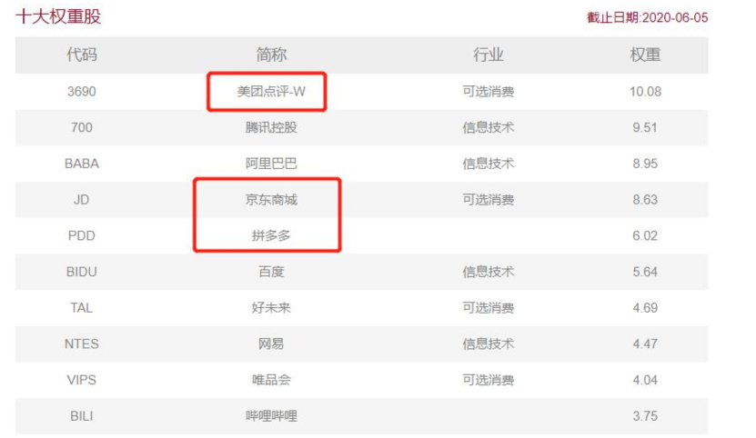

比如，港股上市的美团就是亏损大户，一年亏损上千亿；而京东和拼多多，目前看来也处于亏损中，这会拉低指数整体的净利润，导致pe较高。但是，这并不代表它们发展不好，高估了。就像美股的亚马逊，虽然亏损了十几年，股价依然上涨了几十倍。所以，对于这个指数，PB相比PE更有参考价值。

好啦，我们来总结一下，盈利不稳定的行业：比如证券行业和海外互联网这个指数中的公司，都适合使用pb温度估值。

说到这里，小伙伴可能又要问了，我知道证券行业要用pb，温度来估值，那么温度多少是低估？温度多少是高估呢？
班班和大家讲：pb温度高低估的判断方法和初级课的长投温度是	一样的，30度以下低估，50度以上高估，30-50度则是正常估值。