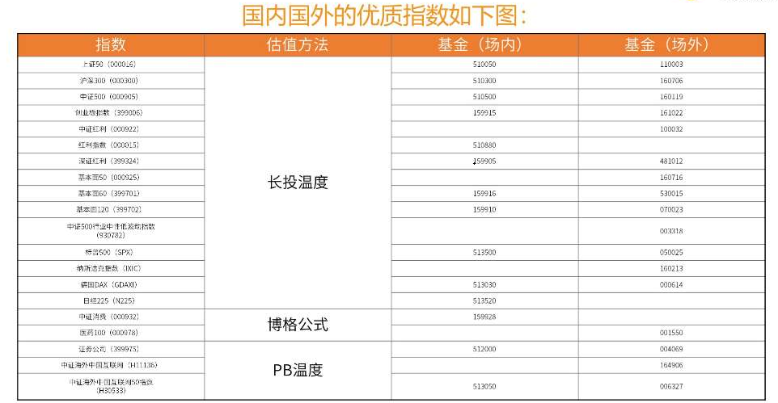
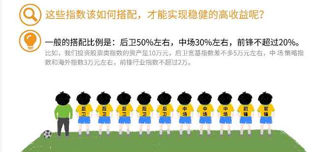
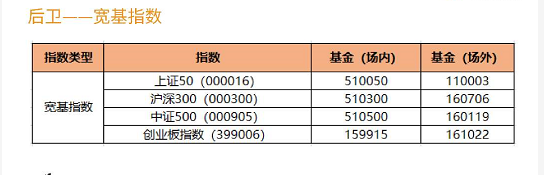
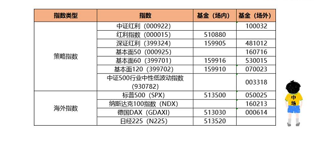
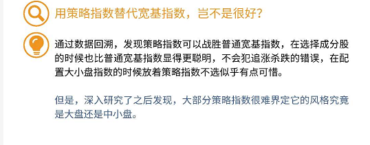
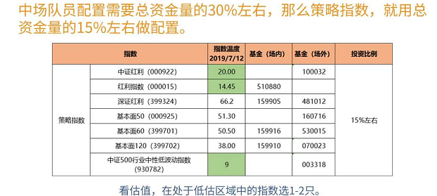
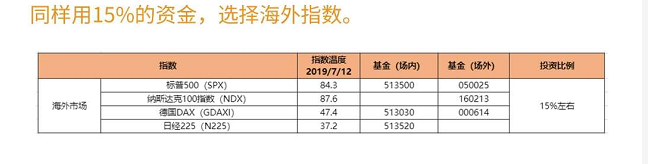
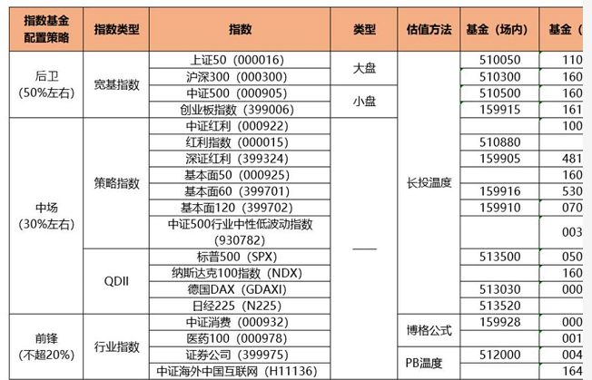

## 指数基金配置

### 估值方法

### 配置方法

#### 后卫—宽基指数

上证50属于超大盘，沪深300属于大盘，中证500属于中小盘，创业板指数属于小盘。
宽基指数配置大原则：一半大盘股，一半小盘股

#### 中场—策略跟海外指数

15%配置策略指数，15%配置海外指数

#### 前锋—行业指数

用投资股票类资产总资金量中不超过20%的比例，根据自己的偏好，任选一只处于低谷状态的行业指数即可。

#### 组合总结

