## 相关名称

### 股息率

是一年的总派息额与当时市价的比例。以占股票最后销售价格的百分数表示的年度股息，该指标是[投资收益率](https://baike.baidu.com/item/投资收益率/2724753)的简化形式。股息率是股息与股票价格之间的比率。
上市公司分红时，每股的分红金额与股票价格之间的比率。

### 市值

股票的市场价值，是一种衡量上市公司规模大小的指标。
计算方法：该公司当前的股票价格 * 该公司所有的普通股票数量

### 基本面

基本面价值，就是对公司的财务报表，所在的行业，产品和市场，公司文化和管理层素质等情况做全面分析，最后得出的综合评价，常见的基本面指标有，企业的营业收入，现金流，净资产，分红等。

### 波动率

波动率是指股票价格的波动程度，波动率越高，股价波动越剧烈，收益的不确定性就越强；波动率越低，股价波动越平缓，收益率的确定性就越强。
如上证180波动率加权指数，从上证180指数样本股中，选取历史波动率最小的100只股票组成的成分股。

### 市盈率

- 指的是一笔钱投资进一只股票，需要多多长时间能够回本。也就是与一只股票的盈利能力相比，目前它的价格是不是够便宜。
- 公式，市盈率 =公司市值/净利润

### 换手率

指在一定时间内市场中股票转手买卖的频率

换手率越高，说明交易者买卖越频繁，股价也就容易波动，反之，则体现为股价波动较小

### 细分领域

什么是细分领域
举个例子吧~比如说咱们出去吃饭，中餐，西餐，火锅，烧烤等等，都是餐饮行业。中餐下面还有，川菜、湘菜、东北菜等等。那么，中餐下面的就属于细分领域。
判断细分行业的方法
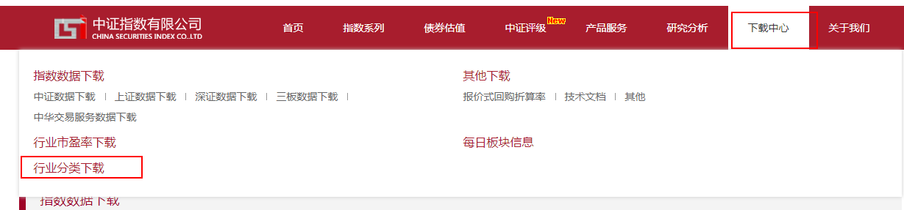

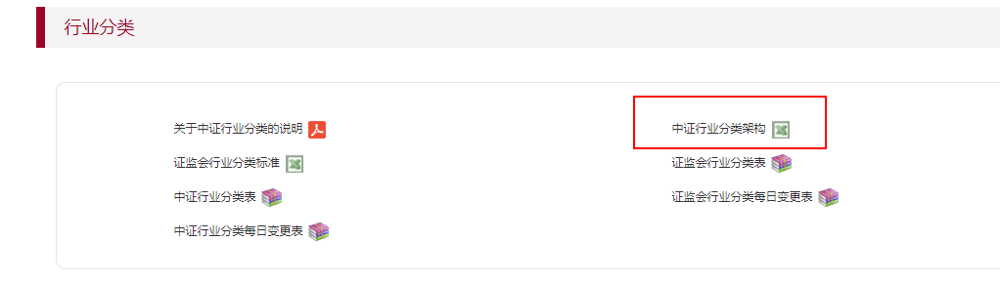

下载之后打开表格；这里最简单粗暴的判断方法就是：一级行业以下的咱们都当作是细分领域（就像是中餐以下的湘菜啊川菜啊这些我们都可以当作细分领域）

## 查看指数信息

### 样本空间

指数的样本空间就是挑选指数成分股的范围

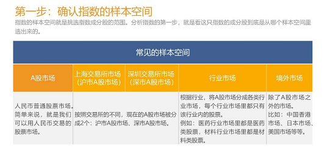

### 选样方法

常见的选样方法有：市值选样，股息率选样，基本面选样和波动率选样

1. 市值选样
   把样本空间里所有的股票，按照市值从大到小排列，然后根据自己的数量要求选择排名靠前的股票
   如沪深300指数，它的选样条件之一，就是将这个A股市场上按照市值从大到小排名，选出前300股票。
2. 股息率选样
   将样本空间中的股票，按照过去的股息率，由高到低进行排名，根据自己的数量要求选择排名靠前的股票
   如红利指数中的50只成分股，是按照过去两年股息率的平均值，由高到低进行排名选出前50只股票
3. 基本面选样
   将样本空间的股票，根据基本面价值从高到低排名，根据自己需要的数量选择排名靠前的股票。
   如基本面50：将A股所有上市公司按照4个基本面指标——营业收入，现金流，净资产，分红——综合评估，并由高到低进行排名，选取前50名纳入指数。
4. 波动率选样
   将样本空间的股票根据波动率大小从低到高排名，选择排名靠前的部分股票。

### 加权方式

常见的加权方式有以下5种

1. 市值加权
   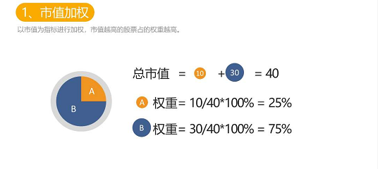
2. 等权重
   指的是指数里所有的股票的权重都一样
3. 股息率加权
   以股息率为指标进行加权，股息率越高股票的权重越高。
4. 基本面加权
   以基本面为指标进行加权，基本面价值越高，权重越高
5. 波动率加权
   以波动率作为重要的指标进行加权。一般来说，波动比价大的股票，权重会比较小；波动比较小的股票，权重比较大。

### 实操

第一步：进入中证指数有限公司官网，以沪深300为例说明

第二步：资料下载

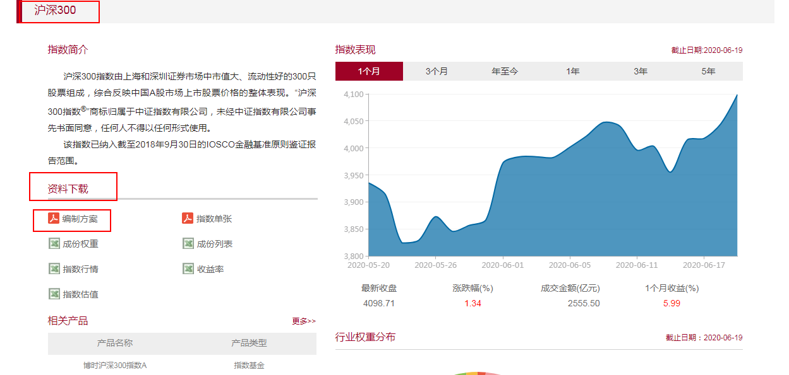

第三步：查看样本空间
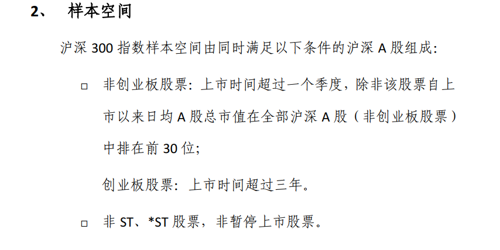

ST表示经营连续两年亏损被特别处理的股票
*ST表示连续经营三年亏损被退市预警的股票

第三步：查看选样方法
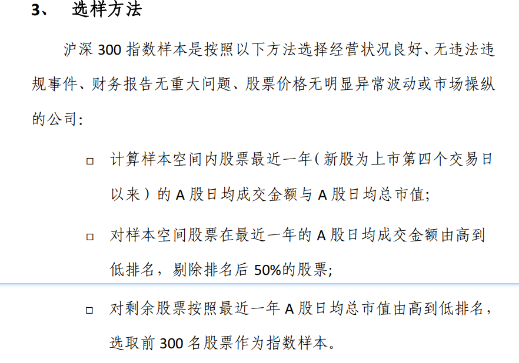

第四步：确认指数的加权方式

有三个方法

1. 直接查看指数的名称
   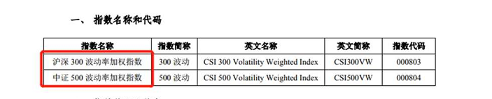

2. 查看编制方案中的介绍
   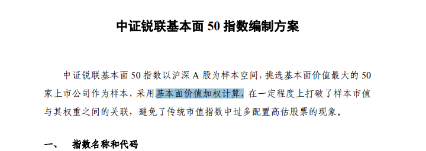

3. 通过指数的计算公式查看
   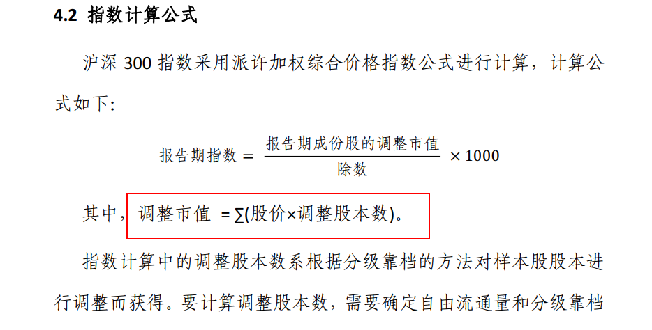

   **当公式中的调整市值只有股价乘以调整股本数，就是市值加权，如上面的沪深300**

   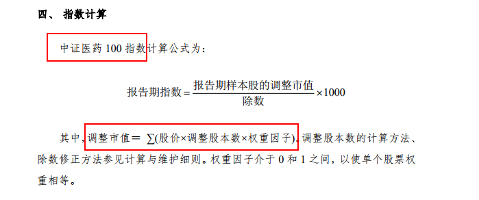

   当公式中的调整市值有权重因子时，看权重因子。
   因子的意思是：元素，因素，成分。权重因子的意思就是决定权重的元素，因素，成分
   **上面的中证医药100,权重因子是使单个股票权重相等，那么该指数的加权方式就是等权重**

   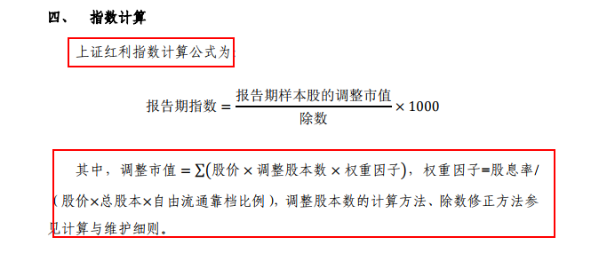

   **如上面的红利指数，权重因子中有股息率，那么可以判断该指数的加权方式采用了股息率加权。**