## 指数分类

宽基指数：代表整个市场的走势
策略指数：使用某种策略选择品质更高的股票
行业指数：从某个行业市场选择股票
国外指数：从海外市场选择股票

### 策略指数概述

#### 有效的策略因子

1. 规模：小盘股长期来看比大盘股回报更高
2. 价值：价格低于价值的股票长期来看比贵的股票收益高
3. 低波动：总体波动较小的股票长期表现更好
4. 红利：分红多的股票长期回报更高
5. 质量：质地好的、优秀公司的股票，长期回报更好
6. 动量：这个因子认为过去涨的股票将来还会继续涨

#### 什么是策略指数

在宽基指数的基础上，再加上策略因子，就是策略指数。如300价值指数，500低波动指数，中证红利指数以及基本面指数等。

### 策略—红利指数

#### 概述

三只重要的红利指数：上证红利指数，中证红利指数，深证红利指数

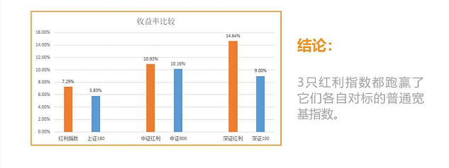

红利指数最大的有点就是分红多，普通的指数只体现在价格上涨，红利指数的全收益包含了股票价格的上涨和分红收益。

#### 上证红利指数

一共包含50只股票，这50只股票有以下特点

1. 在上海证券交易所上市
2. 股息率高
3. 分红稳定
4. 具有一定规模和流动性
5. 能够反映出上海证券交易所高红利股票的整体情况

#### 中证红利指数

一共包含100只股票，股票具有以下特点

1. 在上海和深圳两地的证券交易所上市
2. 股息率高
3. 分红比较稳定
4. 具有一定的规模和流动性
5. 能反映整个A股市场的高红利股票的整体走势

#### 深证红利指数

一共有40只股票，有以下特点

1. 在深圳证券交易所上市
2. 股息率高
3. 分红稳定
4. 具有一定的规模和流动性
5. 能够反映整个深交所高红利股票的整体走势

#### 红利指数的高收益

红利指数的高收益只要有以下几点原因：

1. 指数背后的公司好，通过查看编制方案，发现有以下两个选样原则

   1. 必须连续两年有现金分红
   2. 选择股息率排在前100名的股票

   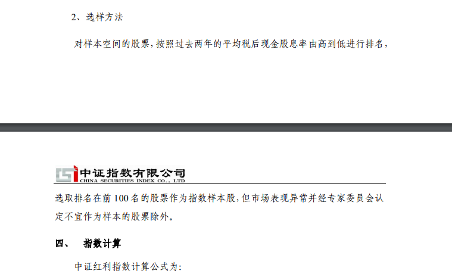

2. 好价格
   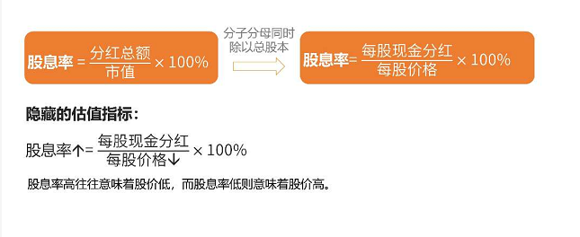

3. 调仓

   1. 中证红利指数在每年的12月份会根据股息率做一次调仓
   2. 在调仓的时候，指数会把姑息率降低到100名以外的股票剔除，同时把股息率上升并且排名进100名以内的股票进行调进来，相当于把贵了的股票卖出，便宜的股票买进来。

### 策略—低波动率指数

#### 什么是波动率

波动率是描述金融资产价格的波动程度。简单来说就是价格变化的程度。

> A股票在5天之内从1元变成5元，变化过程是这样的：第一天1元，第二天2元，第三天3元，第四天4元，第五天5元。B股票也是在5天之内从1元变成5元，但是变化过程是这样的：第一天1元，第二天10元，第三天2元，第四天7元，第五天5元。虽然都是从1元变成5元，但是过程是不一样的，A股票的价格变化程度比B股票小，也就是A股票的波动率比B股票的波动率低。

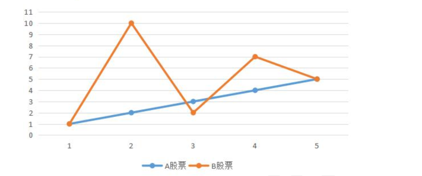

#### 低波动率策略

通过【低波动率】选股，就是在样本股范围内，比如沪深300低波，就是把沪深300的股票作为样本空间，将股票按波动率的从小到大进行排序。选取波动率最小的前一定数量的股票，按照波动率的倒数进行加权，也就是波动率越小的股票在整体组合中的占比越高，形成相应的股票组合。
当然，股票的波动率也会不断变动，现在波动率比较低的股票，可能会在将来的波动率比较高。因此，为了保障组合中的股票波动率处于一个较低的水平，需要定期更换股票。

#### 低波动率策略与收益。

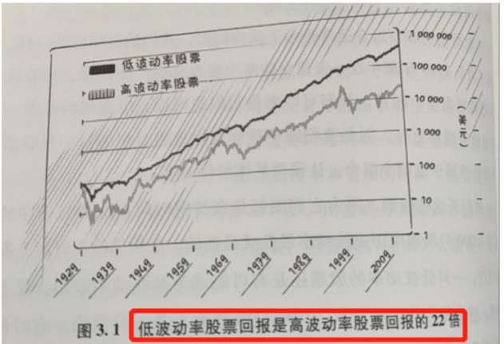

可以看到低波动率股票组合的回报率远高于高波动率股票组合。因此，低风险也可以有高回报。
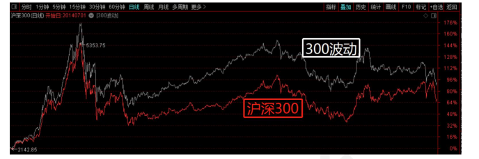

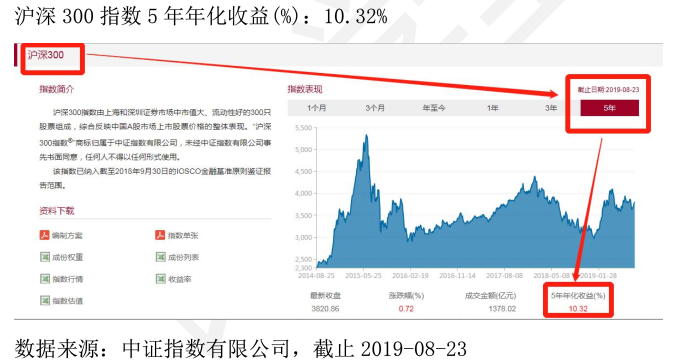

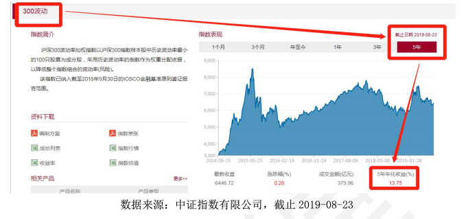

通过回测的数据我们可以看到300波动指数，无论在熊市还是在牛市的表现都要优于沪深300指数

可以看到低波动率策略无论在国外还是在国内都是有效果的；而且，低波动率策略在国内往往会有更好的效果。为什么呢
大家都知道中国股市的散户占了很大一部分。在多数国人的眼中，股市就是一个买大买小的赌场。多数人今天买了股票，明天就想要发大财，短线投机氛围严重。大家买入股票的时候，往往是股票越涨越买，发现一个股票上涨，大家都想买入分一杯羹，大量的资金买入，导致股票价格更加上涨。而下跌的时候，也是一样，看到股价下跌大家都急于卖出，导致越卖价格越低。由于这种不理性的情况出现，导致波动性的增大。好的公司也往往会因此造成估值过高的情况。另外，波动性较高的公司往往风险和不确定性也比较高。从另外一个角度来说，这对咱们来说就是一个不错的机会。因为波动率比较低的公司，往往受到的关注比较少，价值相对容易被低估，而且风险和不确定性也相对比较低。

#### 中证500行业中性低波动指数。

**特点：**
（1）从中证500的指数的成分股中选择波动率最小的150只股票。
（2）波动率越低的股票在组合中权重越多。
（3）行业比例与中证500中行业比例相同。
（4）由于股票波动性会变化，需要周期性换股，一般是半年一次。
（5）500SNLV也是宽基指数，它的买入卖出时机也可以根据长投温度来判断
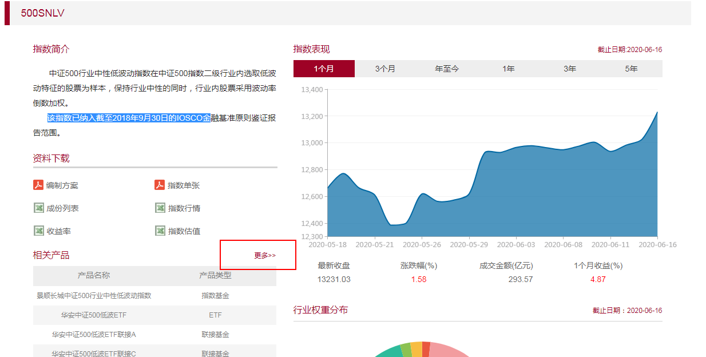

以上方法可以找到对应的产品

### 策略—基本面指数

#### 概念

一起来看看基本面50指数和普通50指数的收益对比
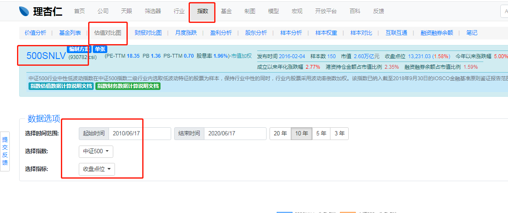

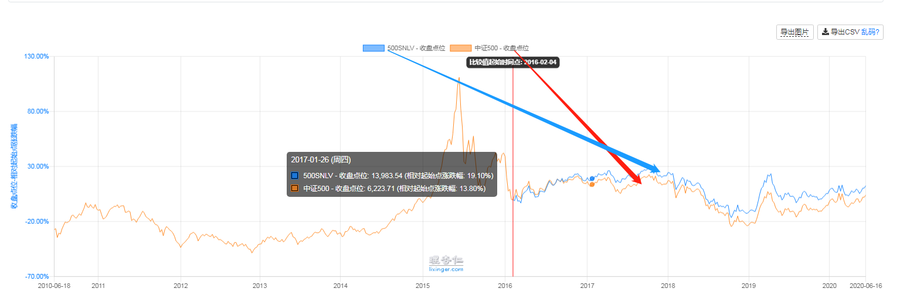

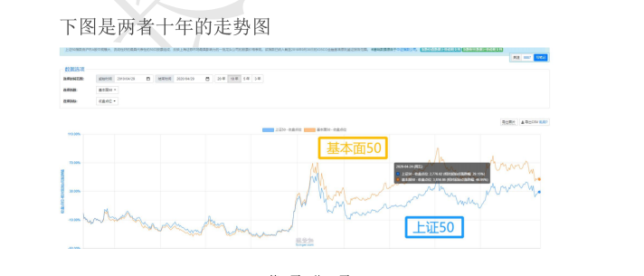

**可以看出：过去10年基本面50指数的业绩基本是超越上证50指数的**

一般的指数使用的是市值加权，也就是咱们前面说的按照股票的市值大小决定它在指数中的占比，市值越高，所占的权
重就越高，占的权重越高对指数的影响就越大；同样的对跟踪该指数的指数基金业绩的影响也就越大。

举个例子来说，假设有一只指数基金，里面所有公司的市值总和1个亿。其中包含AB两家公司，这两家公司的净资产都是100万，但是他们的市值却不同，A公司是1000万，B公司是100万。他们在指数基金中的占比分别为10%、1%。而同样的净资产，市值却不一样，A公司很可能是被高估了嘛～

假如过了一段时间A跌了50%，B涨了50%。那么，他们对指数基金业绩的影响如何呢？可以用涨跌幅度乘以占比来判断啦～A跌了50%\*10%=5% B涨了50%\*1%=0.5%。发现了没有，这里越高估的公司占比越大，他们下跌的风险也大，一旦下跌对指数基金的业绩有很大影响；被低估的公司反而占比小，涨起来以后反倒对业绩提升不大。

虽然公司的估值每天都在变，但是公司还是那个公司，依然是那个在卖东西赚钱的公司。即使今天市场非常看好这家公司，给它一个很高的估值，甚至翻了好几倍，但是实际上，公司的房子、机器设备不会跟着变化，营业收入也不会跟着变化，该赚多少钱还是那么多钱等等都不会变化。而这些不受市场情绪影响的东西，其实就是公司的营业收入、现金流、分红和净资产。既然营业收入、现金流、分红和净资产都不会受到影响，那我就把这四个因素作为计算公司权重的方法。

这几个权重的计算公式是：
**营业收入权重**=某公司的营业收入/所有公司的营业收入 也就是说，公司的营业收入越高，它在指数中占比就越多
**现金流权重**=某公司的现金流/所有公司的现金流 也就是说，公司的现金流越多，它在指数中占比就越多
**分红权重**=某公司的分红/所有公司的分红 也就是说，公司的分红越多，它在指数中占比就越多
**净资产权重**=某公司的净资产/所有公司的净资产 也就是说，公司的净资产越多，它在指数中占比就越多

根据四种权重计算方法，就可以形成四只指数，根据过去的数据来计算一下各自的涨跌情况，找到最好的不就行了嘛。

把四个指标算出的权重进行了平均，得出新的权重，根据新的加权计算方式，得出一个新的指数，基本面指数

**基本面指数就是营业收入、现金流、分红和净资产这四个不怎么受市值影响的指标进行加权，然后算出各个权重的平均**
**值，根据加权方式形成一个新的指数。**

#### 查看

首先要清楚并不是所有的基本面指数都有对应的基金

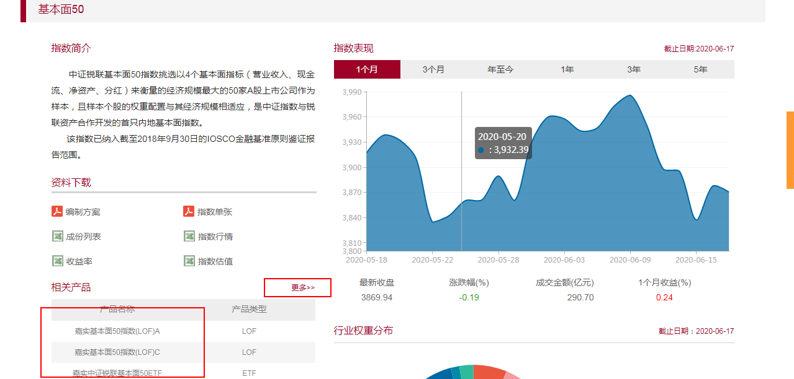

然后打开天天基金网，输入产品名称进行搜索，根据挑选基金的原则进行挑选

首先是看基金的规模，咱们要选基金规模比较大的基金，因为规模大的基金，清盘关闭的几率比较小基金清盘一般需要满足的条件是：连续60日基金资产净值低于5000万；或者连续60日基金份额持有人数不足200人。如何查看基金持有人的情况？
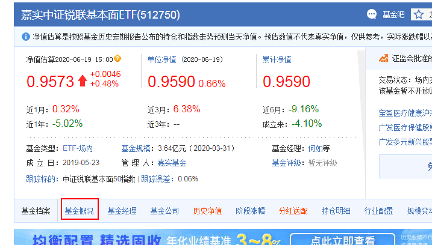

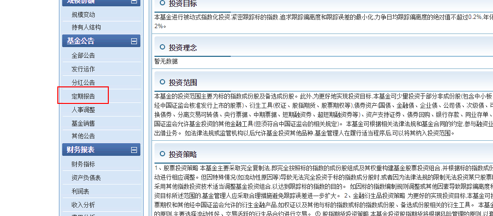

找到最新的报告

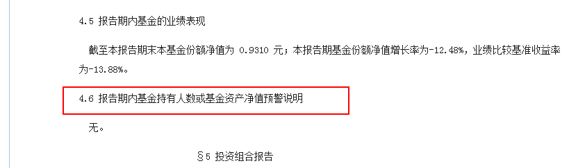

### 行业指数

#### 概念

行业指数，就是在某一个特定行业内挑选成分股，指数内的公司全都出自同一个行业。
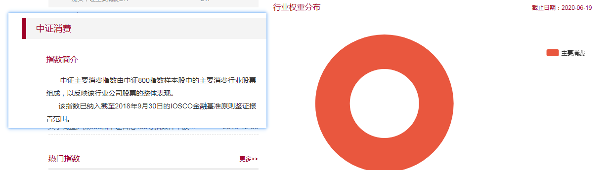

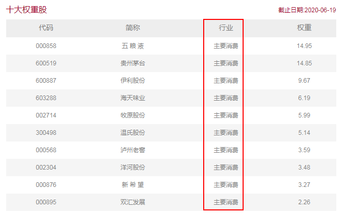

如图中的中证消费指数，就是典型的消费行业指数。

#### 行业分类

**一级行业分类**

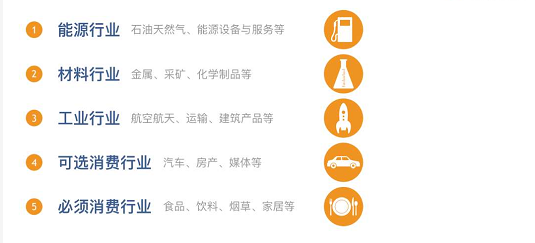

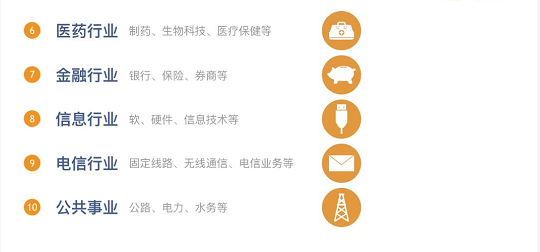

**十大行业对应的中证指数**

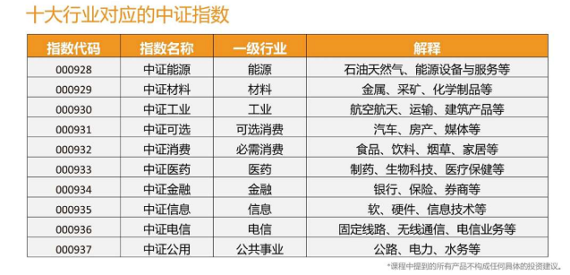

####  行业指数判断

1. 人们的需求是否稳定，只有需求稳定，才能促进行业不断赚钱
2. 参考国外成熟市场的经验
3. 强周期性行业
   1. 一般包括金融，地产，煤炭，钢铁等
   2. 地产行业的周期受国家宏观政策影响
   3. 煤炭、石油的周期，受全球的供求关系影响
4. 证券行业周期明显且容易判断，周期性体现在牛熊交替的时候
   熊市：新开户的人数很少，成交量也少，证券行业的收入自然而然很少
   牛市：大量的人涌进股市，开户的人数和成交量飙升，收入目标自然水涨船高。

#### 挑选行业指数基金

以医药行业为例

第1步：确定要投资的指数

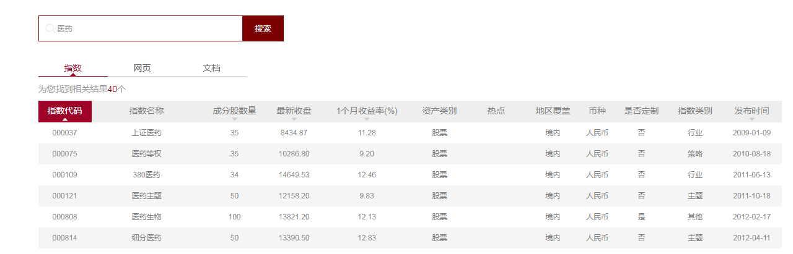

发现一共有四十只，手动整理成以下表格

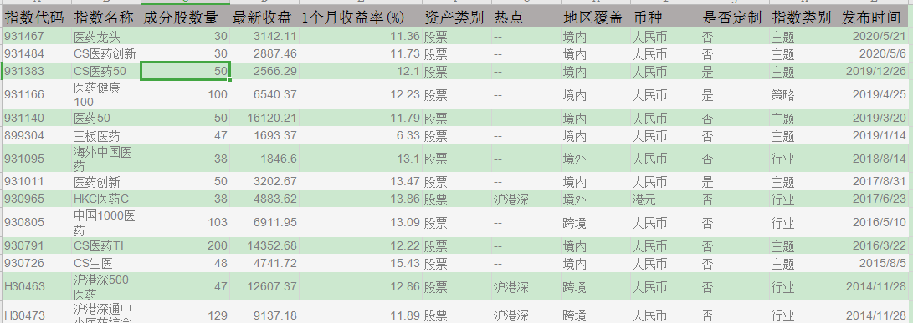

**第2步：筛选非定制指数**，对于大部分普通投资者来说，都选用中证指数、上证指数、深证指数公布的指数；而定制指数是客户根据自身的需求，申请的定制指数，不是通用的指数。

**第3步：剔除没有基金跟踪的指数**，包括只有分级基金的指数2018年央行发布了《关于规范金融机构资产管理业务的指导意见》，规定公募基金产品不得分级，之前的分级基金都要进行整改，也就是说，以后不再有分级基金了，所以我们暂时不考虑只有分级基金的指数。同时，如果没有基金跟踪这只指数，它再好咱们也没办法投资吖~所以要剔除。

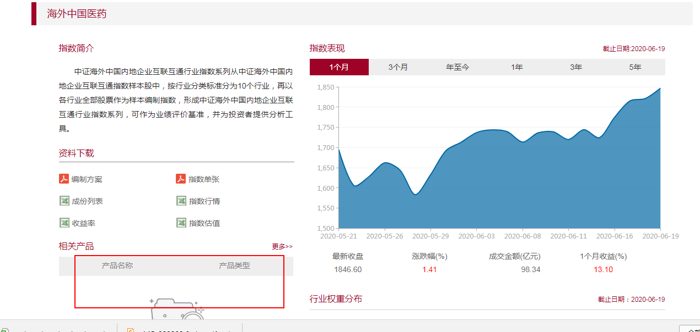

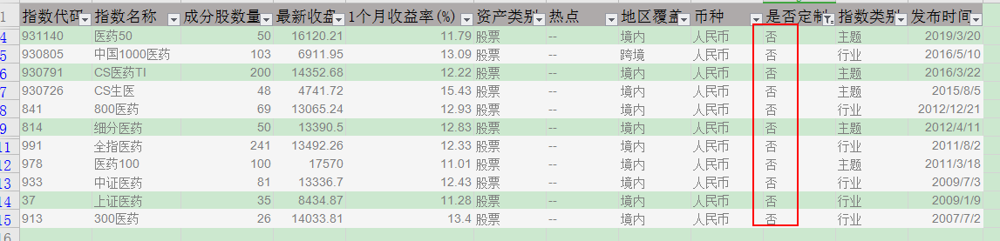

**第4步，看指数的成分股，剔除细分领域的指数**

细分领域解释参考前面。有两种方法查看指数是否属于细分领域

一种是指数的名称，有一些指数名称直接写了细分两字
第二种是，看指数的简介，里面直接描述了选择某行业里面具体的板块。以医药行业为例，医药行业中的医药生物、医疗器械等，都是细分领域(对照表格得出，参照上面的细分领域定义）。由于成分股过于集中于一个小的领域，风险相应
也会较大。因此，像医药生物这样的指数我们可以先不考虑了

我们剔除细分领域指数，是因为细分领域代会进一步收紧选股范围，比如二级肯定比一级范围更小，这样子分散性不好，风险更集中。
有一些指数的描述中，如CS医药TI，这个指数选股范围有一级行业，“医药卫生”，既在一级行业里选股，又追加了一个细分领域选股，这样比较，其实选股范围是扩大了，所以可以不剔除。

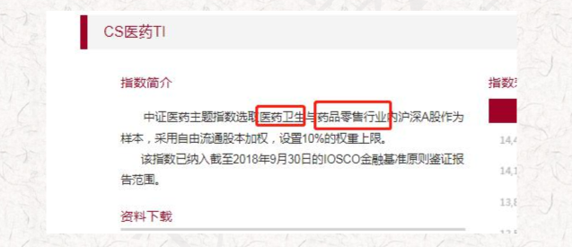

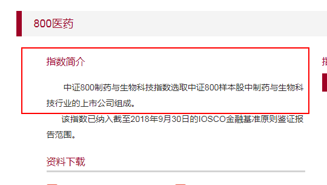

第三种查看细分领域的方法：

简言之，就是下载中证的行业分类，通过理杏仁查找指数十大权重股的具体【所属行业】，对照中证的行业分类，看三级行业有几个~

咱们先到中证指数官网下载中证行业的分类：实操路径：【下载中心】-【行业分类下载】-【中证行业分类架构】
随后，咱们通过理杏仁查指数十大权重股的具体【所属行业】，对照中证的行业分类，看三级行业
在理杏仁网站，搜“CS生医”、“CS医药TI”指数，点【样本权重】，可以看到指数的十大权重股名称、行业和权重占比~~

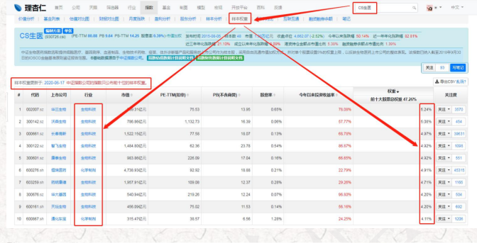

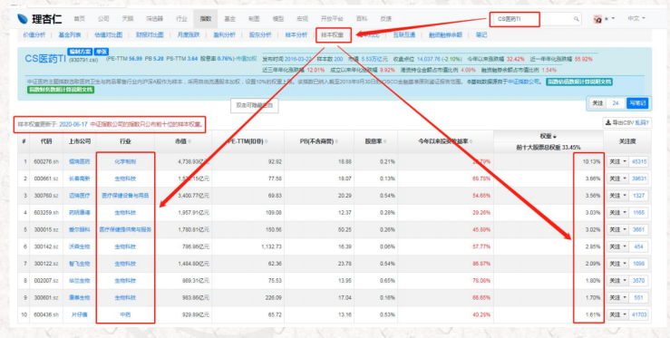

按刚才说的，将指数的简介、十大权重股所属的行业以及中证的行业分类表放在一起来看~

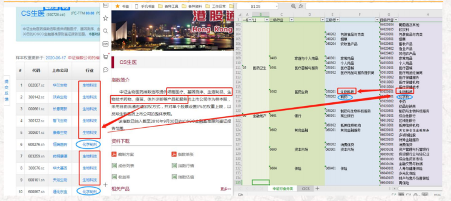

先看“CS生医”，大家跟着我的箭头走哈：
（1）从中证的指数简介上看，细胞医疗、基因测序、血液制品等等，有些详细，有些细化，但不太敢确定；
（2）从理杏仁查十大权重股之后看，嗯，只有【生物科技】和【化学制剂】2个归属，有点儿集中于生物科技；
（3）对照中证的行业分类，归属于2个四级行业分类，也归属于2个三级行业分类
有细心的童鞋就发现了，班班，“化学制剂”几个字我在表里按Ctrl+F也找不到啊，这个时候我们点进“化学制剂”这几个字里
面哈，如下图

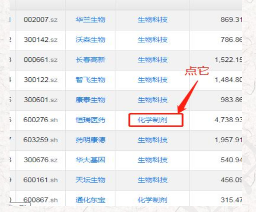

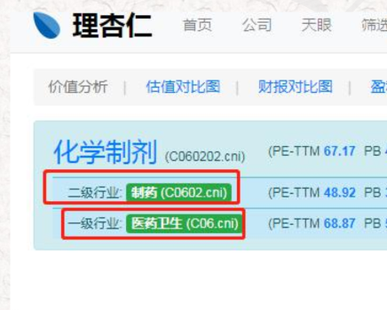

可以看到化学制剂所属上级行业“制药”和一级行业“医药卫生”，那我们就在行业分类表里搜搜上级行业“制药”看看

**第5步，看指数的前十大持仓股票占比,这里主要考虑分散风险，单一个股的占比不宜过大，最好不超过20%。**

1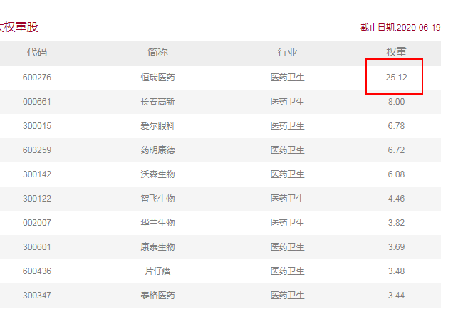

**第6步：精选靠谱的基金公司 查看规模＞1000亿的基金公司**

第7步：锁定指数基金 跟踪误差率（低于同类平均跟踪误差，并且越低越好）、基金规模（大于2亿）、成立年限（大
于3年）及费率（越低越好）

#### 互联网行业

中国最优秀的互联网公司有哪些呢？没错，就是腾讯,阿里巴巴，百度,网易等等~这些公司，在中国股市买不到。因为它们都在美国或者香港上市，阿里巴巴和网易是在美国上市的，腾讯是在香港上市的。嗯，大家应该也知道~现在阿里巴巴和网易还有京东也在香港上市了

那么，有小伙伴可能会问了，为什么中国的互联网公司要跑到美国或者香港上市呢？原因有3点：

1. 我国A股目前不能接受境外公司上市申请；
   像阿里巴巴，百度，腾讯，这些实际上都是在境外注册的公司，所以他们不能在A股上市。
2. 在美国，上市的门槛比较低，而且上市的效率比较高，可以更容易且更快上市。
3. 有助于进军国际市场
   因为美国毕竟是全球资本的中心，在美国上市可以提高企业的知名度。

如果小伙伴们想要购买这么优秀的公司股票的话，需要开通港股账户，把人民币转成港币；或者开通美股账户，把人民币转成美元，emm......，感觉好麻烦~你以为解决了开户的问题，就可以买了吗？不是的，还有资金量的问题。
港股的最小交易单位为一手，但是与A股一手=100股不等，港股交易里，具体每手多少股，由上市公司决定，不同的上市公司，每手交易100股-1000股不等。以腾讯刚刚给大家看到的股价HK$463.2来说，一手最少需要46320港币。换算成人民币，就是42293.645元人民币，才能买得起一手。

假设你开了户，也有钱买了一手股票，但是，还要面临汇率波动。万一外币兑人民币的汇率下跌，也就是说，外币贬值了、人民币升值了，外币能够换到的人民币减少了，好不容易有的收益，就被吃掉了一部分。想要购买优质公司，享受股价上涨带来的快感，怎么就这么难呢。投资基金就好啦。

首先，班班试着用百度搜索雪球，在雪球上试着搜索“中国互联网指数”，向下翻，找到了两只互联网指数基金

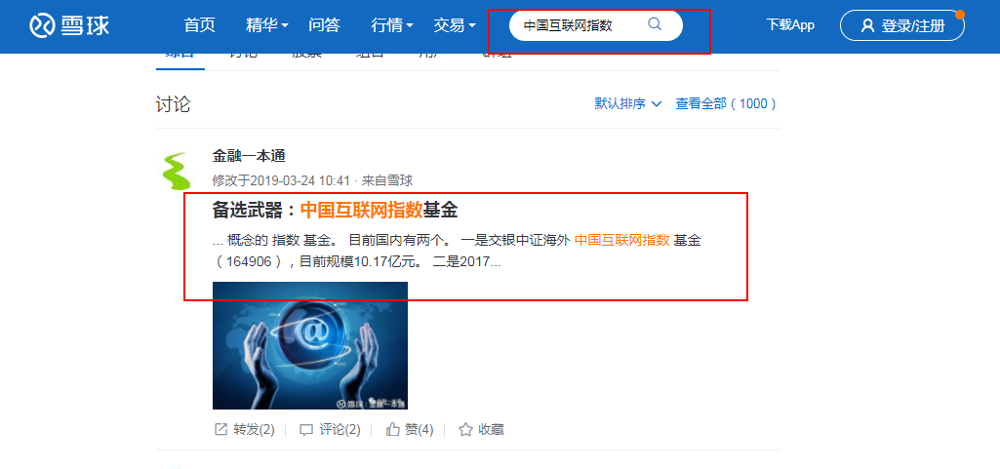

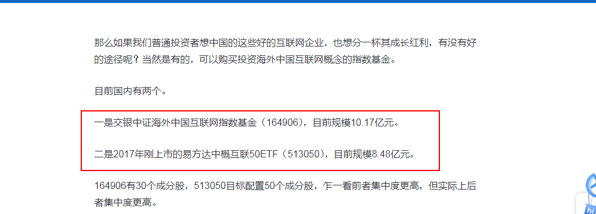

同时还找到了对应的指数，分别为中证海外中国互联网指数和中证海外中国互联网50指数

分析指数，就可以用到我们第二天学到的知识——如何快速认清一只指数。首先，先看这两只指数的成分股，看它们投资了什么。大家可以按照步骤来分析哈~这里班班的思路是看看它投资了多少的BAT（百度，阿里巴巴，腾讯）

这里我们还是用【中证指数有限公司】的官网来查询。我们搜索两只指数标的【中证海外中国互联网指数】和【中证海
外中国互联网50指数】。然后我们对比一下他们的成分股，看看有什么区别。点击进去，页面往下拉，右下角就能看到：

通过比较，我们发现两者的成分股都是互联网公司，相对来说，【中证海外中国互联网50指数】，BAT（百度、阿里、腾讯的简称）的占比更多一些。

接下来，我们对比看看这两只指数的加权方式。
这里班班分享个窍门，**指数加权方式都是自由流通市值加权计算的，其实就是市值加权**。

接下来，我们再来看一下这两只互联网指数和沪深300的历史收益情况。

由于中证海外中国互联网指数是在2011年9月20日发布的，中证海外中国互联网50指数是在2014年12月29日发布的，因此班班找了从15年1月2日到2020年6月18日的收盘点位情况。
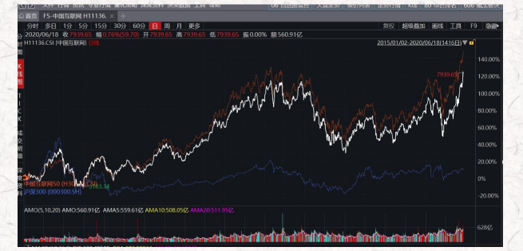

白线为中国互联网指数、红线为中国互联网50指数、蓝线为沪深300指数

我们可以清晰地发现，最近这两年表现最好的的是红色【中证海外中国互联网50指数】，其次是白色【中证海外中国互联网指数】，最后是蓝色【沪深300指数】。

以上证明互联网行业指数的好处。总结：

1、成分股都是互联网公司，相对来说中证海外中国互联网50指数BAT的占比更大；
2、指数加权方式都是自由流通市值加权计算的；
3、从历史表现上看，两个互联网指数的涨势比沪深300更好，中证海外中国互联网50指数是其中涨势最好的；
4、从跟踪误差率来看，中证海外中国互联网50指数对应的易方达中证海外中国互联网50ETF的跟踪误差率更低。
5、从交易成本上看，中证海外中国互联网50指数对应的易方达中证海外中国互联网50ETF的成本更低。

### 境外指数

#### 概念

1. 境外市场：就是值出A股市场以外的市场，如中国香港、美国、德国、日本等。
2. 境外市场分为两大类，一类是新兴市场，一类是成熟市场
3. 新兴市场是指，发展中国家或地区的股票市场，以及发达国家或地区中不成熟的股票市场
4. 成熟市场是指，发达国家或地区中，相对来说较为成熟的股票市场

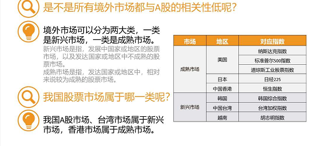

**海外指数也是宽基指数，可以使用长投温度了选择判断买入时机。**

#### 相关性

要找到和A股相关性较低的市场，应该选择境外市场中的成熟市场。因为A股市场属于新兴市场，成熟市场与新兴市场的相关度较低。

配置投资组合的目的是降低风向，提升组合收益。选择相关性低的市场，可以避免同涨同跌的风险

**A股市场与成熟市场相关性低的原因：**

1. 新兴市场的国家和成熟市场的国家，经济基础不一样，发展速度不同步
2. 新兴市场和成熟市场的经济周期不同，投资者对两类市场的预期不一样。会导致股市出现不同的涨跌情况。

**相关性指标：**

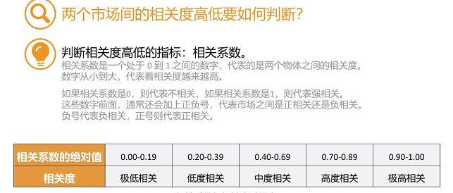

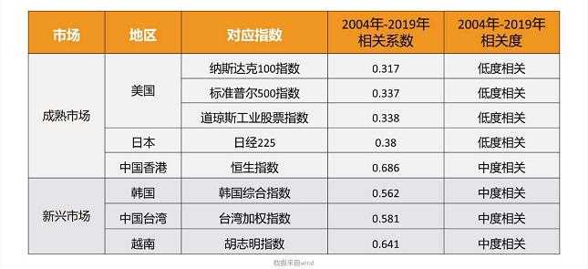

总结：成熟市场整体与A股市场相关度是偏低的，而新兴市场与A股则中度相关。
中国香港属于成熟市场，但与A股依旧是中度相关。因为中国有很多公司同时在港股与A股上市，它们的走势是差不多的，其次，两个市场中的股民也有很多重合，这也会让两个市场的相似度更高。

#### 市场特点

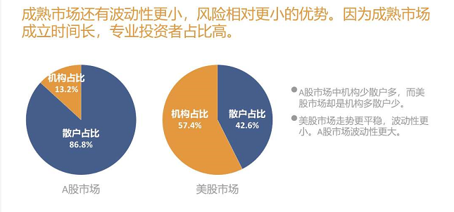

**换手率：**

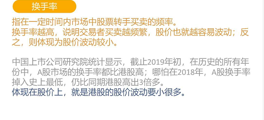

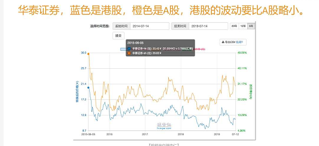

**成熟市场的机构投资者占比更高，换手率相对更低，股市波动小，市场走势相对稳定。**

#### QDII基金

QDII基金是指在一国境内设立，经该国有关部门批准从事境外证券市场的股票、债券等有价证券业务的证券投资基金。
一般是境内的基金公司专门设立的，用来投资境外股票、债券等投资品的基金。不是所有的基金公司都可以投资境外市场，只有经过官方批准，有实力的基金公司才可以。

**常见的专门跟踪境外指数的QDII基金：**

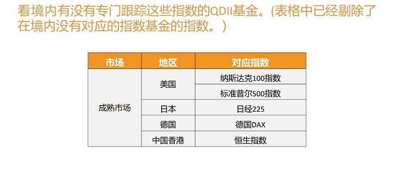

**如何筛选QDII基金：**

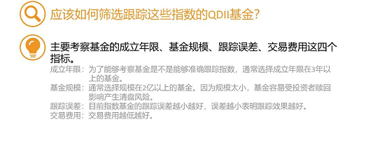

在天天基金网可搜索到跟踪此指数的基金

**何时买入纳斯达克对应的基金：**

使用长投温度，因为它是宽基指数，可以使用长投温度进行判断。