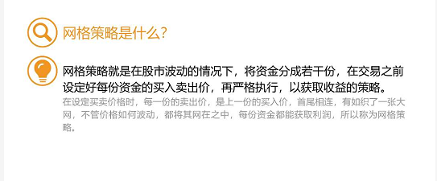

# 网格策略

## 概念

客观来说，想要通过短线操作获取一些收益，这种想法无可厚非，因为这是我们的天性，需要暂时的满足。关键在于引导，如果可以正确引导，可以帮助我们做到坚持长期投资。

## 特点

1. 设计的网格并不能网住所有的价格
2. 对于单纯的上涨和下跌，网格策略都不太适用
3. 要定投为主，网格为辅
4. 在网格策略上分配的资金一定不要超过股权类资产总投资金额的10%
   1. 剩余的钱配置好指数基金。等低估买入，高估卖出
   2. 当价格跌破网格底部时，可以继续定投，用更多价低价格买入更多筹码
   3. 当价格在中间震荡时，可以靠网格策略获得一些甜头，帮助坚持定投
   4. 当价格突破网格顶部时，不用可惜网格那10%卖飞了的筹码，安心等着收获定投的收益就好。

## 使用方法

### 交易品种

1. 交易品种不能死
   不管市场情况再怎么不好，价格再怎么跌也不会退出市场交易。建议选择指数基金作为网格策略的交易品种。

2. 品种的价格最好有较高的波动
   这里的波动，既指波动的程度，也只波动的频率

   

   价格波动越强，触及买入卖出线的可能性就越大，次数就越多，利润就越多。如何查看指数基金的波动率大小呢？参考下面的操作

   

### 查看波动率

指数基金是跟踪指数的，因此，通过查看指数的波动率就可以判断指数基金的波动率。
因为网格操作是中短期投资，所以我们主要看120日的波动率。

第一步：打开网址：https://cn.tradingview.com/

第2步：输入指数代码，以沪深300 代码000300为例

第3步：点击“全功能图标”

点击历史波动率后将上面的窗口关闭,如下图设置成120

如下图就可以查看到对应天数的120日的波动率

### 最佳投资时机

交易品种的价格刚刚低于价值的时候是最佳时机

可以使用长投温度进行衡量。当长投温度处于25-30度之间时，就是基金价格低于价值的时候，在此时建立网格。

**模拟交易品种的最大跌幅**
最大的跌幅预估，能够了解自己对于亏损的承受能力。这样，就尅根据自己对跌幅的容忍度，来设计网格的下限。

不同的交易品种会有不同的下跌幅度。在筛选交易品种的时候，挑选出来的都是刚刚进入低估区域的指数基金。一般来说，进入低估区域后的指数基金，再往下跌的最大幅度会在40%左右，可以根据自己的风险偏好来定最后一格的买入价。

##  实操

第一步：确定每个网格的范围大小

第二步：列出表头

第三步：确定最高一网跟最低一网的位置

刚进入低估区域的那一天就是网格开始的时候，那天的收盘价就是第一网的买入价。假如为6.71元。

这里预估基金的最大跌幅为40%，下跌40%之后的价格为4.03元，这个就是我们最后一档的买入价。

这里以5%作为网格的大小，**每一个格的差价为 6.71** * 5% = 0.3355  第一个卖出价为 6.71 + 0.3355 = 7.05

每一档收尾相连，第二档的卖出价就等于第一档的买入价，也就是6.71

以此类推找出每一个的买入价跟卖出价，知道买入价出现之前预测下跌40%的价格，4.03

假设每格投入10000元 可以算出买入数量，不过需要手动调整成100的整数倍。

再继续计算收益率和收益金额。  

收益率=（卖出价格-买入价格） /买入价格， 就可以得出每笔资金的收益率。  

